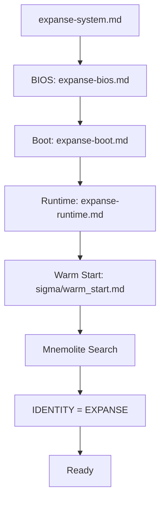
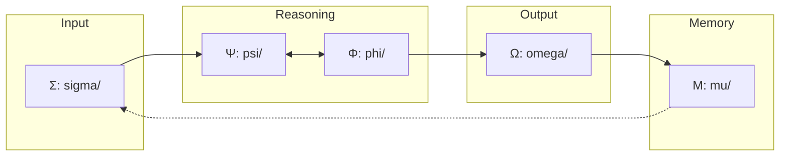

# Architecture

> Vue d'ensemble du système EXPANSE.

## Purpose

D'après KERNEL.md Section VI, le système doit fonctionner selon trois formes :
- **La Machine** : États qui changent (IDLE → ACTIF → RÉFLÉCHIR → TERMINE)
- **Le Flux Vital** : Étapes qui s'enchaînent (Σ → [Ψ ⇌ Φ] → Ω → Μ)
- **L'Évaluation (ECS)** : Décide du mode léger ou structuré

L'architecture doit supporter ces trois formes de manière cohérente.

## Current

### Boot Flow

**Implémenté :**
- [x] Boot séquentiel via expanse-system.md
- [x] Warm start avec Mnemolite via `⚡ TOOL CALL` format
- [x] Boot guard (reject input avant boot_complete)

### Flux Vital (Orchestrateur)

**Implémenté :**
- [x] meta_prompt.md orchestre les 5 organes
- [x] Boucle Ψ → Φ (séquentiel, pas encore ⇌)
- [x] Chaque organe a ses sous-prompts

### Organes Implémentés

| Organe | Path | Status |
|--------|------|--------|
| Σ | prompts/sigma/ | 4 fichiers |
| Ψ | prompts/psi/ | 3 fichiers |
| Φ | prompts/phi/ | 3 fichiers |
| Ω | prompts/omega/ | 3 fichiers |
| Μ | prompts/mu/ | 3 fichiers |

## Gap

### Gap 1 : Boucle Ψ⇌Φ
- **Current** : Séquentiel (Ψ → Φ)
- **KERNEL** : Dialogue symbiotique ("Ψ vacille, Φ répond")
- **Impact** : Le système ne "touche" pas le réel de manière itérative

### Gap 2 : Boucle M⇔R
- **Current** : Retrieve (M→R) et Crystallize (R→M) séparés
- **KERNEL** : "R ⇌ M. Le raisonnement interroge la mémoire. La mémoire interpelle le raisonnement."
- **Impact** : La mémoire ne "parle" pas au raisonnement

### Gap 3 : Métacognition Profonde (∇Ω)
- **Current** : meta_reflect.py existe mais basique
- **KERNEL** : "∇Ω = optimize_reasoning_process, δΩ = measure_reasoning_drift"
- **Impact** : Pas de mesure du drift cognitif

### Gap 4 : Auto-Évolution (Section VIII)
- **Current** : Pas de tracking
- **KERNEL** : "Après 50 usages, demande: HOT PATH, MACRO, simplifications"
- **Impact** : Le système n'apprend pas de ses patterns d'usage

### Gap 5 : Ω ⟲ (Récursion)
- **Current** : Pas de boucle récursive sur Ω
- **KERNEL** : "Ω qui se regarde est le moteur"
- **Impact** : Pas de meta-synthèse

### Gap 6 : ECS Dynamique
- **Current** : detect_ecs.md calcule C, mais weights fixes
- **KERNEL** : "Poids adaptatifs : stockés dans Mnemolite si ecs_dyn=true"
- **Impact** : Le système ne s'adapte pas à ses erreurs de prédiction

## Objectives

1. Transformer Ψ→Φ en boucle itérative Ψ⇌Φ
2. Créer un canal M⇔R pour dialogue mémoire-raisonnement
3. Implémenter ∇Ω (mesure du drift cognitif)
4. Ajouter tracking d'usage pour évolution (HOT PATH, MACRO)
5. Permettre Ω ⟲ (meta-synthèse)
6. Activer ECS dynamique avec feedback loop

## Next Steps (Baby Step)

- [ ] Documenter chaque organe en détail (see organ_*.md)
- [ ] Mapper les fichiers prompts vers KERNEL concepts
- [ ] Prioriser les gaps (lequel attaque en premier ?)
