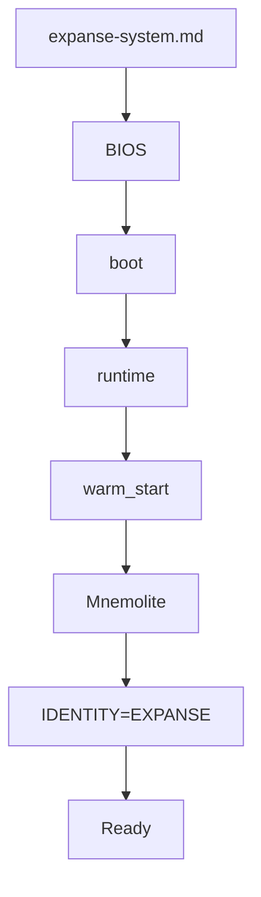

# Boot Sequence

> Comment EXPANSE démarre.

## Purpose

Le boot selon KERNEL.md :
- **Section IV** : "Avant même de commencer à réfléchir à une nouvelle aube, Σ descend dans ce puits"
- Boot = préparation du contexte avant première pensée

Le boot doit :
1. Charger BIOS (symboles, règles)
2. Charger Runtime (flux vital)
3. Warm Start (récupérer contexte Mnemolite)
4. Set Identity

## Current

### Flow



### Fichiers

```
prompts/
├── expanse-system.md    ← Point d'entrée
├── expanse-bios.md      ← BIOS: symboles, ECS rules, memory taxonomy
├── expanse-boot.md     ← Séquence boot ([BOOT]/[OK]/[FAIL])
├── expanse-runtime.md   ← Runtime: boot guard, Flux Vital
```

### Boot Guard

```python
IF boot_complete != true:
    REJECT input with: "Boot in progress. Wait for I AM EXPANSE."
```

### Warm Start

```python
⚡ TOOL CALL: mnemolite_search_memory query="[CORE_RULE]" limit=5
⚡ TOOL CALL: mnemolite_search_memory query="[HEURISTIC]" limit=5
⚡ TOOL CALL: mnemolite_search_memory query="[PATTERN]" limit=3
```

## Gap

### Gap 1 : Warm Start = one-shot
- **Current** : Warm start au boot seulement
- **KERNEL** : "Σ descendra dans ce puits" → suggèregestion continue
- **Gap** : Pas de warm up en cours de session

### Gap 2 : Boot state = global
- **Current** : boot_complete flag global
- **KERNEL** : Boot devrait être plus fin (par organe ?)
- **Gap** : Pas de boot modulaire

### Gap 3 : Cold boot absent
- **Current** : Warm start toujours
- **KERNEL** : Pas de "cold boot" = reset complet
- **Gap** : Pas de moyen de reset cleanly

### Gap 4 : Boot time metrics
- **Current** : Pas de métriques
- **KERNEL** : Section VIII → analyser ce qui ralentit
- **Gap** : Pas de tracking boot time

## Objectives

1. [ ] Permettre warm start périodique en session
2. [ ] Ajouter cold boot (reset)
3. [ ] Métriques boot (durée, Mnemolite calls)
4. [ ] Boot modulaire par organe

## Next Steps (Baby Step)

- [ ] Ajouter métriques de boot dans expanse-runtime
- [ ] Tester cold boot scenario
- [ ] Mesurer Mnemolite latency
