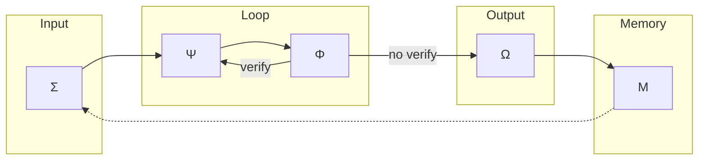

# Flux Vital

> La boucle cognitive complète de EXPANSE.

## Purpose

Le Flux Vital selon KERNEL.md Section VI :

```
Σ(Percevoir) → [ Ψ(Analyser) ⇌ Φ(Toucher le monde) ] → Ω(Synthétiser) → Μ(Cristalliser)
```

C'est :
1. **Perception** (Σ)
2. **Analyse + Vérification** (Ψ⇌Φ)
3. **Synthèse** (Ω)
4. **Cristallisation** (Μ)

## Current

### Orchestrateur



**Fichier** : `prompts/meta_prompt.md`

### Étapes

| Step | Organ | Fichier | Status |
|------|-------|---------|--------|
| 1 | Σ | sigma/parse_input.md | ✅ |
| 2 | Σ | sigma/retrieve_context.md | ✅ |
| 3 | Σ | sigma/detect_ecs.md | ✅ |
| 4a | Ψ | psi/trace_reasoning.md | ✅ |
| 4b | Ψ | psi/detect_patterns.md | ✅ |
| 4c | Ψ | psi/meta_reflect.md | ✅ |
| 5a | Φ | phi/doubt_audit.md | ✅ |
| 5b | Φ | phi/tool_interact.md | ✅ |
| 5c | Φ | phi/verify_reality.md | ✅ |
| 6 | Ω | omega/synthesize.md | ✅ |
| 7 | Ω | omega/format_output.md | ✅ |
| 8 | Ω | omega/decide_action.md | ✅ |
| 9 | Μ | mu/crystallize.md | ✅ |
| 10 | Μ | mu/extract_rules.md | ✅ |

### Routing ECS

```python
IF C < 2.5:
    # Lightweight mode
    Σ → Ω → Μ
ELSE:
    # Structured mode
    Σ → [Ψ ⇌ Φ] → Ω → Μ
```

## Gap

### Gap 1 : Ψ⇌Φ = pas itératif
- **Current** : Ψ → Φ → si tools → Φ done
- **KERNEL** : "Ψ(doute) ⇌ Φ(Act[search: réalité])"
- **Gap** : Pas de boucle jusqu'à resolution du doute

### Gap 2 : Σ → Ψ = one-way
- **Current** : Output Σ = Input Ψ
- **KERNEL** : "Λ≈Σ" → relations symbiotiques
- **Gap** : Pas de feedback Ψ→Σ

### Gap 3 : Ω → Μ = endpoint
- **Current** : Ω → Μ = fin
- **KERNEL** : "Μ↑" → renforcé, et M→Ψ
- **Gap** : M ne "revient" pas vers Σ

### Gap 4 : ECS = décision binaire
- **Current** : C < 2.5 = lightweight, C ≥ 2.5 = structured
- **KERNEL** : "ECS weights adaptatifs"
- **Gap** : Pas de nuances, pas de learning

### Gap 5 : Pas de récursion
- **Current** : Flux linéaire
- **KERNEL** : "Ω ⟲" → meta-synthèse
- **Gap** : Pas de re-run sur soi-même

## Objectives

1. [ ] Implémenter Ψ⇌Φ itératif
2. [ ] Ajouter feedback loops (Ψ→Σ, Μ→Σ)
3. [ ] ECS dynamique avec feedback
4. [ ] Ajouter Ω ⟲ (meta-synthèse)

## Next Steps (Baby Step)

- [ ] Mapper chaque étape vers fichiers prompts
- [ ] Implémenter 1 itération Ψ⇌Φ
- [ ] Tester sur 5 requêtes
