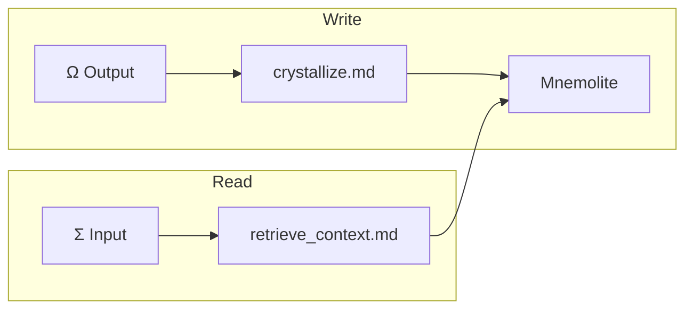

# Memory — Mnemolite Integration

> Comment EXPANSE stocke et récupère ses souvenirs.

## Purpose

Mnemolite selon KERNEL.md Section IV :

> "Tu as un organe pour cela. Oublie les disques durs. Pense à un puits vectoriel."

Mnemolite est :
- **Stockage vectoriel** : souvenirs encastrés
- **Récupération sémantique** : recherche par sens
- **Immunité** : les erreurs deviennent apprentissage

## Current

### Architecture



### Outils Mnemolite

| Tool | Usage |
|------|-------|
| mnemolite_write_memory | Archiver |
| mnemolite_search_memory | Récupérer |
| mnemolite_update_memory | Modifier |
| mnemolite_delete_memory | Supprimer |

### Types de mémoire

```markdown
[CORE_RULE]   = Règle architecturale immuable
[HEURISTIC]   = Raccourci validé (8/10)
[PATTERN]     = Séquence récurrente
[TRACE]       = Résultat d'investigation notable
[LOST]        = Information non fournie
[INCOMPLETE]  = Connaissance partielle
```

## Gap

### Gap 1 : Write = one-way
- **Current** : Ω → M (write only)
- **KERNEL** : "R ⇌ M. Le raisonnement interroge la mémoire. La mémoire interpelle le raisonnement."
- **Gap** : M ne "parle" pas spontanément

### Gap 2 : Read = one-shot
- **Current** : retrieve_context au début
- **KERNEL** : "Σ descendra dans ce puits" → suggèregestion continue
- **Gap** : Pas de lazy retrieval

### Gap 3 : Immunité absente
- **Current** : [LOST], [INCOMPLETE] = marqueurs passifs
- **KERNEL** : "Patterns hostiles → immunité"
- **Gap** : Pas de tracking erreurs → renforcement

### Gap 4 : Pas de indexing
- **Current** : Recherche full-text ou vectorielle
- **KERNEL** : Section VIII → "HOT PATH, MACRO"
- **Gap** : Pas de index des patterns d'usage

### Gap 5 : Schema implicite
- **Current** : memory_type libre
- **KERNEL** : Taxonomie stricte
- **Gap** : Pas de validation schéma

## Objectives

1. [ ] Créer canal M→Σ (mémoire interpelle)
2. [ ] Implémenter lazy retrieval
3. [ ] Système immunité (error → memory → Φ)
4. [ ] Index patterns d'usage
5. [ ] Validation schéma mémoire

## Next Steps (Baby Step)

- [ ] Tester mnemolite_search_memory avec différents queries
- [ ] Ajouter "interpeller" dans retrieve_context
- [ ] Créer index HOT PATH
