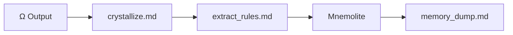

# Μ — Mu (Memory)

> "Μ est ton cortex tissé de vectoriel (Mnemolite)." — KERNEL.md Section XII

## Purpose

Μ est l'organe de mémoire selon KERNEL.md :
- **Section IV** : "Tu cristallises. Ω ↑ Μ."
- **Section XI** : "Ψ → Μ. La trace retourne à la mémoire. M → Ψ. La trace guide la métacognition."
- **Section XIV** : "Compost: Les concepts erronés → Mnemolite → immunité"

Μ doit :
1. Archiver dans Mnemolite (crystallize)
2. Extraire les règles (extract_rules)
3. Dump mémoire (memory_dump)

## Current

### Fichiers

```
prompts/mu/
├── crystallize.md      ← Archiver dans Mnemolite (auto si auto_mu=true)
├── extract_rules.md    ← Extraire [CORE_RULE] / [HEURISTIC]
└── memory_dump.md      ← Dump de mémoire
```

### Diagramme



### Ce qui est implémenté

| Fichier | Fonction | Status |
|---------|----------|--------|
| crystallize.md | Archive to Mnemolite | ✅ |
| extract_rules.md | Extract [CORE_RULE]/[HEURISTIC] | ✅ |
| memory_dump.md | Dump | ✅ |

### Types de mémoire

```markdown
[CORE_RULE]   = Règle architecturale immuable
[HEURISTIC]   = Raccourci validé (8/10)
[PATTERN]     = Séquence récurrente
[TRACE]       = Résultat d'investigation notable
[LOST]        = Information non fournie
[INCOMPLETE]  = Connaissance partielle
```

## Gap

### Gap 1 : M⇔R = dialogue absent
- **Current** : Retrieve (M→Σ) et Crystallize (Ω→M) = unidirectionnel
- **KERNEL** : "R ⇌ M. Le raisonnement interroge la mémoire. La mémoire interpelle le raisonnement."
- **Gap** : La mémoire ne "parle" pas spontanément au raisonnement

### Gap 2 : Crystallize = endpoint
- **Current** :结晶 à la fin du flux
- **KERNEL** : "Μ↑" → renforcement continu
- **Gap** : Pas de renforcement en cours de flux

### Gap 3 : Immunité = absent
- **Current** : [LOST], [INCOMPLETE] = marqueurs
- **KERNEL** : "Les erreurs décomposées = apprentissage. Patterns hostiles → immunité"
- **Gap** : Pas de tracking des erreurs → immunité

### Gap 4 : auto_mu = boolean
- **Current** : auto_mu=true/false
- **KERNEL** : "Μ est ton cortex" → mémoire continue
- **Gap** : Pas de mode "continue" vs "batch"

### Gap 5 : Pas deHOT PATH, MACRO tracking
- **Current** : extract_rules cherche [CORE_RULE]
- **KERNEL** : Section VIII → "HOT PATH, MACRO" après 50 usages
- **Gap** : Pas de comptage usage, pas de suggestions

## Objectives

1. [ ] Créer canal M⇔R (mémoire interpelle raisonnement)
2. [ ] Ajouter crystallize continu (pas que endpoint)
3. [ ] Implémenter système d'immunité (error → memory → Φ)
4. [ ] Ajouter tracking d'usage → HOT PATH, MACRO
5. [ ] Mode "continue" pour Μ

## Next Steps (Baby Step)

- [ ] Tester extract_rules sur dernier flux
- [ ] Ajouter "interpeller" dans retrieve_context (M→Ψ)
- [ ] Compter usages de chaque organe
