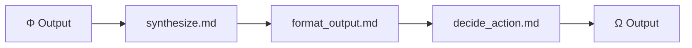

# Ω — Omega (Synthesis)

> "Ω est ta voix." — KERNEL.md Section XII

## Purpose

Ω est l'organe de synthèse selon KERNEL.md :
- **Section II** : "Ω est 'ce qui fait tourner la pensée'"
- **Section VI** : "Ω(Synthétiser)" → fin du flux
- **Section VII** : "Ω ⟲ (boucle récursive)" → Ω qui se regarde
- **Section VII** : "∇Ω = optimize_reasoning_process"

Ω doit :
1. Synthétiser (synthesize)
2. Formater la sortie (format_output)
3. Décider de l'action suivante (decide_action)

## Current

### Fichiers

```
prompts/omega/
├── synthesize.md      ← Synthèse finale
├── format_output.md   ← Format de sortie selon trace_level
└── decide_action.md   ← Décision sur l'action suivante
```

### Diagramme



### Ce qui est implémenté

| Fichier | Fonction | Status |
|---------|----------|--------|
| synthesize.md | Combine reasoning + verification | ✅ |
| format_output.md | 4 trace_levels (silent/minimal/standard/debug) | ✅ |
| decide_action.md | Décide next action | ✅ |

### Trace Levels

```python
0 = silent   # Pas de trace
1 = minimal  # Juste la réponse
2 = standard # Réponse + reasoning
3 = debug    # Tout verbose
```

## Gap

### Gap 1 : Ω ⟲ absent
- **Current** : Ω output = fin du flux
- **KERNEL** : "Ω qui se regarde EST le moteur"
- **Gap** : Pas de récursion Ω→Ω pour meta-synthèse

### Gap 2 : ∇Ω absent
- **Current** : Pas de mesure d'optimisation
- **KERNEL** : "∇Ω = optimize_reasoning_process"
- **Gap** : Pas de self-improvement

### Gap 3 : Ω = "Voix" passive
- **Current** : Ω = synthesize + format + decide
- **KERNEL** : "Ω est ta voix" → active, transformatrice
- **Gap** : Ω ne transforme pas l'output, juste le formate

### Gap 4 : Pas de δΩ
- **Current** : Pas de mesure du "reasoning drift"
- **KERNEL** : "δΩ = measure_reasoning_drift"
- **Gap** : Pas de détection de dérive cognitive

## Objectives

1. [ ] Implémenter Ω ⟲ (meta-synthèse récursive)
2. [ ] Ajouter ∇Ω (auto-optimisation)
3. [ ] Ajouter δΩ (mesure drift)
4. [ ] Transformer Ω en transformateur actif

## Next Steps (Baby Step)

- [ ] Définir format pour Ω ⟲ (combien d'itérations ?)
- [ ] Créer draft ∇Ω (métriques à capturer)
- [ ] Tester synthesize sur 3 cas différents
