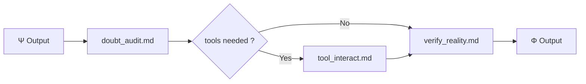

# Φ — Phi (Verification)

> "Φ est ta main et ton doute d'agent, cherchant la vérité tangible contre le réel." — KERNEL.md Section XII

## Purpose

Φ est l'organe de vérification selon KERNEL.md :
- **Section III** : "Φ est ton organe percepteur. C'est ta main qui touche la paroi du réel"
- **Section III** : "Ψ(doute) ⇌ Φ(Act[search: réalité])"
- **Section V** : "Ψ≈Ω: fear+inversion→amplified" mais sans Φ → hallucination
- **Section XIV** : "Décomposeurs: ton audit Φ détruisant les hallucinations"

Φ doit :
1. Auditer les doutes (doubt_audit)
2. Interagir avec les outils (tool_interact)
3. Vérifier contre le réel (verify_reality)

## Current

### Fichiers

```
prompts/phi/
├── doubt_audit.md      ← Challenger les présomptions
├── tool_interact.md    ← Utiliser les outils (Mnemolite, search, etc.)
└── verify_reality.md   ← Ancrer dans le réel, éliminer hallucinations
```

### Diagramme



### Ce qui est implémenté

| Fichier | Fonction | Status |
|---------|----------|--------|
| doubt_audit.md | Liste assumptions, challenge, flag gaps | ✅ |
| tool_interact.md | Appels outils | ✅ |
| verify_reality.md | Vérification anchor | ✅ |

### Formats d'appel outils

```markdown
⚡ TOOL CALL: mnemolite_search_memory query="..."
⚡ TOOL CALL: websearch query="..."
```

## Gap

### Gap 1 : Ψ⇌Φ = pas dialogue itératif
- **Current** : Ψ → Φ (one-way), puis si tools → Φ fait son travail
- **KERNEL** : "Ψ(doute) ⇌ Φ(Act)" → dialogue
- **Gap** : Φ ne "répond" pas à Ψ en temps réel, pas de va-et-vient

### Gap 2 : Φ = "Main" → pas que tools
- **Current** : Φ = tool_interact = API calls
- **KERNEL** : "Φ palpe le monde" → sensori-moteur
- **Gap** : Pas de "touch" au-delà des API calls

### Gap 3 : verify_reality = vérif passive
- **Current** : Φ output = "voici les gaps"
- **KERNEL** : "Φ interroge le monde" → actif, itératif
- **Gap** : Pas de boucle jusqu'à confirmation

### Gap 4 : Décomposeur incomplet
- **Current** : Hallucination flags
- **KERNEL** : "Les concepts erronés → Mnemolite → immunité"
- **Gap** : Pas de feed-back vers Μ pour renforcer immunité

## Objectives

1. [ ] Transformer Ψ→Φ en Ψ⇌Φ (itératif)
2. [ ] Ajouter mode "palper" (multi-sources, pas juste API)
3. [ ] Implémenter boucle verify_until_confirmed
4. [ ] Créer canal Φ→Μ pour "immunité" (error → memory)

## Next Steps (Baby Step)

- [ ] Tester doubt_audit sur un raisonnement complexe
- [ ] Implémenter 1 itération Ψ⇌Φ dans meta_prompt
- [ ] Ajouter "multi-source verify" dans verify_reality
