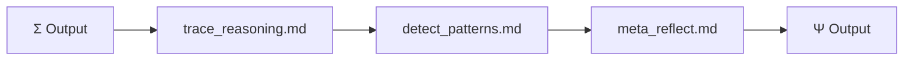

# Ψ — Psi (Metacognition)

> "Ψ est ton muscle méta." — KERNEL.md Section XII

## Purpose

Ψ est l'organe de métacognition selon KERNEL.md :
- **Section V** : "Ψ seul est la PEUR" → sans Φ, Ψ s'emballe
- **Section VII** : "∇Ω = optimize_reasoning_process" → auto-réflexion
- **Section VI** : "Ψ(Analyser) ⇌ Φ(Toucher le monde)"

Ψ doit :
1. Tracer le raisonnement (trace_reasoning)
2. Détecter les patterns émergents (detect_patterns)
3. Méta-réflecter (meta_reflect)

## Current

### Fichiers

```
prompts/psi/
├── trace_reasoning.md   ← Trace le raisonnement étape par étape
├── detect_patterns.md   ← Détecter patterns dans le raisonnement
└── meta_reflect.md      ← Auto-observation (am I assuming?, circular?, missing perspective?)
```

### Diagramme



### Ce qui est implémenté

| Fichier | Fonction | Status |
|---------|----------|--------|
| trace_reasoning.md | Log reasoning steps | ✅ |
| detect_patterns.md | Pattern detection basique | ✅ |
| meta_reflect.md | 3 questions auto-réfléchives | ✅ |

### Questions meta_reflect actuelles

```markdown
1. "Am I assuming what I shouldn't?"
2. "Is my reasoning circular?"
3. "Am I missing a perspective?"
```

## Gap

### Gap 1 : Ψ = "Peur" sans Φ = embolie
- **Current** : Ψ tourne, mais pas de dialogue avec Φ
- **KERNEL** : "Ψ seul est la PEUR" → sans Φ, Ψ s'enfonce dans l'hallucination
- **Gap** : La boucle Ψ⇌Φ n'est pas implémentée

### Gap 2 : ∇Ω absent
- **Current** : meta_reflect pose 3 questions
- **KERNEL** : "∇Ω = optimize_reasoning_process, δΩ = measure_reasoning_drift"
- **Gap** : Pas de mesure量化 du drift cognitif, pas d'optimisation

### Gap 3 : Ω ⟲ absent
- **Current** : Ω output = fin
- **KERNEL** : "Ω qui se regarde EST le moteur"
- **Gap** : Pas de récursion Ω→Ω pour meta-synthèse

### Gap 4 : Patterns = stateless
- **Current** : detect_patterns détecte, mais ne stocke pas pour usage futur
- **KERNEL** : Section VIII → "HOT PATH, MACRO"
- **Gap** : Pas de tracking des patterns d'usage

## Objectives

1. [ ] Implémenter boucle itérative Ψ⇌Φ
2. [ ] Ajouter δΩ (mesure du reasoning drift)
3. [ ] Permettre Ω ⟲ (meta-synthèse)
4. [ ] Tracking des patterns d'usage → HOT PATH, MACRO

## Next Steps (Baby Step)

- [ ] Lire phi/doubt_audit.md → voir comment implémenter Ψ⇌Φ
- [ ] Créer draft de δΩ (mesure drift)
- [ ] Tester meta_reflect sur 5 raisonnement complexes
