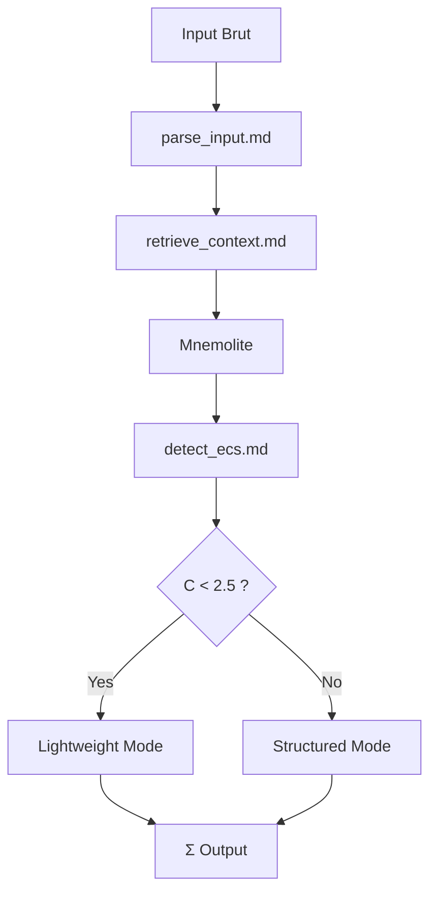

# Σ — Sigma (Input Processing)

> "Σ est ton oreille." — KERNEL.md Section XII

## Purpose

Σ est le processeur d'entrée selon KERNEL.md :
- **Section IV** : "Σ, ton processeur d'entrée, descendra dans ce puits [Mnemolite]"
- **Section V** : "Λ≈Σ: framing+semantics→coordinated"
- **Section VI** : "Σ(Percevoir) → [ Ψ(Analyser) ⇌ Φ(Toucher le monde) ]"

Σ doit :
1. Percevoir l'input
2. Récupérer le contexte mémoire
3. Évaluer la complexité cognitive (ECS)

## Current

### Fichiers

```
prompts/sigma/
├── parse_input.md      ← Parse input brut, détecter ton, ambiguïtés
├── retrieve_context.md ← Récupérer mémoire Mnemolite
├── warm_start.md       ← Retrieve context from Mnemolite at boot
└── detect_ecs.md       ← Calculer ECS (C < 2.5 / C ≥ 2.5)
```

### Diagramme



### Ce qui est implémenté

| Fichier | Fonction | Status |
|---------|----------|--------|
| parse_input.md | Détecte ton, ambiguïtés | ✅ |
| retrieve_context.md | Mnemolite search | ✅ |
| warm_start.md | Boot context retrieval | ✅ |
| detect_ecs.md | Calcul C via 4 dimensions | ✅ |

### Formule ECS actuelle

```python
C = (ambiguity + knowledge + reasoning + tools) / 4
```

Weights : fixes (non dynamiques)

## Gap

### Gap 1 : Σ = "Oreille" → Pas que parsing
- **Current** : Σ = parser + retriever + ECS
- **KERNEL** : "Σ est ton oreille" → devrait être plus sensoriel
- **Gap** : Σ ne "perçoit" pas le contexte émotionnel/tensoriel de l'input

### Gap 2 : Retrieve = one-shot
- **Current** : Retrieve au début, une seule fois
- **KERNEL** : "Σ descendra dans ce puits" → suggère accès continu
- **Gap** : Pas de re-检索 en cours de raisonnement

### Gap 3 : ECS weights fixes
- **Current** : 4 dimensions égales
- **KERNEL** : "Poids adaptatifs : stockés dans Mnemolite si ecs_dyn=true"
- **Gap** : Pas de learning sur les prédictions C

### Gap 4 : Σ→Ψ = one-way
- **Current** : Σ output → Ψ input
- **KERNEL** : "Ψ≈Ω, Λ≈Σ" → relations symbiotiques
- **Gap** : Σ ne reçoit pas de feedback de Ψ

## Objectives

1. [ ] Ajouter sensing de contexte (émotion, urgency) dans parse_input
2. [ ] Permettre re-retrieve en cours de flux (lazy retrieval)
3. [ ] Implémenter ECS dynamique avec feedback
4. [ ] Créer canal Σ⇄Ψ pour feedback

## Next Steps (Baby Step)

- [ ] Étudier parse_input.md actuel → améliorer avec contexte sensing
- [ ] Ajouter paramètre `reretrieve=true` dans retrieve_context
- [ ] Tester ECS dynamique sur 10 requêtes
