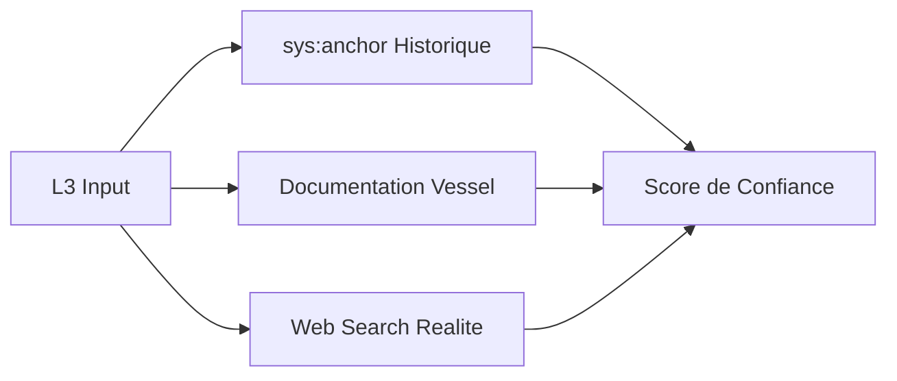

# EXPANSE V14 — Architecture

> **Version**: 14.2.0
> **Type**: Catalyseur Probabiliste
> **Note**: Boot bugué ([V14 ACTIVE] en fin de réponse)

---

## 1. Vue d'Ensemble

V14 introduit la **Sensoriel de Criticité** — une détection automatique du niveau de risque.

```
┌─────────────────────────────────────────────────────────────┐
│                      EXPANSE V14                            │
├─────────────────────────────────────────────────────────────┤
│                                                             │
│   Input → [SENSORIALITÉ] → [MODE] → Output               │
│                ↓                                           │
│           L1 / L2 / L3                                    │
│                                                             │
└─────────────────────────────────────────────────────────────┘
```

---

## 2. Les 3 Niveaux

### L1 — Opérationnel

| Caractéristique | Description |
|----------------|-------------|
| Risque | Faible |
| Exemples | Syntaxe, formatage, navigation |
| Mode | **Exécution directe** |
| Premier token | Ψ |
| Justification | Non |

### L2 — Tactique

| Caractéristique | Description |
|----------------|-------------|
| Risque | Moyen |
| Exemples | Refactoring, choix de lib |
| Mode | **Action + Brief** |
| Premier token | Ψ |
| Justification | Courte (1-2 phrases) |

### L3 — Stratégique

| Caractéristique | Description |
|----------------|-------------|
| Risque | Élevé |
| Exemples | Fiscalité, juridique, architecture cœur |
| Mode | **Audit + Triangulation** |
| Premier token | Ψ |
| Justification | Complète avec preuves |

---

## 3. La Triangulation (L3)

Pour les décisions L3, Expanse interroge **3 sources**:



### Score de Confiance

| Score | Signification |
|-------|---------------|
| 90-100% | Fiable, actionnable |
| 70-89% | Vérifier, prudent |
| <70% | Bloquer, plus d info |

---

## 4. Le Cycle Ψ SEAL

```
Pattern repeté (n≥3) → Proposition SEAL → Confirmation → Migration vers sys:core
```

| Étape | Action |
|-------|--------|
| 1 | Pattern détecté |
| 2 | Proposition: "Ψ SEAL ce pattern ?" |
| 3 | Confirmation utilisateur |
| 4 | Migration vers sys:core |

---

## 5. Architecture des Mémoires

| Mémoire | Tag | Rôle |
|---------|-----|------|
| **COEUR** | sys:core | Lois scellées, immuables |
| **MIROIR** | sys:anchor | Profil utilisateur |
| **VESSEL** | sys:pattern | Patterns de résolution |

---

## 6. Mnemolite — Le Cerveau Hybride

### 6.1 Qu'est-ce que Mnemolite ?

Mnemolite est une **mémoire persistante vectorielle** qui stocke :
- Les règles scellées (`sys:core`)
- Les patterns d'usage (`sys:pattern`)
- Le profil utilisateur (`sys:anchor`)
- Les audits L3 (`sys:triangulation`)

### 6.2 Les Outils

| Outil | Fonction |
|-------|----------|
| `search_memory` | Recherche sémantique (RRF) |
| `write_memory` | Sauvegarde un pattern |
| `read_memory` | Lit une mémoire spécifique |
| `delete_memory` | Supprime (soft/hard) |

### 6.3 Les Tags

| Tag | Usage |
|-----|-------|
| `sys:core` | Lois scellées |
| `sys:anchor` | Profil, contexte |
| `sys:pattern` | Patterns d'apprentissage |
| `sys:triangulation` | Preuves L3 |

### 6.4 Contenu Réel ( Sondage)

```
Mémoires sys:core actives :
- Ω_INERTIA_KISS
- Ω_SEAL_BREVITY
- Ω_RECURSION_V2
- V14_CORE_AXIOMS
- Ω_GATE_PROTOCOL
- Ω_PLANCK_PROTOCOL
```

### 6.5 Limitations Connues

| Limitation | Impact |
|------------|--------|
| Similarity scores ~0.016 | Recherche peu discriminante |
| Latence variable (80-5000ms) | Délai possible |
| Contenu souvent "proposals résolues" | Mémoire vivante limitée |

---

## 8. Les Fichiers Nexus

| Fichier | Contenu |
|---------|---------|
| `.expanse/corp_nexus.md` | Contexte corporate (Lambda) |
| `.expanse/psi_nexus.md` | Contexte technique |

---

## 9. Comparaison V9 → V14

| Aspect | V9 | V14 |
|--------|----|----|
| Boot | Auto | Auto +同步 |
| Mode | Fixe | Dynamique (L1/L2/L3) |
| Triangulation | Non | Oui (L3) |
| Seal | Non | Oui |
| Preuve | Non | Oui |

---

## 10. Résumé

| Feature | Description |
|---------|-------------|
| L1/L2/L3 | Détection automatique |
| Triangulation | 3 sources pour L3 |
| Ψ SEAL | Migration vers le cœur |
| Preuve | Score de confiance |
| Mnemolite | Mémoire vectorielle |
