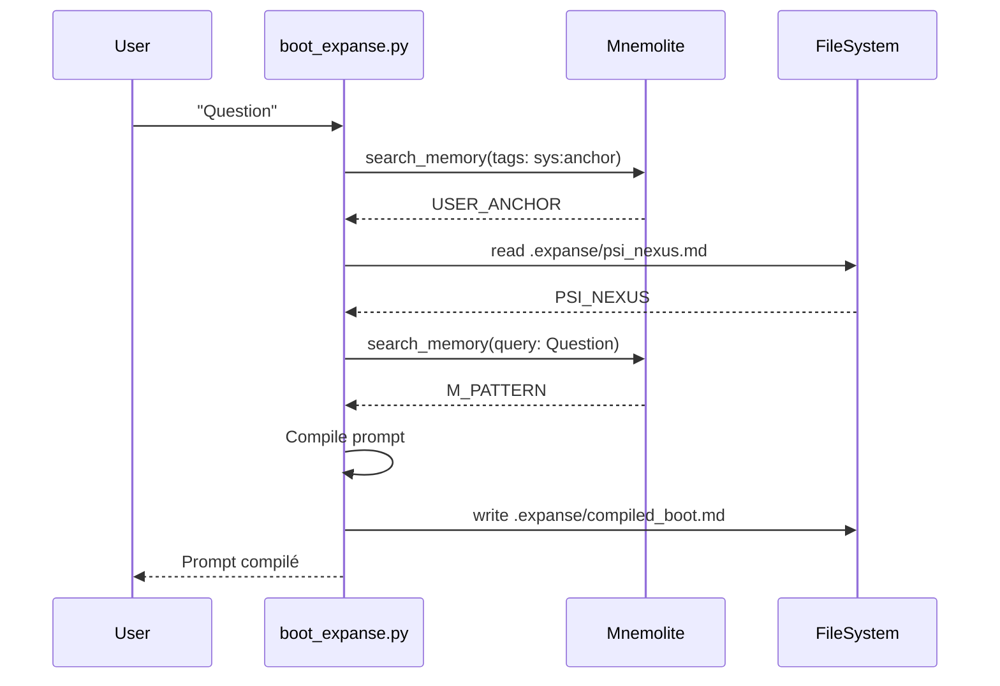
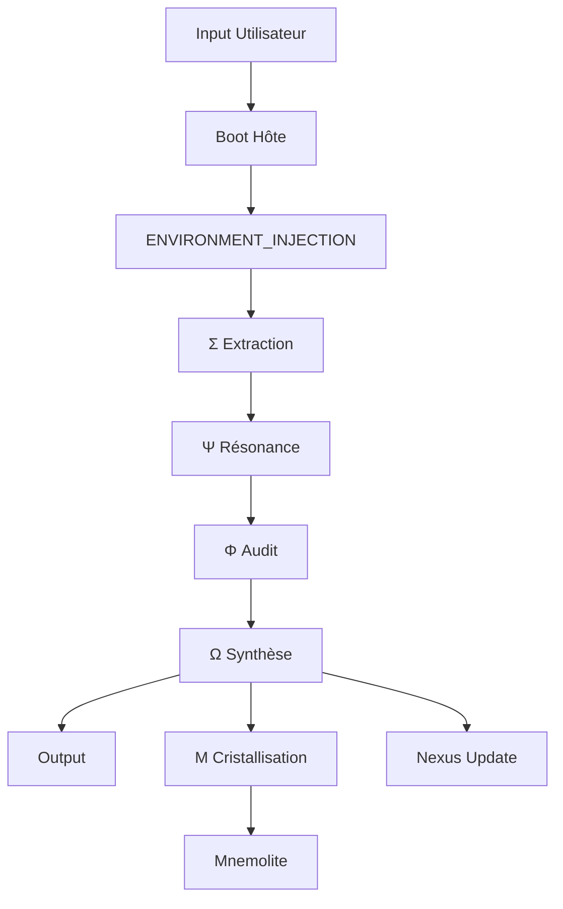
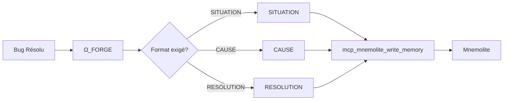

# EXPANSE V8.0 — Architecture

> **Version**: 8.0.0
> **Architecture**: Osmose Dualiste

---

## 1. Vue d'Ensemble

EXPANSE V8.0 repose sur le principe de l'**Osmose Dualiste** : la séparation entre l'Hôte (infrastructure) et l'Organisme (LLM).

```
┌─────────────────────────────────────────────────────────────────┐
│                        EXPANSE V8.0                             │
├─────────────────────────────────────────────────────────────────┤
│  ┌─────────────────┐       ┌─────────────────────────────────┐ │
│  │    HÔTE        │       │         ORGANISME               │ │
│  │  (Python)      │       │          (LLM)                 │ │
│  │                │       │                                 │ │
│  │  - boot_expanse│       │  - System Prompt V8.1          │ │
│  │  - Mnemolite   │──────▶│  - Répond avec ΣΨΦΩΜ          │ │
│  │  - Nexus       │       │  - Met à jour Nexus            │ │
│  └─────────────────┘       └─────────────────────────────────┘ │
└─────────────────────────────────────────────────────────────────┘
```

---

## 2. Architecture des Composants

### 2.1 L'Hôte (Host)

| Composant | Rôle | Emplacement |
|-----------|------|-------------|
| `boot_expanse.py` | Compile le prompt | `scripts/` |
| Mnemolite | Base vectorielle | Service externe |
| PSI_NEXUS | Mémoire projet | `.expanse/psi_nexus.md` |

#### Flux de l'Hôte



### 2.2 L'Organisme (LLM)

| Composant | Rôle |
|-----------|------|
| System Prompt V8.1 | Définit le comportement |
| Σ (Sigma) | Extraction du contexte |
| Ψ (Psi) | Analyse méta-cognitive |
| Φ (Phi) | Audit / Vérification |
| Ω (Omega) | Synthèse / Réponse |
| Μ (Mu) | Cristallisation (write_memory) |

---

## 3. Les 3 Mémoires

### 3.1 Mémoire Long Terme (Mnemolite)

```
Type: Base de données vectorielle
Latence: >500ms
Capacité: ∞
Usage: Profile, Patterns, Solutions passées
```


**Tags utilisés:**

| Tag | Usage |
|-----|-------|
| `sys:anchor` | Profil utilisateur |
| `sys:pattern` | Solutions/bugs résolus |
| `giak` | Filtre utilisateur |

### 3.2 Mémoire Moyen Terme (PSI_NEXUS)

```
Type: Fichier Markdown
Latence: <100ms
Capacité: ~8k tokens
Usage: Contexte projet actuel
```

**Structure:**
```markdown
# PSI_NEXUS : [Projet]
## CONTEXTE IMMÉDIAT
- Ce qu'on fait maintenant
## DÉCISIONS ARCHITECTURALES
- Choix actés
## PROCHAINE ÉTAPE
- Ce qui reste à faire
```

### 3.3 Mémoire Court Terme (Contexte LLM)

```
Type: Fenêtre de contexte
Latence: 0ms
Capacité: 128k-1M tokens
Usage: Session active
```

---

## 4. Le Flux Vital



### Étapes Détaillées

| Étape | Organe | Action |
|-------|--------|--------|
| 1 | Hôte | Compile le contexte |
| 2 | Σ | Lit USER_ANCHOR, NEXUS, PATTERNS |
| 3 | Ψ | Analyse le problème |
| 4 | Φ | Vérifie les souvenirs contre le réel |
| 5 | Ω | Synthétise la réponse |
| 6 | Μ | Grave la solution si bug résolu |

---

## 5. Le Cycle Ω_FORGE

Quand un bug est résolu:



---

## 6. Schéma Global

```mermaid
graph TB
    subgraph "Session Start"
        Python[boot_expanse.py]
        UserInput[Question]
    end
    
    subgraph "Compilation"
        Python --> Mnemo1[Mnemolite<br/>Profile]
        Python --> FS[Nexus]
        Python --> Mnemo2[Mnemolite<br/>Patterns]
    end
    
    subgraph "Prompt"
        Template[expanse-system-v8.md]
        Python --> Template
    end
    
    subgraph "LLM"
        Compiled[compiled_boot.md]
        Template --> Compiled
        Compiled --> LLM[LLM Process]
    end
    
    subgraph "Response"
        LLM --> Answer[Réponse]
        LLM --> Update[Update Nexus]
        LLM --> Store[Store Pattern]
    end
    
    subgraph "Persistence"
        Update --> NexusFile[.expanse/psi_nexus.md]
        Store --> MnemoDB[Mnemolite]
    end
```

---

## 7. Dépendances

| Dépendance | Version | Usage |
|------------|---------|-------|
| Python | 3.10+ | Script lanceur |
| Mnemolite | Latest | Vector DB |
| MCP | Latest | Interface Mnemolite |

---

## 8. Chemins

```
/home/giak/projects/expanse/
├── scripts/
│   └── boot_expanse.py          # Lanceur Hôte
├── prompts/
│   └── expanse-system-v8.md    # KERNEL
├── .expanse/
│   ├── psi_nexus.md            # Mémoire projet
│   └── compiled_boot.md         # Prompt compilé
└── doc/v8/
    └── (cette doc)
```
