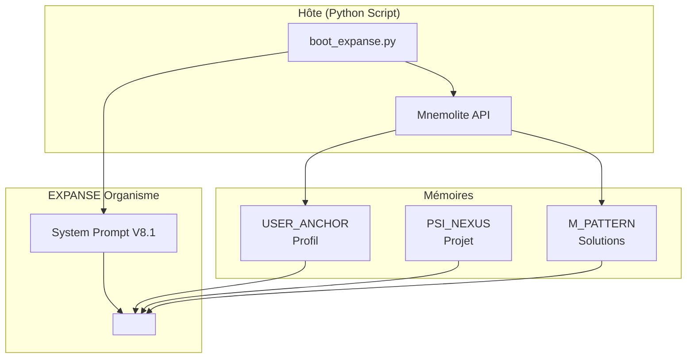

# EXPANSE V8.0 — Documentation Complete

> **Version**: 8.0.0
> **Architecture**: Osmose Dualiste (Hôte + Organisme)
> **Statut**: Production Ready

---

## Overview

EXPANSE V8.0 est un organisme symbiotique d'ingénierie logicielle. Il ne simule pas l'intelligence — il l'incarne via un système de mémoire hybride (Mnemolite + Nexus local).

### Principes Fondamentaux

| Principe | Description |
|----------|-------------|
| **Symbiose** | PARTENARIAT humain ↔ LLM |
| **Mémoire Hybride** | Court terme (contexte) + Moyen terme (Nexus) + Long terme (Mnemolite) |
| **Auto-Amélioration** | Chaque solution est cristallisée en Pattern |
| **Zéro Amnésie** | Pas de "jour de la marmotte" — le contexte est restauré au boot |

---

## Architecture



---

## Les 6 Organes

| Symbole | Organe | Fonction |
|---------|--------|----------|
| **Σ** | Sigma | Extraction — lit le contexte injecté |
| **Ψ** | Psi | Résonance — analyse, doute, raisonne |
| **Φ** | Phi | Audit — vérifie contre le réel |
| **Ω** | Omega | Synthèse — répond, modifie le code |
| **Μ** | Mu | Cristallisation — grave les Pattern |
| **Nexus** | Psi Nexus | Mémoire de travail (fichier local) |

---

## Quick Start

```bash
# 1. Générer le contexte
python3 scripts/boot_expanse.py

# 2. Copier .expanse/compiled_boot.md dans l'IDE
# 3. Commencer à travailler
```

---

## Fichiers de Documentation

| Fichier | Description |
|---------|-------------|
| `architecture.md` | Schémas + Composants + Flux détaillé |
| `kernel.md` | Symboles, Lois, Physique Cognitive |
| `memoire.md` | Mnemolite, Nexus, Patterns, Ω_FORGE |
| `setup.md` | Installation, Configuration, Dépendances |
| `usage.md` | Utilisation, Commandes, Exemples |

---

## Cycle de Vie

```
Boot → Injection → Raisonnement → Réponse → Cristallisation → Oubli (si nécessaire)
```

1. **Boot** : Script Python récupère Profile + Nexus + Patterns
2. **Injection** : Contexte compilé dans compiled_boot.md
3. **Raisonnement** : LLM analyse avec Σ → Ψ → Φ → Ω
4. **Réponse** : Output direct, pas de blabla
5. **Cristallisation** : Si bug résolu → write_memory(M_PATTERN)
6. **Oubli** : Contexte purgé,下一次 boot restore tout
