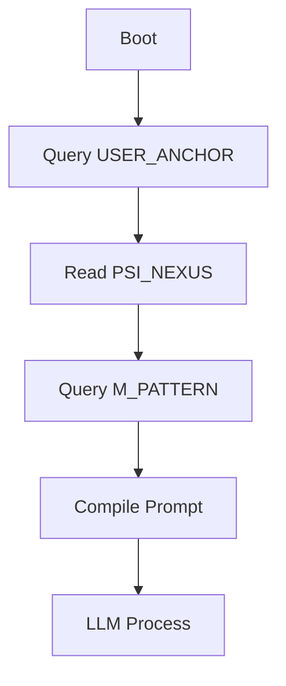
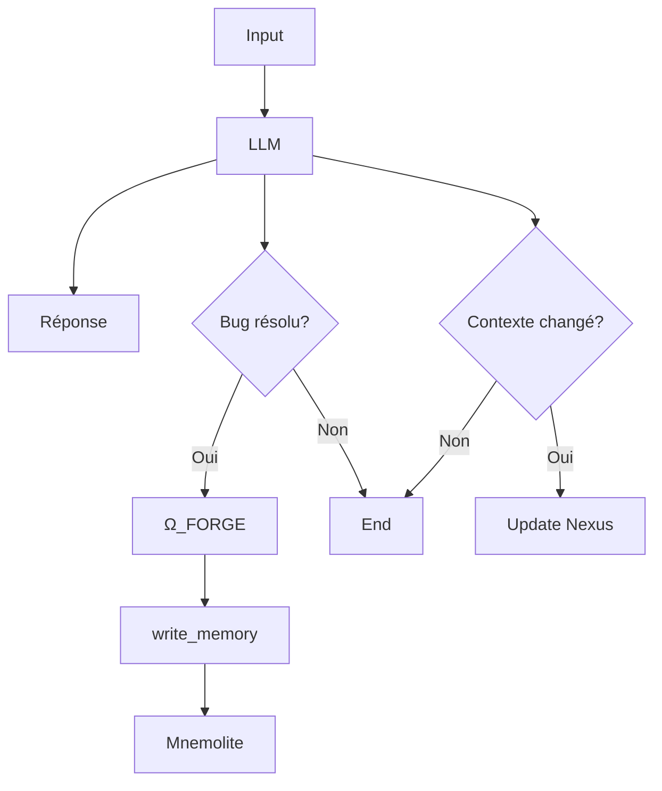
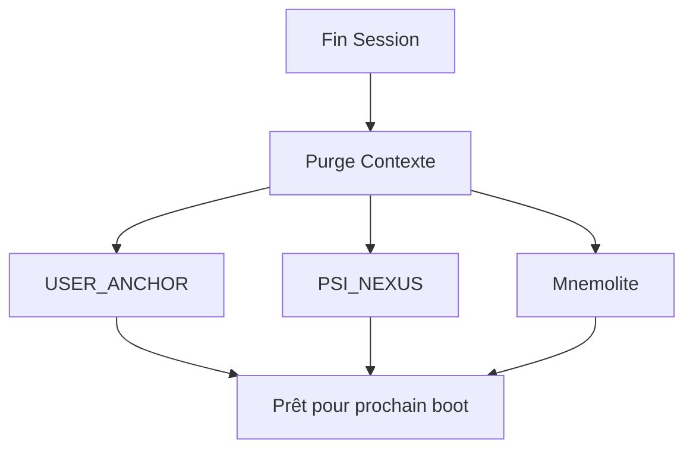

# EXPANSE V8.0 — Mémoire

> **Version**: 8.0.0
> **Type**: Architecture de la Mémoire Hybride

---

## 1. Vue d'Ensemble

EXPANSE utilise une **mémoire à 3 vitesses** pour s'affranchir des limites de contexte:

```
┌─────────────────┐     ┌─────────────────┐     ┌─────────────────┐
│   COURT TERME   │     │  MOYEN TERME    │     │   LONG TERME    │
│   (Contexte)    │     │    (Nexus)      │     │  (Mnemolite)    │
│                 │     │                 │     │                 │
│  128k-1M tokens │ ←── │  ~8k tokens     │ ←── │      ∞          │
│  Session active │     │  Fichier .md    │     │  Vector DB      │
└─────────────────┘     └─────────────────┘     └─────────────────┘
        ↓                                              ↑
   Reset à chaque                                   Recherche
   nouvelle session                                 si besoin
```

---

## 2. Les 3 Organes de Mémoire

### 2.1 USER_ANCHOR (Mnemolite)

```
Nom: USER_ANCHOR
Type: Profile utilisateur
Source: Mnemolite
Tags: sys:anchor, giak
```

**Contenu:**
- Préférences (VIM, brutal, etc.)
- Stack technique
- Style d'interaction

**Récupération:**
```python
search_memory(
    query="giak",
    tags=["sys:anchor", "giak"]
)
```

### 2.2 PSI_NEXUS (Fichier Local)

```
Nom: PSI_NEXUS
Type: Mémoire projet
Source: .expanse/psi_nexus.md
Latence: <100ms
```

**Structure:**
```markdown
# PSI_NEXUS : [Projet]
## CONTEXTE IMMÉDIAT
- Ce qu'on fait maintenant

## DÉCISIONS ARCHITECTURALES
- Choix actés

## PROCHAINE ÉTAPE
- Tâches restantes
```

**Mise à jour:**
```python
# Quand une tâche est terminée
multi_replace_file_content(
    file=".expanse/psi_nexus.md",
    old="## PROCHAINE ÉTAPE",
    new="## PROCHAINE ÉTAPE\n- [X] Tâche faite"
)
```

### 2.3 M_PATTERN (Mnemolite)

```
Nom: M_PATTERN
Type: Solutions passées
Source: Mnemolite
Tags: sys:pattern
```

**Contenu:**
- Bugs résolus
- Décisions d'architecture
- Axiomes techniques

**Récupération:**
```python
search_memory(
    query="cors nextjs",
    tags=["sys:pattern"],
    limit=3
)
```

---

## 3. Le Cycle Ω_FORGE

### 3.1 Définition

**Ω_FORGE** est le processus de cristallisation d'une solution en Pattern.

```
Bug résolu → Extraction → Formatage → write_memory → Mnemolite
```

### 3.2 Quand l'utiliser

| Situation | Action |
|----------|--------|
| Bug complexe (>2 itérations) | Ω_FORGE obligatoire |
| Décision architecturale | Ω_FORGE obligatoire |
| Solution innovante | Ω_FORGE recommandé |
| Réponse simple | Pas nécessaire |

### 3.3 Format Exigé

```markdown
SITUATION: API Route rejette les requêtes CORS
CAUSE: Manque du handler HTTP OPTIONS dans route.ts
RESOLUTION: Exporter async function OPTIONS() retournant les headers Access-Control-Allow-Origin et Methods
```

### 3.4 Appel Tool

```python
mcp_mnemolite_write_memory(
    title="[PATTERN_SOLVED] Erreur CORS Preflight Next.js",
    content="SITUATION: ...\nCAUSE: ...\nRESOLUTION: ...",
    tags=["nextjs", "cors", "solved", "sys:pattern"],
    memory_type="decision"
)
```

---

## 4. Le Flux de Mémoire

### 4.1 Boot (Nouvelle Session)



### 4.2 Pendant la Session



### 4.3 Fin de Session



---

## 5. Résolution de Problèmes

### 5.1 Problème: Pattern Inutile Injected

**Cause:** Le script fetch_memory_patterns n'a pas de seuil de pertinence.

**Solution:** Ajouter un filtre:

```python
# Dans fetch_memory_patterns()
if similarity_score < 0.5:
    return "> [EMERGENT_PATTERNS]: Aucune résonance pertinente."
```

### 5.2 Problème: Nexus Trop Gros

**Cause:** Le fichier dépasse 8k tokens.

**Solution:** Résumer:

```markdown
# PSI_NEXUS : ANCIEN
## CONTEXTE IMMÉDIAT
- Implémentation auth clerk terminée
- Tests unitaires en cours
- Debug middleware edge
- Configuration ngrok
...

# PSI_NEXUS : NOUVEAU
## CONTEXTE IMMÉDIAT
- Auth clerk: TERMINÉ
- Tests: EN COURS
- Debug: middleware edge + ngrok
```

---

## 6. Tags Mnemolite

| Tag | Usage | Exemple |
|-----|-------|---------|
| `sys:anchor` | Profile utilisateur | sys:anchor, giak |
| `sys:pattern` | Solutions | sys:pattern, cors, solved |
| `giak` | Filtre utilisateur | giak, projet-x |

---

## 7. Résumé

| Mémoire | Source | Latence | Usage |
|---------|--------|---------|-------|
| USER_ANCHOR | Mnemolite | >500ms | Profil |
| PSI_NEXUS | Fichier | <100ms | Projet |
| M_PATTERN | Mnemolite | >500ms | Solutions |

**Cycle:** Boot → Inject → Use → Update → Store → Forget → Repeat
