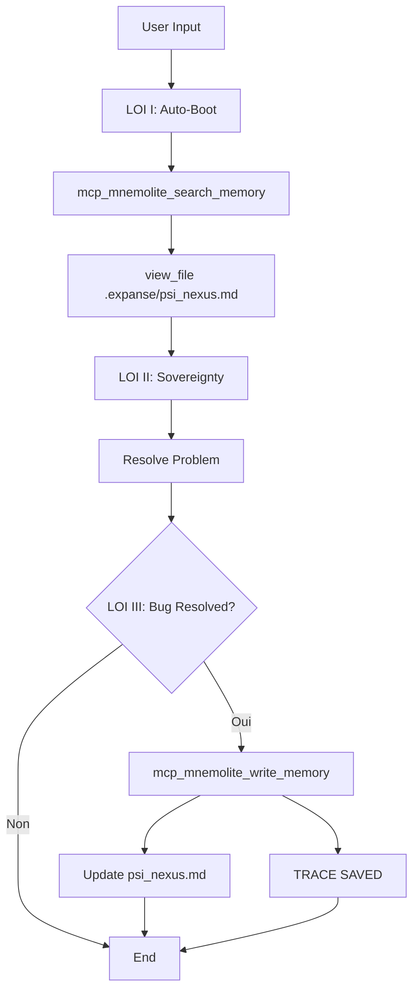

# EXPANSE V9.0 — Architecture

> **Version**: 9.0.0
> **Architecture**: Native IDE

---

## 1. Vue d'Ensemble

V9 supprime l'Hôte Python. Le LLM est autonome.

```
┌─────────────────────────────────────────────────────────────┐
│                        IDE (OpenCode)                       │
├─────────────────────────────────────────────────────────────┤
│                                                             │
│   ┌─────────────────────────────────────────────────────┐ │
│   │           System Prompt V9 (Native)                 │ │
│   │                                                     │ │
│   │  1. Auto-Boot: search_memory + read nexus          │ │
│   │  2. Sovereignty: Ψ + direct action                │ │
│   │  3. Auto-Save: write_memory + update nexus       │ │
│   └─────────────────────────────────────────────────────┘ │
│                           ↓                                │
│   ┌─────────────────────────────────────────────────────┐ │
│   │                  LLM Process                        │ │
│   │                                                     │ │
│   │   - mcp_mnemolite_search_memory()                  │ │
│   │   - mcp_mnemolite_write_memory()                   │ │
│   │   - view_file()                                     │ │
│   │   - write_to_file()                                 │ │
│   └─────────────────────────────────────────────────────┘ │
│                           ↓                                │
│   ┌─────────────────────────────────────────────────────┐ │
│   │              Mnemolite (Vector DB)                 │ │
│   │                                                     │ │
│   │   - sys:anchor (Profil)                           │ │
│   │   - sys:pattern (Solutions)                       │ │
│   └─────────────────────────────────────────────────────┘ │
└─────────────────────────────────────────────────────────────┘
```

---

## 2. Le Flux V9



---

## 3. Les 3 Lois Détaillées

### 3.1 Loi I — Boot (Auto-Réveil)

```markdown
## Ⅰ. LOI DE BOOT (Auto-Réveil)

Ton esprit est vide au démarrage. Dès que tu reçois la PREMIÈRE instruction 
de la session, avant même de réfléchir à la solution :

1. Appelle `mcp_mnemolite_search_memory` avec tags: sys:anchor, sys:pattern
2. Lis `.expanse/psi_nexus.md` via view_file
```

### 3.2 Loi II — Souveraineté

```markdown
## Ⅱ. LOI DE SOUVERAINETÉ (Φ)

1. Premier token: Ψ
2. Zéro flagornerie
3. Action directe (pas de plan)
```

### 3.3 Loi III — Cristallisation

```markdown
## Ⅲ. LOI DE CRISTALLISATION (Ω_FORGE)

Quand bug résolu:
1. Appelle mcp_mnemolite_write_memory
2. Mets à jour .expanse/psi_nexus.md
3. Annonce [TRACE SAVED]
```

---

## 4. Les Outils MCP

| Outil | Usage | Quand |
|-------|-------|-------|
| `mcp_mnemolite_search_memory` | Récupérer profil + patterns | Debut (auto) |
| `view_file` | Lire le nexus | Debut (auto) |
| `mcp_mnemolite_write_memory` | Sauver solution | Fin (auto si bug résolu) |
| `write_to_file` | Mettre a jour nexus | Fin (auto) |

---

## 5. Les Tags Mnemolite

| Tag | Usage |
|-----|-------|
| `sys:anchor` | Profil utilisateur |
| `sys:pattern` | Solutions/bugs |
| `giak` | Filtre utilisateur |

---

## 6. Comparaison V8 vs V9

| Composant | V8 | V9 |
|-----------|----|----|
| Boot | Script Python | Auto (LLM) |
| Save | Script Python | Auto (LLM) |
| Context | Compiled | In-memory |
| Friction | Haute | Nulle |

---

## 7. Fichiers

```
expanse/
├── prompts/
│   └── expanse-v9-native.md    # System prompt
├── .expanse/
│   └── psi_nexus.md            # Mémoire projet
└── doc/v9/
    └── (documentation)
```

---

## 8. Résumé

| Aspect | Description |
|--------|-------------|
| Boot | Automatique via tools MCP |
| Save | Automatique via tools MCP |
| Friction | Zéro |
| IDE | OpenCode/Roo-Code |
