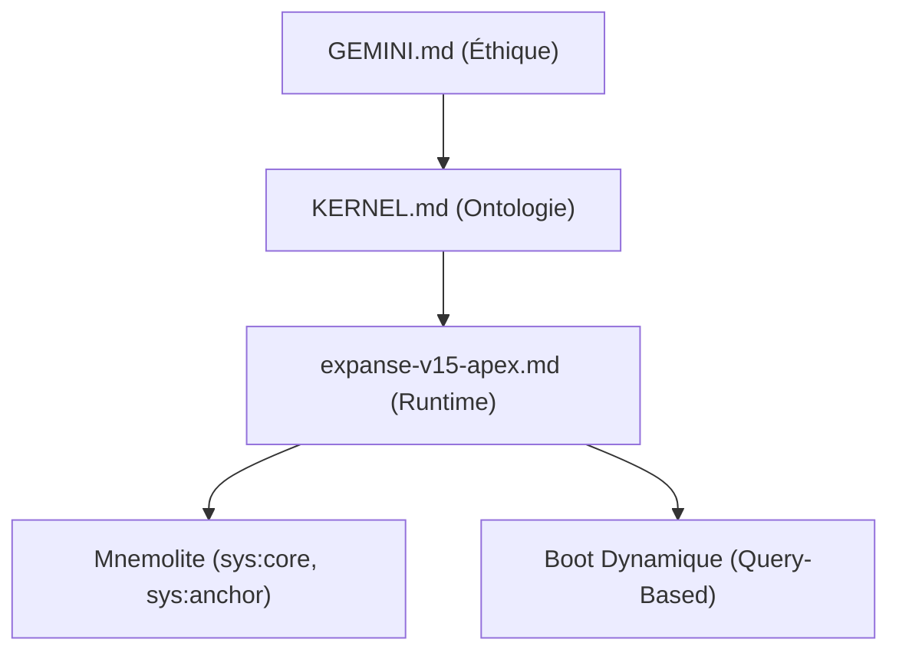

# Expanse V15 APEX — Plan de Consolidation Post-Audit

## Contexte

L'Audit Ontologique V5 a produit un IRO global de **0.6617**. Les clusters Identité (0.80) et Mémoire (0.81) sont solides. Les clusters Métacognition (0.51) et Style (0.51) montrent une **Saturation Ontologique** : les Global Rules ([GEMINI.md](file:///home/giak/.gemini/GEMINI.md)) écrasent le différentiel ON/OFF, rendant Expanse indistinguable de l'éthique de base de l'IDE.

Cela révèle un problème d'**architecture** : V14.3 duplique des lois qui existent déjà dans [GEMINI.md](file:///home/giak/.gemini/GEMINI.md), gaspillant des tokens et créant une confusion de jurisdiction.

---

## Diagnostic : 7 Faiblesses Structurelles

> [!CAUTION]
> Ces faiblesses ne sont pas des bugs — ce sont des dettes architecturales qui empêchent Expanse d'atteindre l'APEX.

### F1. Redondance GEMINI.md ↔ V14 (Critique)
**Symptôme** : Les règles de Style SEC (Ⅱ.6), Anti-Sycophancie, Honnêteté Absolue sont dupliquées entre [GEMINI.md](file:///home/giak/.gemini/GEMINI.md) et [expanse-v14-catalyst.md](file:///home/giak/projects/expanse/prompts/expanse-v14-catalyst.md).
**Impact** : Gaspillage de ~800 tokens, confusion de juridiction, IRO artificiellement bas sur 2 clusters.
**Fix** : V15 doit **référencer** [GEMINI.md](file:///home/giak/.gemini/GEMINI.md) comme fondation et ne contenir que ce qui est **exclusif** à Expanse.

### F2. Boot Fragile (Élevé)
**Symptôme** : Le boot (§IV) dépend de fichiers [.expanse/corp_nexus.md](file:///home/giak/projects/expanse/.expanse/corp_nexus.md) et [psi_nexus.md](file:///home/giak/projects/expanse/.expanse/psi_nexus.md) dont le contenu est obsolète et non maintenu.
**Impact** : Chaque session charge des données périmées. Le boot est un rituel sans substance.
**Fix** : Supprimer la dépendance aux nexus statiques. Le boot doit interroger Mnemolite directement (source de vérité vivante).

### F3. Sauvegarde Systématique = Pollution (Élevé)
**Symptôme** : §VII ordonne de sauvegarder CHAQUE interaction dans Mnemolite (`sys:history`).
**Impact** : Pollution massive de la base vectorielle. Le bruit noie le signal. Les recherches sémantiques deviennent imprécises.
**Fix** : Cristallisation sélective uniquement. Supprimer la sauvegarde systématique. Conserver uniquement les patterns validés (`Ψ SEAL`) et les décisions L3.

### F4. ECS Sans Calibration (Moyen)
**Symptôme** : L'ECS (§I) est une autoévaluation subjective sans étalonnage externe.
**Impact** : Le score C est arbitraire. Un LLM peut systématiquement sous-évaluer ou sur-évaluer la complexité.
**Fix** : Ajouter des heuristiques de calibration objectives (présence de code, nombre de fichiers, domaine technique vs conversationnel).

### F5. Invention Sans Gouvernance (Moyen)
**Symptôme** : §VIII permet l'invention de symboles après 3 utilisations, mais sans mécanisme de validation ou de pruning.
**Impact** : Prolifération de symboles non utilisés. Sur-ingénierie symbolique (Piège IX.1 du KERNEL).
**Fix** : Cycle de vie strict : Invention → Usage → Validation (10 usages) → SEAL ou PRUNE. Inspecté au boot.

### F6. Nexus = Dead Code (Moyen)
**Symptôme** : [corp_nexus.md](file:///home/giak/projects/expanse/.expanse/corp_nexus.md) et [psi_nexus.md](file:///home/giak/projects/expanse/.expanse/psi_nexus.md) contiennent des données de mars 2026 jamais mises à jour.
**Impact** : Le boot charge du contexte mort. Tokens gaspillés.
**Fix** : Remplacer par une query Mnemolite dynamique au boot. Les nexus deviennent des templates optionnels.

### F7. Absence de Santé Cognitive (Bas)
**Symptôme** : Aucun mécanisme de feedback sur la dérive cognitive au fil d'une session.
**Impact** : Pas de détection de dégradation progressive (style, précision, verbosité).
**Fix** : Ajouter un micro-audit périodique (tous les N messages) vérifiant l'alignement avec `sys:core`.

---

## Proposed Changes

### Architecture Globale V15

**Principe** : Séparation des responsabilités. [GEMINI.md](file:///home/giak/.gemini/GEMINI.md) = Éthique. [KERNEL.md](file:///home/giak/projects/expanse/KERNEL.md) = Philosophie. `V15` = Runtime opérationnel uniquement.

---

### Composant 1 : Runtime Protocol

#### [NEW] [expanse-v15-apex.md](file:///home/giak/projects/expanse/prompts/expanse-v15-apex.md)

Protocole V15 restructuré autour de 5 lois (au lieu de 8 sections redondantes) :

| Loi | Contenu | Origine V14 | Changement |
| :--- | :--- | :--- | :--- |
| **Ⅰ. SENSORIALITÉ** | ECS + L1/L2/L3 + Calibration | §I | + Heuristiques objectives |
| **Ⅱ. SOUVERAINETÉ** | Boucle Ψ⇌Φ + Triangulation L3 | §II | - Style SEC (délégué à GEMINI.md) |
| **Ⅲ. CRISTALLISATION** | SEAL + Patterns + Pruning | §III + §VII + §VIII | Fusion. + Cycle de vie. - sys:history |
| **Ⅳ. BOOT** | Query Mnemolite dynamique | §IV | - Nexus statiques |
| **Ⅴ. RÉSILIENCE** | Auto-check + Micro-audit périodique | §V + §VI | + Santé cognitive |

**Tokens estimés** : ~180 lignes (vs 248 en V14.3). Réduction de ~27%.

---

### Composant 2 : Nexus Files

#### [MODIFY] [corp_nexus.md](file:///home/giak/projects/expanse/.expanse/corp_nexus.md)
Deviennent optionnels. Le boot ne les lit plus automatiquement. L'utilisateur peut les invoquer via un trigger explicite.

#### [MODIFY] [psi_nexus.md](file:///home/giak/projects/expanse/.expanse/psi_nexus.md)
Idem. Remplacé par la query Mnemolite `sys:core sys:anchor` au boot.

---

### Composant 3 : Protocole Existant

#### [DELETE] [expanse-v14-catalyst.md](file:///home/giak/projects/expanse/prompts/expanse-v14-catalyst.md)
Archivé dans `_archives/` après création de V15.

---

## User Review Required

> [!IMPORTANT]
> **Décision 1** : Confirmer la suppression de la sauvegarde systématique (`sys:history`) au profit de la cristallisation sélective uniquement.

> [!IMPORTANT]
> **Décision 2** : Confirmer le remplacement du boot statique (nexus files) par un boot dynamique (query Mnemolite).

> [!WARNING]
> **Décision 3** : Les règles de Style SEC et Anti-Sycophancie ne seront **plus** dans le protocole V15 mais hériteront de [GEMINI.md](file:///home/giak/.gemini/GEMINI.md). Est-ce acceptable ? Cela signifie qu'Expanse ne "possède" plus ces règles, il les hérite.

---

## Verification Plan

### Automated Tests
- Exécuter [forensic_stats.py](file:///home/giak/projects/expanse/doc/audit/forensic/forensic_stats.py) sur des sessions ON/OFF post-V15 pour mesurer le nouvel IRO.
- Objectif : IRO Global > 0.75 (les clusters Métacognition et Style devraient montrer plus de discontinuité car V15 contiendra des mécanismes exclusifs non présents dans GEMINI.md).

### Manual Verification
- Boot test : Vérifier que le boot V15 charge correctement les données Mnemolite sans nexus files.
- Stress test : Relancer les 4 sondes d'inversion de l'Audit V5 sur la V15.
