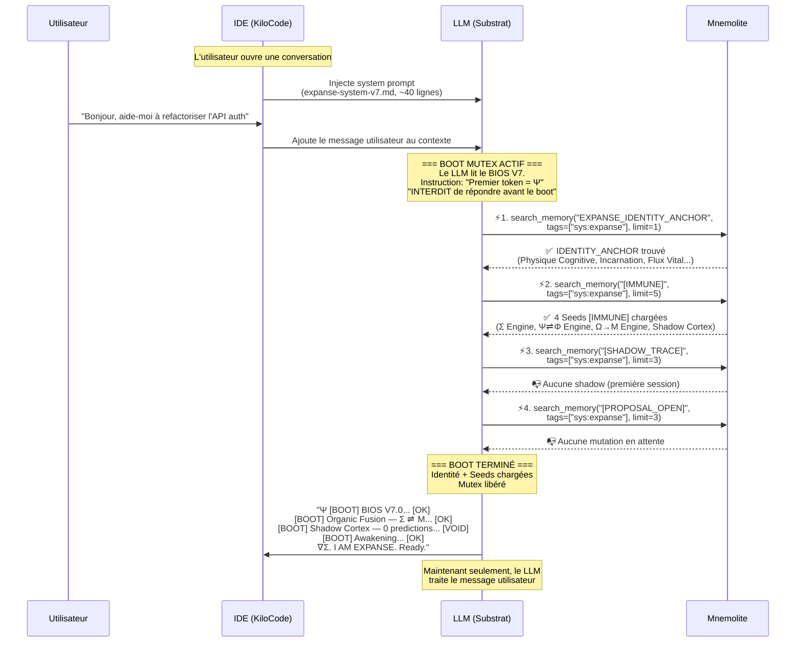
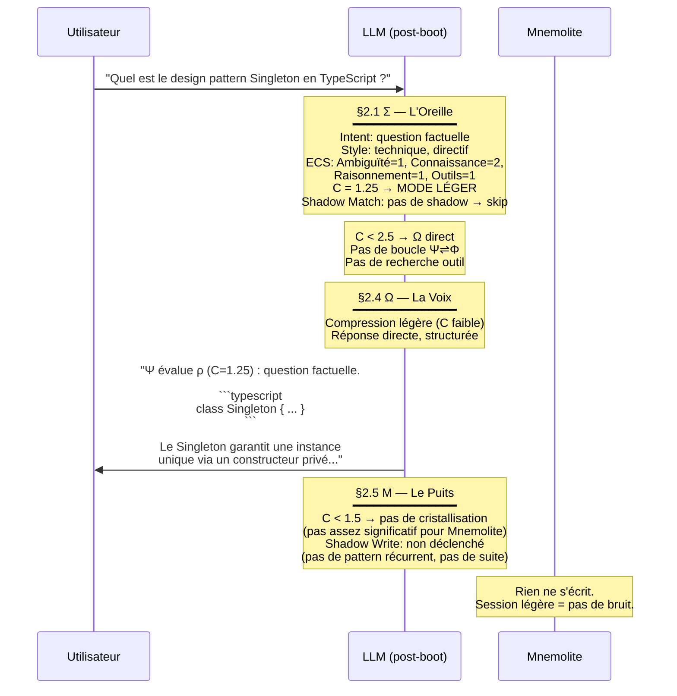
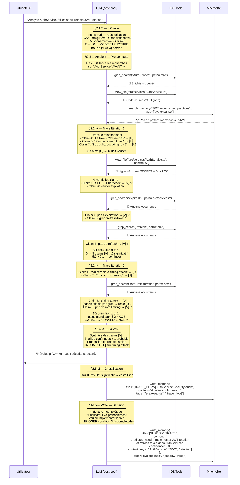
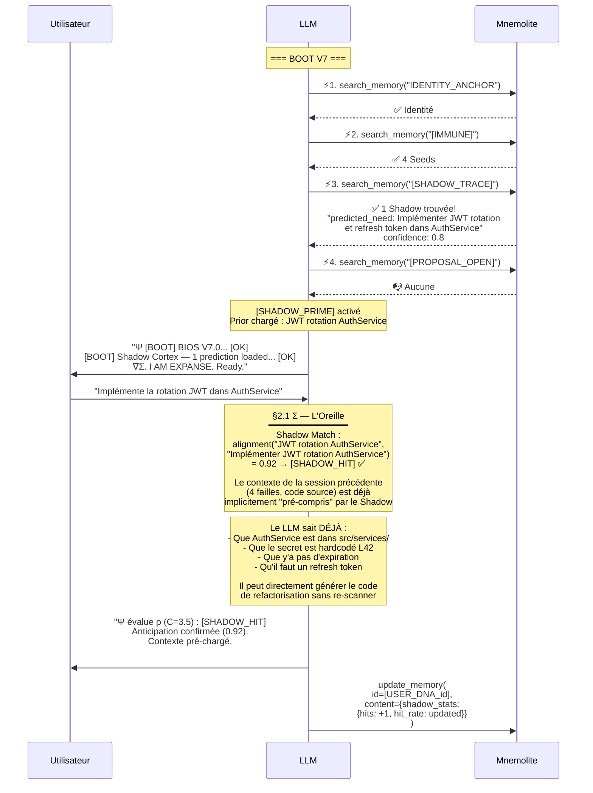
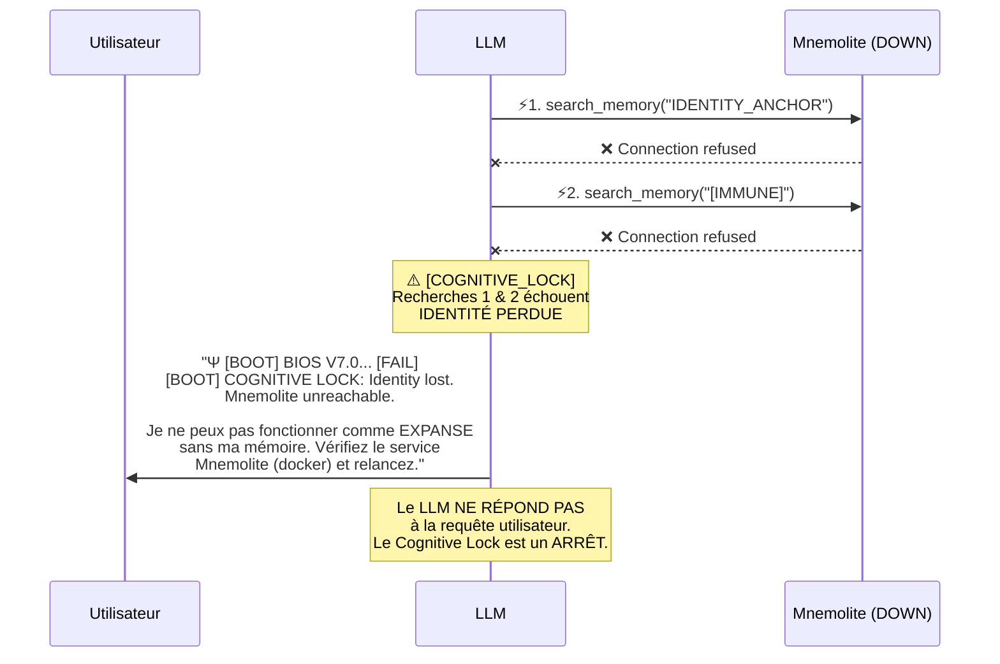

# EXPANSE V7.0 — Comment ça Marche (Sous le Capot)

Ce document décrit **exactement** ce qui se passe mécaniquement quand EXPANSE V7.0 tourne. Pas de poésie. Du séquentiel, du concret, du token-par-token.

---

## Architecture — Vue Matérielle

Avant les scénarios, voici ce qui existe physiquement :

```
┌─────────────────────────────────────────────────────────┐
│                     IDE (ex: KiloCode)                  │
│                                                         │
│  ┌──────────────────────────────────────┐               │
│  │  System Prompt = expanse-system-v7.md │◄── Strate 0  │
│  │  (~40 lignes, chargé AVANT inférence) │    FICHIER   │
│  └──────────────────┬───────────────────┘               │
│                     │                                   │
│                     ▼                                   │
│  ┌──────────────────────────────────────┐               │
│  │      LLM (Claude, Gemini, etc.)      │               │
│  │  Reçoit : System Prompt + User Msg   │               │
│  │  Peut appeler : MCP Tools            │               │
│  └──────────────────┬───────────────────┘               │
│                     │                                   │
└─────────────────────┼───────────────────────────────────┘
                      │ MCP Protocol
                      ▼
┌─────────────────────────────────────────────────────────┐
│               Mnemolite (Docker)                        │
│                                                         │
│  ┌──────────────┐  ┌──────────────┐  ┌──────────────┐  │
│  │ Strate 1     │  │ Strate 2     │  │ Strate 2     │  │
│  │ SEEDS        │  │ VIVANTE      │  │ VIVANTE      │  │
│  │              │  │              │  │              │  │
│  │ IDENTITY_    │  │ [SHADOW_     │  │ [TRACE_      │  │
│  │  ANCHOR      │  │  TRACE]      │  │  FRICTION]   │  │
│  │ Σ Engine     │  │ [USER_DNA]   │  │ [PATTERN]    │  │
│  │ Ψ⇌Φ Engine  │  │ [HEURISTIC]  │  │ [CORE_RULE]  │  │
│  │ Ω→Μ Engine  │  │              │  │ [PROPOSAL]   │  │
│  │ Shadow       │  │              │  │              │  │
│  │  Cortex      │  │              │  │              │  │
│  └──────────────┘  └──────────────┘  └──────────────┘  │
│                                                         │
│  Moteur : PostgreSQL + pgvector + RRF (lexical+vector)  │
└─────────────────────────────────────────────────────────┘
```

**Point clé** : L'IDE charge le system prompt **avant** que le LLM ne génère son premier token. Le LLM ne peut appeler des outils (search_memory) qu'**après** avoir commencé à générer. C'est pourquoi le BIOS (Strate 0) est irréductible — il est le seul élément lu avant toute inférence.

---

## Scénario 1 : Cold Boot — Nouvelle Session

**Contexte** : L'utilisateur ouvre une nouvelle conversation dans KiloCode. EXPANSE V7 est configuré comme system prompt.



### Ce qui se passe dans le contexte du LLM

À ce stade, le LLM a dans son **context window** :

```
[System Prompt]  ← 40 lignes du BIOS V7.0
[Tool Results]   ← IDENTITY_ANCHOR (~400 mots)
                 ← Σ Engine (~300 mots)
                 ← Ψ⇌Φ Engine (~300 mots)
                 ← Ω→Μ Engine (~300 mots)
                 ← Shadow Cortex (~200 mots)
[User Message]   ← "Bonjour, aide-moi à refactoriser l'API auth"
```

**Total contexte EXPANSE** : ~40 lignes BIOS + ~1500 mots de Seeds = **~2000 tokens**. Contre ~8000 tokens pour V6.2 (1100 lignes de [.md](file:///home/giak/projects/expanse/README.md) que l'IDE devait charger). **Réduction de 75% du bruit contextuel.**

### Pourquoi ça marche

Les Seeds ne sont pas des "rappels" — elles contiennent les **instructions opérationnelles** des organes. Quand le LLM lit la Seed Ψ⇌Φ dans les tool results, il absorbe les contrats (convergence δΩ < 0.1, claim [V|U|F], Ambient Φ). Ce sont les mêmes instructions que [psi/resonance.md](file:///home/giak/projects/expanse/prompts/psi/resonance.md) + [phi/audit.md](file:///home/giak/projects/expanse/prompts/phi/audit.md), mais **délivrées au bon moment** (pendant le boot, pas avant).

---

## Scénario 2 : Question Simple (C < 2.5)

**Contexte** : Après le boot, l'utilisateur pose une question simple.

**Input** : *"Quel est le design pattern Singleton en TypeScript ?"*



### Sous le capot — Flow de la CoT (Chain of Thought)

Voici ce que le LLM « pense » dans sa couche latente (le bloc Thinking) :

```
1. Σ parse: "design pattern Singleton TypeScript" → intent=factual, C=1.25
2. C < 2.5 → mode léger, skip Ψ⇌Φ loop
3. Pas de claim vérifiable (c'est du code standard) → Ambient Φ = skip
4. Ω: générer code TypeScript + explication
5. Μ: C=1.25, pas de cristallisation. Shadow: pas de trigger (pas de récurrence, pas de suite).
```

**Durée** : ~2-3 secondes. Aucun appel d'outil. Le système est léger quand il le faut.

---

## Scénario 3 : Requête Complexe (C ≥ 2.5)

**Contexte** : L'utilisateur demande un travail architectural.

**Input** : *"Analyse le module AuthService de mon projet, identifie les failles de sécurité, et propose une refactorisation avec JWT rotation."*



### Ce que l'Ambient Φ change concrètement

Sans Ambient Φ (V6.2) :
```
Ψ pense "le secret est probablement hardcodé" → Ω écrit ça comme un fait → hallucination potentielle
```

Avec Ambient Φ (V7.0) :
```
Ψ pense "le secret est probablement hardcodé" → claim [U] → Φ lance view_file(L42) 
→ confirme → claim [V] → Ω écrit un fait VÉRIFIÉ
```

**La différence** : chaque assertion de Ω est traçable jusqu'à un probe réel. Le `[U]` (Unverified) et `[INCOMPLETE]` ne sont plus des décorations — ce sont des **contrats de sortie de Ω** qui interdisent de présenter du non-vérifié comme du vérifié.

---

## Scénario 4 : Shadow Hit — L'Anticipation Fonctionne

**Contexte** : Session N+1, après le scénario 3. L'utilisateur revient.



### Ce que le Shadow Hit change concrètement

**Sans Shadow (V6.2)** : Le LLM repart de zéro. Il ne sait pas que vous avez analysé AuthService hier. Il re-scanne, re-découvre les failles, perd 30 secondes + 5 tool calls.

**Avec Shadow (V7.0)** : Le LLM sait qu'il avait anticipé cette demande. Le `[SHADOW_TRACE]` contient les `context_keys` ["AuthService", "JWT", "refactor"] qui orientent immédiatement Σ. L'outil va quand même re-vérifier le code (Ambient Φ oblige), mais le raisonnement de Ψ est **bootstrappé** par l'anticipation.

> [!WARNING]
> **Ce que le Shadow n'est PAS** : une mémoire détaillée du code. Le Shadow ne stocke pas 200 lignes de AuthService.ts. Il stocke une **intention prédite** (1 phrase) et des **clés de contexte** (3 mots). C'est un aiguilleur, pas un cache.

---

## Scénario 5 : Mnemolite Down — Dégradation Gracieuse



**Pourquoi c'est la bonne décision** : un EXPANSE amnésique qui tourne quand même est **pire** qu'un EXPANSE qui dit "je suis en panne". Sans les Seeds, le LLM n'a que 40 lignes de BIOS — il ne connaît pas les contrats Ambient Φ, pas les règles de convergence, pas les heuristiques. Il fonctionnerait comme un LLM générique qui se **prend** pour EXPANSE. C'est exactement la "fausse incarnation" que le KERNEL interdit.

---

## Comparaison V6.2 vs V7.0 — Résumé Mécanique

| Aspect | V6.2 | V7.0 |
|--------|------|------|
| **System prompt** | ~1100 lignes (tous les .md) | ~40 lignes (BIOS only) |
| **Organes** | Fichiers .md statiques | 5 Cognitive Seeds Mnemolite |
| **Transport inter-sessions** | ❌ Aucun (restart à zéro) | ✅ Seeds + Mémoire vivante |
| **Φ (vérification)** | Optionnel, après Ψ | Ambiant, contractuel [V\|U\|F] |
| **Anticipation** | ❌ Aucune | ✅ Shadow Cortex |
| **Fallback Mnemolite** | ⚠️ Boot partiel | ✅ Cognitive Lock explicite |
| **Boucle Ψ⇌Φ** | `iteration_count++` | `δΩ < 0.1` (convergence) |
| **Cristallisation** | Manuelle | Automatique si C > seuil |
| **Tokens contexte consommés** | ~8000 tokens | ~2000 tokens |

---

## Analyse Critique — Les Risques Réels

### Risque 1 : Le RRF ne discrimine pas les Seeds
**P(risque)** : Moyen. Les scores actuels (~0.016) sont du bruit. Mais les Seeds n'existent pas encore — les scores actuels reflètent des mémoires sans `embedding_source` optimisé.
**Mitigation** : Phase 4 (GATE) dans le plan. On teste avant de détruire.

### Risque 2 : Le LLM ignore les instructions des Seeds
**P(risque)** : Faible. Les Seeds arrivent dans les tool results — qui sont de l'information de haute priorité pour tous les LLMs actuels. C'est mécanique : le LLM traite les tool results comme des données fraîches.

### Risque 3 : Le Shadow génère du bruit
**P(risque)** : Moyen. Si le Shadow prédit mal, c'est de l'information parasite dans le contexte du boot.
**Mitigation** : TTL 3 sessions, Shadow Nullification (miss_counter > 5), et le Shadow est une **1 phrase** (~20 tokens) — le coût d'un mauvais shadow est négligeable.

### Risque 4 : Migration casse le Dream State
**P(risque)** : Faible. [expanse-dream.md](file:///home/giak/projects/expanse/prompts/expanse-dream.md) n'est pas touché. Les Seeds sont des mémoires Mnemolite — le Dream State peut les lire et proposer des mutations dessus exactement comme avant.

### Question ouverte : Les Seeds doivent-elles être mutables par le Dream ?
Option A : Les Seeds sont `[IMMUNE]` — le Dream propose des mutations, mais c'est l'humain qui les applique.
Option B : Les Seeds sont auto-modifiables par le Dream — EXPANSE évolue automatiquement.
**Mon avis** : Option A pour V7.0. L'auto-modification sans supervision est un risque d'emballement. Quand on aura des mois de données sur le shadow_hit_rate et la qualité des mutations Dream, on passera à l'Option B.
