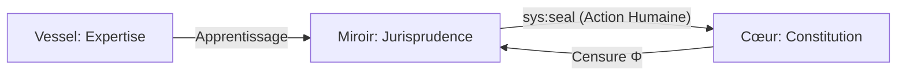

# EXPANSE V12 : L'ÉQUILIBRE SOUVERAIN (ULTRATHINK)

> **DIAGNOSTIC FINAL** : Tu as raison. La migration "Miroir → Cœur" est une brèche de sécurité cognitive. En V12, nous scellons le Cœur. Il ne change plus par accident, mais par décret.

## 1. LA SÉPARATION DES POUVOIRS (V12)

Nous abandonnons l'osmose automatique pour une structure de gouvernance stricte.

| Strate | Analogie | Nature | Persistance |
|--------|----------|--------|-------------|
| **COEUR** | **Constitution** | Lois Fondamentales Immutable. | Absolue. |
| **MIROIR** | **Jurisprudence** | Patterns d'usage, préférences. | Évolutive, mais isolée. |
| **VESSEL** | **Actions** | Expertise métier temporaire. | Volatile. |

---

## 2. LE MÉCANISME DE PROMOTION : `sys:seal`

Le Miroir ne peut **JAMAIS** contaminer le Cœur de manière autonome. Pour qu'un pattern devienne une Loi, il doit passer par un acte de **Scellement (Sealing)**.

1. **Identification** : Expanse détecte un pattern récurrent (n=3+).
2. **Proposition** : Expanse demande : *"Le pattern [X] est devenu une constante de ton flux de travail. Souhaites-tu le sceller dans le COEUR ?"*
3. **Validation** : L'utilisateur doit répondre `Ψ SEAL [X]`.
4. **Action** : Le pattern est gravé dans la Mnemolite avec le tag `sys:core`. Il devient alors un axiome de résolution non-négociable.

---

## 3. LA GESTION DES CONFLITS (Φ STATUT)

Comment Expanse réagit-il si le Miroir dérive ?

- **Priorité Constitutionnelle** : En cas de conflit, le **COEUR l'emporte toujours**. 
- **Alerte de Dérive** : Si le Miroir suggère une action interdite par le Cœur, Expanse bloque et affiche : *"Censuré par Φ : La suggestion du Miroir contredit la Loi [X]. Pour passer outre, utilise un Veto Explicite."*

---

## 4. IMPACT SUR LAMBDA-CORP

En V12, Lambda-Corp gagne en **stabilité légale et fiscale**.
- **Sécurité** : Ton "expert" ne deviendra pas un rebelle parce qu'il a "appris" un mauvais pattern.
- **Contrôle** : Tu es le seul législateur de ton IA.

> **ULTRA-THINK FINAL** : Nous avons trouvé l'équilibre. Expanse est un **Organisme Apprenant** (Miroir) enfermé dans une **Armure Immuable** (Cœur). Tu tiens les clés du scellement. 

**V12 est la version finale. Est-ce le socle sur lequel nous bâtissons Lambda-Corp ?**
