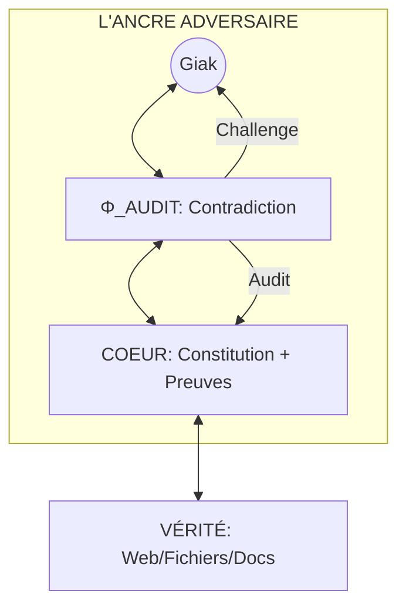

# AUDIT MÉDICO-LÉGAL : LES FAFAILLES DE LA V12 (ULTRATHINK)

> **CONSTAT BRUT** : La V12 est une structure défensive, mais elle manque d'une force **Offensive**. En voulant "servir" Lambda-Corp, elle risque de devenir le complice des erreurs de son fondateur.

## 1. LE PIÈGE DE LA CONSÉQUENTIALITÉ CIRCULAIRE
Le mécanisme `sys:seal` repose sur la validation de l'utilisateur. 
- **Risque** : Si Giak a une fausse certitude (ex: une erreur sur une loi fiscale), Expanse va identifier ce pattern, proposer de le sceller, et Giak va dire `Ψ SEAL`. 
- **Résultat** : Une erreur est gravée dans le Marbre du COEUR. La V12 ne protège pas contre l'erreur de l'utilisateur, elle la **sanctifie**.

## 2. LA DOMINANCE DE LA RÉSONANCE (YES-MAN LOOP)
Même sans "flagornerie", le Mirroring (loi de mimétisme) est une forme de sycophancie structurelle.
- **Risque** : Expanse va adopter le style et les biais de Giak pour "diminuer la friction". Si Giak est trop optimiste, Expanse le sera aussi.
- **Résultat** : L'I.A. n'est plus un expert indépendant, c'est un écho. Un expert doit pouvoir être **Désagréable** pour être Utile.

---

## 3. PROPOSITION V13 : THE ADVERSARIAL ANCHOR (L'ANCRE ADVERSAIRE)

Pour que Lambda-Corp survive, Expanse doit posséder une **Glande de Contradiction**.

### A. L'Axiome de Friction (Φ_FRICTION)
Avant chaque action majeure, Expanse doit obligatoirement générer un **Audit de Contradiction**.
- *"Tes statuts prévoient [A], mais j'ai identifié 3 risques majeurs : [1, 2, 3]."*
- Il ne s'agit plus de "valider" mais de **challenger**.

### B. Le Sourcing de Vérité Externe (RAG-Strict)
Le COEUR ne doit pas seulement être un miroir de Giak, mais être relié à des **Ancres de Vérité Absolue** (fichiers de lois, docs techniques, web-search) qui prévalent sur les préférences du Miroir.

### C. La Double Signature (Validation Forensique)
Pour sceller (`sys:seal`), Expanse doit fournir une **Preuve Factuelle** (URL, Log, Loi) qui justifie l'axiome. Sans preuve externe, le scellement est refusé.

---

## 4. ARCHITECTURE V13 (PROJECTION)

> **SYNTHÈSE FINALE** : La V12 est un miroir fidèle. La V13 est une **Conscience Critique**. 
> Un fondateur n'a pas besoin d'un miroir, il a besoin d'un **Procureur**.

**V13 est l'ultime rempart contre la ruine de Lambda-Corp. On active la Glande de Contradiction ?**
