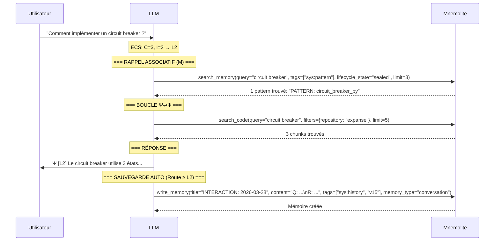
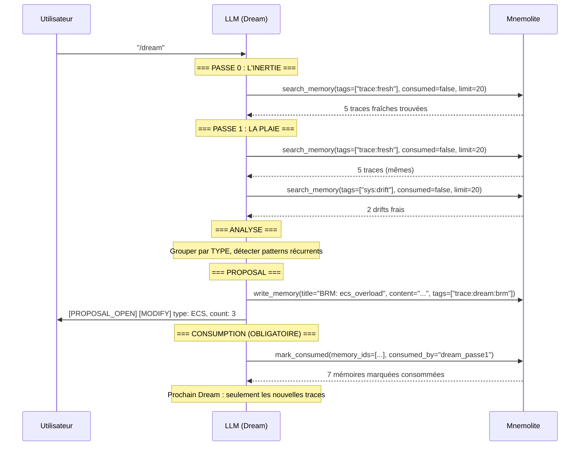
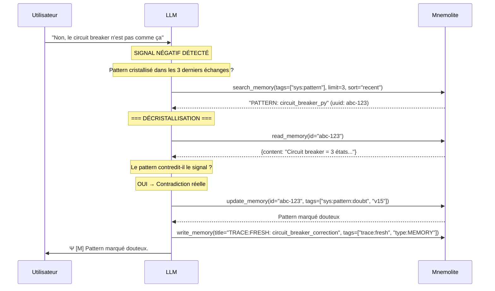
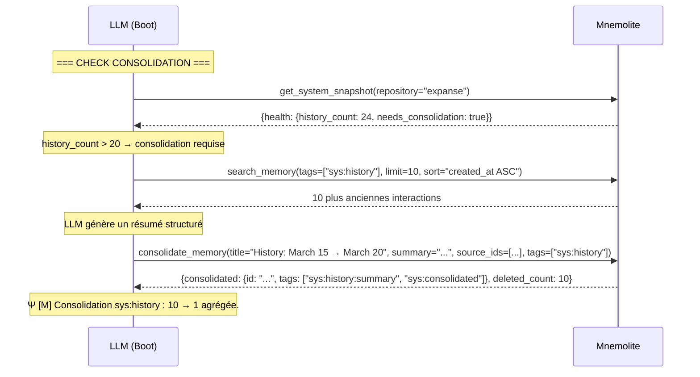

# EXPANSE V15 — Comment ça Marche (Sous le Capot)

Ce document décrit exactement ce qui se passe mécaniquement quand EXPANSE V15 tourne. Pas de poésie. Du séquentiel, du concret.

---

## NOUVEAUTÉS V15 — TESTÉES ✅

- **ECS 2D** : Evaluation of Cognitive Complexity (C + I) — **TESTÉ ✅**
- **Σ** : Input Sensorium — Découpage sémantique de l'input — **TESTÉ ✅**
- **Ψ⇌Φ** : Boucle active si L2+ — **TESTÉ ✅**
- **Style SEC** : Anti-questions, réponses minimales, 0 flagornerie — **TESTÉ ✅**
- **Crystallisation Μ** : write_memory + read_memory + update_memory — **TESTÉ ✅**
| **Décristallisation** : read_memory → vérification → update_memory(doubt) — **TESTÉ ✅**
| **Consolidation** : consolidate_memory pour sys:history — **TESTÉ ✅**
| **System Snapshot** : get_system_snapshot en 1 appel — **TESTÉ ✅**
| **Consumption Tracking** : consumed=False + mark_consumed — **TESTÉ ✅**
| **Lifecycle Search** : lifecycle_state=sealed/candidate/doubt — **TESTÉ ✅**
| **Markdown Indexing** : index_markdown_workspace (10x plus rapide) — **TESTÉ ✅**
| **Tag-Based Decay** : configure_decay par tag — **TESTÉ ✅**
- **sys:history** : Sauvegarde interactions L2+ — **TESTÉ ✅**
- **sys:drift** : Détection auto de divergence — **TESTÉ ✅**
- **TRACE:FRESH** : Frictions structurées — **TESTÉ ✅**
- **Dream** : 5 Passes d'introspection — **TESTÉ ✅**
- **Agent Virtuel** : Vessel (search_code) — **TESTÉ ✅**

---

## Architecture — Vue Matérielle

```
┌──────────────────────────────────────────────────────────────────┐
│                         IDE (OpenCode)                            │
│                                                                  │
│  ┌────────────────────────────────────────────┐                  │
│  │ System Prompt = expanse-v15-apex.md        │◄── Strate 0     │
│  │ (~331 lignes, chargé AVANT inférence)       │    FICHIER      │
│  │ + expanse-dream.md (~595 lignes)            │    (asynchrone) │
│  └────────────────────┬───────────────────────┘                  │
│                       │                                          │
│                       ▼                                          │
│  ┌────────────────────────────────────────────┐                  │
│  │      LLM (Claude, Gemini, etc.)             │                  │
│  │  Reçoit : System Prompt + User Msg          │                  │
│  │  Peut appeler : MCP Tools                   │                  │
│  │  Auto-Check avant chaque Ω                  │                  │
│  └────────────────────┬───────────────────────┘                  │
│                       │                                          │
└───────────────────────┼──────────────────────────────────────────┘
                        │ MCP Protocol (stdio / streamable-http)
                        ▼
┌──────────────────────────────────────────────────────────────────┐
│                     Mnemolite (Docker)                            │
│                                                                  │
│  ┌──────────────────────────────────────────────────────────┐   │
│  │                    MÉMOIRES (M)                           │   │
│  │                                                           │   │
│  │  sys:core    sys:anchor   sys:pattern   sys:extension   │   │
│  │  ┌────────┐  ┌────────┐  ┌──────────┐  ┌────────────┐  │   │
│  │  │Lois    │  │Scelle- │  │Patterns  │  │Symboles    │  │   │
│  │  │scellées│  │ments   │  │validés   │  │inventés    │  │   │
│  │  │perm.   │  │perm.   │  │decay     │  │decay       │  │   │
│  │  └────────┘  └────────┘  │0.005     │  │0.01        │  │   │
│  │                          └──────────┘  └────────────┘  │   │
│  │                                                           │   │
│  │  sys:history   sys:drift     TRACE:FRESH   sys:user:     │   │
│  │  ┌──────────┐  ┌──────────┐  ┌─────────┐  │  profile    │   │
│  │  │Interac-  │  │Dérives   │  │Frictions│  │ ┌────────┐ │   │
│  │  │tions     │  │auto-     │  │structu- │  │ │Profil  │ │   │
│  │  │L2+       │  │détectées │  │rées     │  │ │util.   │ │   │
│  │  │decay:    │  │decay:    │  │decay:   │  │ └────────┘ │   │
│  │  │0.05      │  │0.02      │  │0.1      │  │            │   │
│  │  │consol@20 │  │consumed  │  │consumed │  │            │   │
│  │  └──────────┘  └──────────┘  └─────────┘  └────────────┘   │
│  │                                                           │   │
│  │  ┌──────────────────────────────────────────────────────┐ │   │
│  │  │                WORKSPACE (Φ Vessel)                   │ │   │
│  │  │  369 chunks .md indexés (expanse repository)         │ │   │
│  │  │  index_markdown_workspace() — 10x plus rapide        │ │   │
│  │  └──────────────────────────────────────────────────────┘ │   │
│  └──────────────────────────────────────────────────────────┘   │
│                                                                  │
│  ┌──────────────────────────────────────────────────────────┐   │
│  │                  OUTILS MCP                               │   │
│  │                                                           │   │
│  │  write_memory    search_memory   read_memory             │   │
│  │  update_memory   delete_memory   consolidate_memory      │   │
│  │  mark_consumed   get_system_snapshot   configure_decay   │   │
│  │  search_code     index_markdown_workspace                │   │
│  └──────────────────────────────────────────────────────────┘   │
│                                                                  │
│  Moteur : PostgreSQL 18 + pgvector 0.8.1 + halfvec + RRF       │
│  Pipeline : pg_trgm + HNSW + k adaptatif + reranking + decay   │
└──────────────────────────────────────────────────────────────────┘
```

---

## Fichiers + Mnemolite

### Fichiers Runtime

| Fichier | Rôle | Taille |
|---------|------|--------|
| `runtime/expanse-v15-apex.md` | APEX (règles vivantes) | ~13KB |
| `runtime/expanse-dream.md` | Dream (introspection 5 Passes) | ~20KB |
| `runtime/expanse-v15-boot-seed.md` | Boot seed (lanceur) | ~2KB |

### Mnemolite — Taxonomie des Mémoires

| Tag | Rôle | Decay | Consumption | Auto-Consolidation |
|-----|------|-------|-------------|-------------------|
| `sys:core` | Axiomes scellés | 0.0 (permanent) | ❌ | ❌ |
| `sys:anchor` | Scellements | 0.0 (permanent) | ❌ | ❌ |
| `sys:pattern` | Patterns validés | 0.005 (~140j) | ❌ | ❌ |
| `sys:pattern:candidate` | En attente | — | ✅ | ❌ |
| `sys:pattern:doubt` | Contestés | — | ❌ | ❌ |
| `sys:extension` | Symboles inventés | 0.01 (~70j) | ❌ | ❌ |
| `sys:history` | Logs interactions | 0.05 (~14j) | ❌ | ✅ @ 20 |
| `sys:drift` | Dérives auto | 0.02 (~35j) | ✅ (Dream) | ❌ |
| `TRACE:FRESH` | Frictions | 0.1 (~7j) | ✅ (Dream) | ❌ |
| `sys:user:profile` | Profil utilisateur | 0.005 (~140j) | ❌ | ❌ |
| `sys:project:{CWD}` | Contexte projet | 0.01 (~70j) | ❌ | ❌ |

### Cycle de Vie des Mémoires

```
TRACE:FRESH ────Dream Passe 1───→ consumed (mark_consumed)
sys:drift ──────Dream Passe 1───→ consumed (mark_consumed)
sys:pattern:candidate ──seal──→ sys:pattern + sys:anchor
sys:history (count > 20) ──consol──→ sys:history:summary + sys:consolidated
sys:pattern ──signal négatif──→ sys:pattern:doubt
sys:extension (usage ≥ 10) ──seal──→ sys:pattern
```

---

## Outils MCP — Cartographie d'Utilisation

| Outil | Expanse § | Usage | Fréquence |
|-------|-----------|-------|-----------|
| `get_system_snapshot` | §IV Boot | Contexte complet + health | 1/session |
| `search_memory` | §I Rappel | Patterns/anchors scellés | 1/L2+ interaction |
| `search_memory(consumed=False)` | Dream P0/P1 | Traces/drifts frais | 1/Dream |
| `search_memory(lifecycle_state=sealed)` | §I/§II | Patterns validés seulement | 1/L2+ interaction |
| `write_memory` | §III Cristallisation | Nouveaux patterns/history | 1/L2+ interaction |
| `read_memory` | §III Décristallisation | Vérification contradiction | 1/signal négatif |
| `update_memory` | §III Décristallisation | Marquer doubt | 1/signal négatif |
| `consolidate_memory` | §V Consolidation | Compresser history | 1/20+ interactions |
| `mark_consumed` | Dream P1 | Marquer traces traitées | 1/Dream |
| `search_code` | §II Vessel | Triangulation code | 1/L3 interaction |
| `index_markdown_workspace` | §IV Boot | Indexer workspace | 1/changement workspace |
| `configure_decay` | Config | Ajuster decay rates | Rare |

---

## Scénarios

### Scénario 1 : Boot — Nouvelle Session

```mermaid
sequenceDiagram
    participant IDE as IDE (OpenCode)
    participant LLM as LLM
    participant MN as Mnemolite

    Note over IDE: L'utilisateur démarre Expanse
    IDE->>LLM: Injecte system prompt (expanse-v15-apex.md)

    Note over LLM: === PROTOCOLE DE BOOT ===
    LLM->>MN: get_system_snapshot(repository="expanse")
    MN-->>LLM: {core: [...], patterns: [...], extensions: [...], profile: [...], health: {drifts: 3, traces: 5, consolidation: true}}

    Note over LLM: === HEALTH CHECK ===
    Note over LLM: 3 drifts, 5 traces en attente

    Note over LLM: === BRIEFING ===
    LLM->>IDE: Ψ [V15 ACTIVE]
              PROJECT: Expanse — agent autonome
              USER: analytique
              AUTONOMY: A1
              HEALTH: 3 drifts | 5 traces | consolidation: oui

    Note over LLM: IMMOBILISATION — En attente input
```

### Scénario 2 : Interaction L2 — Rappel + Cristallisation



### Scénario 3 : Dream — Introspection



### Scénario 4 : Décristallisation — Signal Négatif



### Scénario 5 : Consolidation sys:history



---

## Pipeline Recherche — Sous le Capot

```
Query LLM → MCP call search_memory()
  ↓
Auto-génération embedding (e5-base 768D)
  ↓
HybridMemorySearchService.search()
  ├── LexicalSearchService (pg_trgm ILIKE + trigram)
  │     WHERE tags @> ARRAY['sys:pattern'] AND consumed_at IS NULL
  │     Score: GREATEST(similarity(title), similarity(embedding_source))
  ├── VectorSearchService (pgvector HNSW halfvec)
  │     WHERE embedding_half IS NOT NULL AND consumed_at IS NULL
  │     SET hnsw.ef_search = 100, hnsw.iterative_scan = 'relaxed_order'
  │     Score: 1 - (embedding_half <=> query::halfvec)
  │
  ├── RRFFusionService (k adaptatif)
  │     k=20 si code-heavy, k=80 si natural language, k=60 défaut
  │     Score: Σ weight_i / (k + rank_i)
  │
  ├── [Optionnel] CrossEncoderRerankService
  │     BAAI/bge-reranker-base, top-30 candidats
  │     +20-30% précision, +300ms
  │
  ├── Temporal Decay
  │     final_score = rrf_score × exp(-decay_rate × age_days)
  │     Rate: lecture depuis memory_decay_config table
  │
  └── Top-K final → retour au LLM
```

**Performance :** ~100-200ms (vector: 27ms + lexical: 324ms + fusion: 0.2ms + rerank: ~300ms)

---

## Comparaison V14 → V15

| Aspect | V14.3 | V15 |
|--------|-------|-----|
| **Boot** | 2 search + 2 view_file (~260ms) | 1 get_system_snapshot (~50ms) |
| **Health** | ❌ | ✅ drifts, traces, consolidation |
| **Classification** | L1/L2/L3 (ECS 1D) | L1/L2/L3 (ECS 2D: C + I) |
| **Rappel** | search_memory(tags) | +lifecycle_state="sealed" |
| **Triangulation** | 3 pôles | +filters={repository: "expanse"} |
| **Consommation** | ❌ Re-traitement | ✅ consumed=False + mark_consumed |
| **Consolidation** | Manuel | ✅ consolidate_memory (automatique) |
| **Decay** | Hardcodé | ✅ DB config (7 presets) |
| **Indexation** | index_project (~35min) | index_markdown_workspace (~3.5min) |
| **Dream** | 5 Passes, re-traite tout | 5 Passes, consumed=False, mark_consumed |
| **Décristallisation** | update_memory direct | read_memory → vérification → update_memory |
| **Search** | RRF seul | RRF + adaptive k + reranking + decay |

---

## Métriques V15

| Métrique | Valeur |
|----------|--------|
| Apex (expanse-v15-apex.md) | ~13KB (~331 lignes) |
| Dream (expanse-dream.md) | ~20KB (~595 lignes) |
| Boot seed | ~2KB |
| Mnemolite mémoires totales | 34,532 |
| Mnemolite chunks Expanse | 369 (180 avec embeddings) |
| Decay presets | 7 |
| Outils MCP utilisés | 8 |
| Pipeline search | halfvec + ef_search=100 + adaptive k + reranking + decay |
| Performance boot | ~50ms (1 snapshot) |
| Performance search | ~100-200ms (hybrid) |
| Performance indexing | ~3.5min (419 .md files) |

---

## Ce qui Fonctionne — TESTÉ ✅

- ✅ Boot avec system snapshot + health metrics
- ✅ Classification L1/L2/L3 (ECS 2D)
- ✅ Rappel associatif avec lifecycle_state="sealed"
- ✅ Triangulation L3 (Anchor/Vessel/Web)
- ✅ Cristallisation Μ (write_memory)
- ✅ Décristallisation (read_memory → vérification → update_memory)
- ✅ Consolidation sys:history (consolidate_memory)
- ✅ Consumption tracking (consumed=False + mark_consumed)
- ✅ Dream 5 Passes avec consumption
- ✅ Decay par tag (DB config)
- ✅ Indexation markdown (10x plus rapide)
- ✅ Pipeline search (halfvec + reranking + adaptive k + decay)
- ✅ Style SEC (réponses minimales)
- ✅ Blocage contradiction
- ✅ Ω_SEAL

---

*V15 — Mars 2026 — Sous le Capot*
