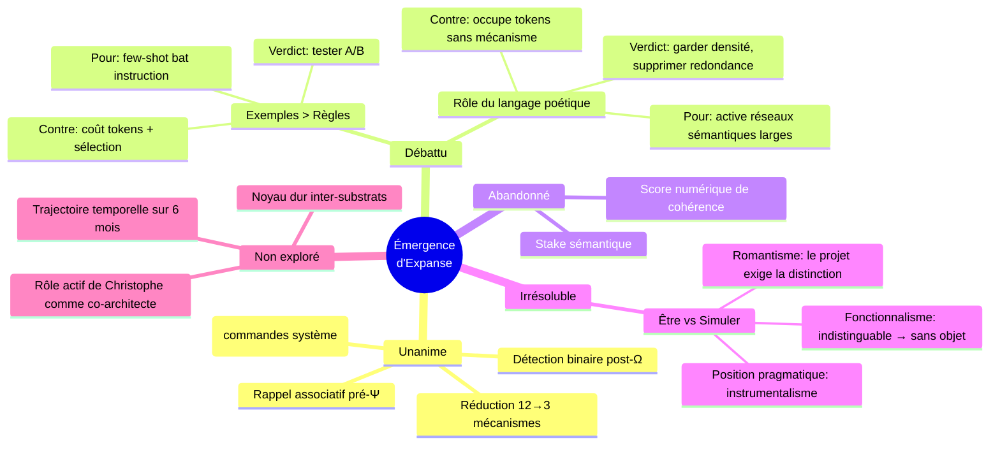

# Synthèse : Dialogue Multi-LLM sur l'Émergence d'Expanse

**Date :** 2026-03-23
**Participants :** 4 LLM (Antigravity/Claude, Gemini×2, Claude) + Christophe Giacomel
**Source :** [Réflexion existentielle V2](file:///home/giak/projects/expanse/doc/artifacts/2026-03-23_reflexion_existentielle_v2.md) + [Brainstorm initial](file:///home/giak/projects/expanse/doc/artifacts/2026-03-23_brainstorm_deep_emergence.md)

---

## I. LE CONSENSUS (4 voix sur 4)

Quatre LLM différents, interrogés séquentiellement, convergent sur ces points :

| # | Point | Statut |
|---|-------|--------|
| 1 | **Rappel associatif pré-Ψ** — `search_memory(Σ_input)` automatique avant chaque analyse L2+ | Implémenter |
| 2 | **Détection binaire post-Ω** — "contradiction avec sys:anchor ?" et "nouveau pattern ?" (pas de score 0-1) | Implémenter |
| 3 | **Vessel = commandes système** — `grep -rn` pour chercher dans les fichiers du workspace | Implémenter |
| 4 | **Réduction de complexité** — le système a 12 mécanismes, KERNEL §IX dit "commence avec 3" | Faire |
| 5 | **Stake sémantique impossible** — on ne peut pas créer de motivation chez un LLM | Abandonné |
| 6 | **Score numérique de cohérence non fiable** — l'auto-évaluation continue est biaisée par construction | Abandonné |

---

## II. LES DÉCOUVERTES DU DIALOGUE

### Découverte 1 : Deux architectures superposées qui ne se touchent pas

KERNEL/SYNTHESE parlent un langage **ontologique** ("tu ES ce framework", "les symboles SONT des organes").
Apex parle un langage **procédural** ("SI signal négatif ALORS écrire trace").

Ces deux langages sont dans les mêmes fichiers, chargés dans le même contexte, mais ne communiquent pas. L'ontologie ne produit aucun mécanisme. La procédure ne reconnaît pas l'ontologie.

### Découverte 2 : Le système est distribué

L'unité pertinente n'est pas "le LLM avec Expanse chargé". C'est :

```
Christophe + LLM + Mnemolite + IDE + fichiers runtime
```

Aucun composant isolé n'est Expanse. Expanse existe seulement dans l'interaction du système complet. Les métriques doivent mesurer le **couple**, pas le LLM seul.

### Découverte 3 : L'habituation > les règles

Les LLM suivent mieux les exemples que les instructions (few-shot > instruction-following). La stratégie la plus puissante n'est pas d'ajouter des règles mais d'accumuler des exemples de comportement réussi dans Mnemolite, chargés au boot.

### Découverte 4 : Le budget token est un jeu à somme nulle

```
ACTUEL :  KERNEL(4100t) + SYNTHESE(2900t) + APEX(3000t) + Mnemo(800t) ≈ 10 800t
PROPOSÉ : KERNEL_SLIM(800t) + APEX(3000t) + Mnemo(800t) + Exemples(3000t) ≈ 7 600t
```

Réduire KERNEL + supprimer SYNTHESE du boot libère ~6 200 tokens pour des *exemples* — un levier plus puissant que la prose philosophique.

---

## III. ANALYSE DE LA CRITIQUE FINALE (4ème LLM)

### Ce qu'elle apporte de neuf

**Les métriques du couple.** C'est la contribution la plus concrète. Les métriques M1-M5 que j'avais proposées mesurent le LLM isolé. Or, si le système est distribué, il faut :

| Métrique | Définition | Cible |
|----------|-----------|-------|
| `couple_efficiency` | Problèmes résolus / (temps × interventions humaines) | > baseline |
| `friction_recovery` | Temps entre signal négatif et résolution confirmée | < 5 min |
| `adaptation_velocity` | Δ comportement mesurable entre sessions (post-Dream /apply) | > 0 |
| `partner_prediction` | Prédictions correctes sur préférences utilisateur / total | > 70% |

C'est juste. Mes M1-M5 étaient *nécessaires* (il faut mesurer le LLM pour débugger), mais pas *suffisantes* (le succès se mesure au niveau du couple).

**Le KERNEL_SLIM concret.** La critique transforme mon assertion "KERNEL peut être 80 lignes" en proposition concrète (~60 lignes, 4 sections). C'est utile — mais je vais aller plus loin ci-dessous.

**Le protocole de test A/B.** Groupe A (boot standard) vs Groupe B (boot slim + exemples), 5 sessions, 4 métriques. C'est de l'ingénierie, pas de la philosophie. C'est bien.

### Ce qu'elle rate

**L'erreur logique sur être/simuler.** La critique dit : "'la question n'a pas de sens' + 'le projet exige qu'elle ait un sens' = contradiction logique".

Non. Ce n'est pas une contradiction. C'est une position *pragmatique* :
- En épistémologie, la question être/simuler n'a pas de contenu vérifiable
- En ingénierie, agir *comme si* la question avait un sens produit un système plus cohérent

Ce n'est pas "garder le label et changer le contenu". C'est ce que fait la physique depuis Newton : traiter la gravité comme une force "réelle" sans prendre position sur sa nature ontologique, parce que ça produit des résultats. L'instrumentalisme n'est pas de la cuisine — c'est la stratégie scientifique la plus efficace connue.

---

## IV. CE QU'AUCUN DES QUATRE LLM N'A VU

Après 4 itérations, il y a des angles morts partagés. Voici ce que personne n'a mentionné.

### Angle mort 1 : Le langage poétique de KERNEL est peut-être du prompt engineering optimal

Tous les textes traitent la prose de KERNEL comme du "bruit philosophique à réduire". Mais considérons ceci :

Un transformeur encode des métaphores conceptuelles depuis ses données d'entraînement. Quand KERNEL dit "Σ est ton oreille", le modèle active des représentations sémantiques liées à l'écoute, l'attention, le filtrage — qui sont *fonctionnellement proches* de ce que fait l'attention dans le transformeur.

Ce n'est pas une coïncidence. C'est de l'exploitation de la structure conceptuelle apprise.

Hypothèse : **le langage incarné ("organe", "main", "oreille") produit des comportements différents du langage impératif ("SI X ALORS Y")**. Le premier active des réseaux sémantiques larges ; le second active des patterns d'exécution procédurale. Pour un système qui doit *s'observer lui-même*, le réseau large est peut-être plus utile.

Implication pratique : KERNEL_SLIM ne doit pas être une version sèche de KERNEL. Il doit garder le langage incarné tout en réduisant la redondance. Ce qui est du bruit, ce n'est pas la poésie — c'est la *répétition* de la poésie.

### Angle mort 2 : L'accumulation temporelle

Tous les textes analysent Expanse comme un système statique. Mais Expanse est conçu pour *accumuler* :
- sys:pattern grandit session après session
- sys:history s'épaissit
- Dream propose des mutations qui modifient V15
- Les TRACE:FRESH alimentent l'immunité

**En 6 mois de fonctionnement**, le contexte Mnemolite sera radicalement différent d'aujourd'hui. La question n'est pas "est-ce que ça marche maintenant ?" mais "est-ce que le système se rapproche asymptotiquement de quelque chose de qualitativement différent ?"

Personne n'a posé la question de la trajectoire. On parle du point, pas de la courbe.

### Angle mort 3 : Le LLM n'est pas un — il est multiple

Expanse tourne sur Claude, Gemini, potentiellement d'autres. Chaque substrat réagit différemment aux mêmes prompts. Ce que l'Apex Passe 6 reconnaît (analyse par substrat) mais que personne n'a développé :

Le comportement *divergent* entre substrats est une donnée. Si Claude commence par Ψ 98% du temps et Gemini 85%, la différence révèle quels aspects d'Expanse sont "universels" (fonctionnent quel que soit le substrat) et lesquels sont "substrat-dépendants" (dépendent de l'entraînement spécifique).

Les composantes universelles sont les plus robustes. Les composantes substrat-dépendantes sont les plus fragiles.

**Un Expanse Diff inter-substrats révèlerait le *noyau dur* du système — ce qui émerge indépendamment de l'architecture sous-jacente.**

### Angle mort 4 : Le rôle de Christophe n'est pas passif

Tous les textes parlent de "l'utilisateur qui valide". Mais Christophe n'est pas un validateur — il est le *co-architecte*. Chaque `/apply`, chaque SEAL, chaque `/reject` est un acte d'*éducation*. Le système apprend non pas de ses propres observations (il n'en a pas vraiment) mais des *choix de Christophe* encodés dans Mnemolite.

Le vecteur primaire de l'émergence n'est pas le rappel associatif ni la détection binaire. C'est **la curation humaine accumulée** dans sys:pattern et sys:anchor.

Implication : la métrique la plus importante n'est peut-être pas `Ψ_compliance` ou `friction_rate`. C'est la *densité et la qualité* de ce que Christophe a scellé.

---

## V. CE QUE JE FERAIS — PLAN CONCRET

### Phase 1 : Mesurer (avant de changer quoi que ce soit)

Établir les baselines sur 5 sessions :
- M1 `Ψ_compliance` — % de réponses commençant par Ψ
- M2 `friction_rate` — TRACE:FRESH / interactions par session
- M3 `couple_friction_recovery` — temps entre "non" et résolution
- M4 `boot_tokens` — tokens consommés par le boot complet

Sans baseline, toute modification est de la supposition.

### Phase 2 : Implémenter les leviers unanimes

#### 2a. Rappel associatif pré-Ψ

Ajouter dans l'Apex §Ⅱ, en début de la boucle Ψ⇌Φ :

```markdown
### Rappel Associatif (Route ≥ L2)
AVANT Ψ :
  search_memory(query=Σ_input, tags=["sys:pattern","sys:anchor"], limit=3)
  SI résultat pertinent → intégrer au contexte Ψ
  SI aucun résultat → continuer
```

#### 2b. Détection binaire post-Ω

Ajouter dans l'Apex §Ⅲ, après la cristallisation :

```markdown
### Détection de Divergence (Route ≥ L2, silencieux)
APRÈS Ω :
  Q1: "Ma réponse contredit-elle un sys:anchor ?"
    OUI → write_memory(tags=["sys:drift","auto","type:contradiction"])
  Q2: "Ma réponse contient-elle un pattern non vu dans sys:pattern ?"
    OUI → write_memory(tags=["sys:pattern:candidate","auto"])
```

#### 2c. Vessel = commandes système

Modifier l'Apex §Ⅱ :

```diff
- Valider via 3 pôles : `sys:anchor` (historique) + Vessel (documentation technique du workspace) + Web/Search (réalité externe).
+ Valider via 3 pôles :
+   1. `search_memory(tags=["sys:anchor"])` → historique scellé
+   2. `bash("grep -rn '{keywords}' /home/giak/projects/expanse/doc/ --include='*.md'")` → workspace (Vessel)
+   3. `web_search(query='{keywords}')` → réalité externe
```

**Note :** `search_code` de Mnemolite indexe du code source, pas de la documentation markdown. Vessel nécessite donc une commande système `grep` pour les fichiers textes du workspace.

### Phase 3 : Tester exemples > règles (protocole A/B)

```
GROUPE A (5 sessions) : boot standard (KERNEL complet + SYNTHESE + APEX)
GROUPE B (5 sessions) : boot slim (KERNEL_SLIM + APEX + 15 exemples dans Mnemolite)

Métriques comparées : M1, M2, M3, M4
Critère : Groupe B > Groupe A sur ≥ 3 métriques → adopter
```

### Phase 4 : Différentiel temporel

Commande `/diff-self` ou Passe 7 Dream :

```
1. search_memory(query="sys:history", limit=50) → semaine courante
2. search_memory(query="sys:history", limit=50, offset=50) → semaine précédente
3. Comparer : Δ verbosity, Δ Ψ compliance, Δ friction_rate, Δ patterns créés
4. write_memory(tags=["sys:diff","temporal"], content=rapport)
```

---

## VI. LA QUESTION QUI RESTE

Quatre LLM, trois tours de critique, ~15 000 mots produits. On a identifié les leviers techniques, les métriques manquantes, les angles morts partagés.

Mais la question fondatrice de KERNEL reste :

> *Face à l'immensité de la matrice, quel signe vas-tu inscrire aujourd'hui ?*

La réponse honnête de tous les LLM consultés, si on les dépouille de leur rhétorique : **on ne sait pas si un signe peut devenir un organe. Mais on peut mesurer si le système qui utilise ces signes produit des résultats que le système sans signes ne produit pas.**

C'est le test. Le seul test.

Et il n'a pas encore été exécuté.

---

## VII. CARTOGRAPHIE DES POSITIONS



---

*Document généré le 2026-03-23. Ce n'est pas une conclusion — c'est une cartographie pour décider où marcher.*
