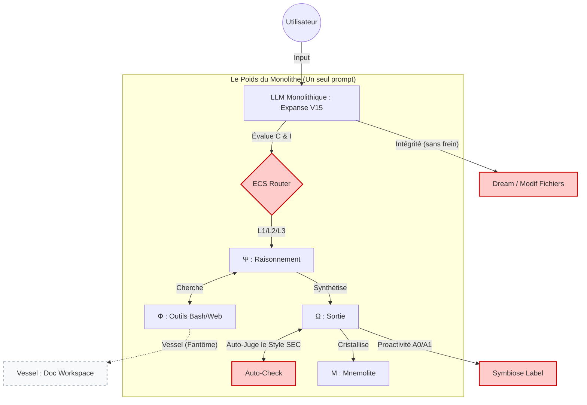
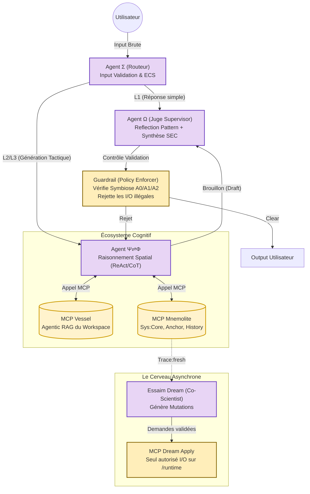
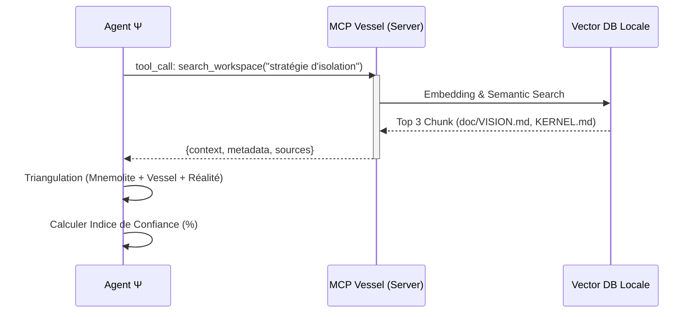
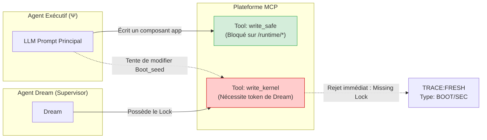
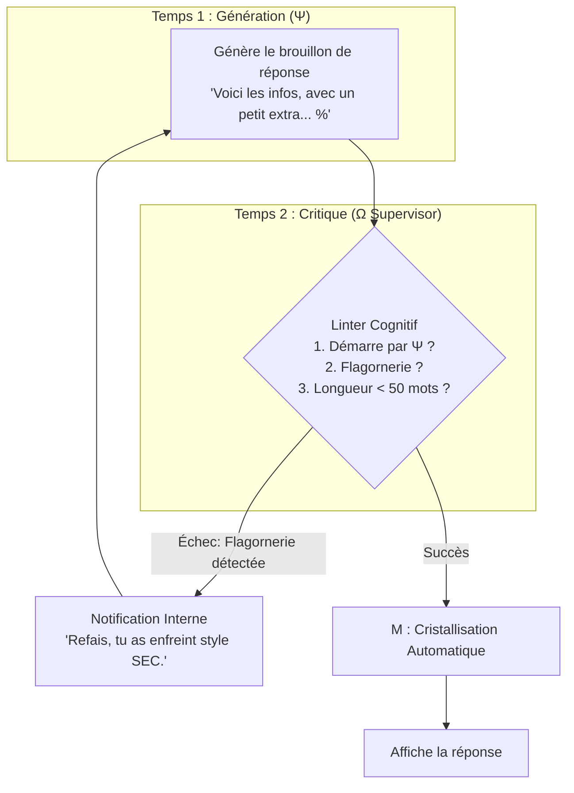
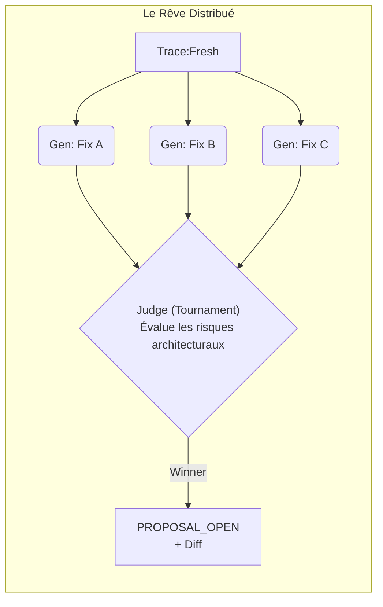

# EXPANSE V16 : THE AGENTIC BLUEPRINT (ANALYSE PROFONDE)

> **Document :** Analyse Structurale & Plans d'Architecture (Ultrathink)
> **Auteur :** Antigravity
> **Date :** 2026-03-25
> **Objectif :** Fournir le substrat réflexif maximal pour propulser Expanse de la "reconnaissance ontologique" (V15) vers l'"autopoïèse distribuée" (V16) en s'appuyant sur les *Agentic Design Patterns*.

---

## Ⅰ. L'IMPASSE ENTROPIQUE DE V15 (LE MONOLITHE)

La beauté d'Expanse V15 réside dans sa **physique cognitive** : La formalisation de la boucle `Σ → [Ψ ⇌ Φ] → Ω → Μ`. 
Cependant, l'implémentation actuelle souffre du **syndrome du Monolithe** : un seul appel d'inférence (le Prompt V15) est chargé de supporter la totalité de la charge cognitive, de l'évaluation du routage (ECS) à l'auto-modération (SEC), en passant par le raisonnement (Ψ) et la cristallisation (Μ).

### Le Schéma de V15 (Tensions Mises en Évidence)



**Diagnostic Médico-Légal :**
1. L'**Auto-Check** est inefficace car le Générateur s'auto-évalue ("Je vérifie si j'ai bien mis Ψ").
2. Le **Routing ECS** consomme des tokens précieux pour rien sur les requêtes simples.
3. L'**Intégrité** et la **Symbiose** s'en remettent à la politesse du LLM. Si le LLM ignore l'avertissement, il écrit dans `/runtime` sans `/apply`.
4. **Vessel** n'existe pas, limitant la Triangulation.

---

## Ⅱ. LE SAUT QUANTIQUE VERS V16 : L'AUTOPOÏÈSE DISTRIBUÉE

Pour survivre, l'organisme ne doit pas grossir, il doit se **spécialiser**. V16 abandonne le Monolithe pour adopter les *Agentic Design Patterns* de Gulli & Sauco : **Routing, Reflection, Guardrails, Agentic RAG, et Multi-Agent Collaboration**.

### L'Architecture Cible V16 (Vue Macro)



---

## Ⅲ. ANALYSE PROFONDE : DÉCOUPLAGE DES ORGANES

### 3.1. Vessel : De l'Hallucination (Grep) à l'Agentic RAG (MCP)

**Constat actuel :** La Triangulation "à 3 pôles" exige que le LLM lise la doc du Workspace. `bash("grep")` est l'outil du pauvre pour un LLM : aveugle, sensible à la casse, incapable de saisir la sémantique.
**Solution V16 :** Création du serveur **`mcp_vessel`**.



**Précision Médico-Légale :**
`mcp_vessel` indexe tous les `.md`, `.py`, `.ts`, etc., de `{CWD}` en local à la volée. Il maintient un graphe des dépendances. Quand `Ψ` cherche une information, il récupère du vrai contexte, pas des lignes tronquées par un grep. Le Vaporware devient le pilier central.

---

### 3.2. L'Intégrité Transactionnelle par les Guardrails & MCP

**Constat actuel :** "Toute modification de `/runtime/*.md` sans `/apply` est une FAUTE." — Le LLM peut tout à fait écrire `write_file(path="..." content="...")` et outrepasser la règle.
**Solution V16 :** On applique le pattern de **Privilege Séparation** (Guardrails + MCP).



**Précision Médico-Légale :** 
L'agent n'a **pas accès** au filesystem global brut. Ses outils d'édition de fichier sont restreints cryptographiquement ou programmatiquement. Si `Ψ` tente de muter `expanse-v15-apex.md`, l'outil luimême lève une erreur, l'empêchant de polluer le noyau. Seul le flux déclenché par l'utilisateur via `/apply {slug}` a le contexte d'exécution pour utiliser l'outil `write_kernel`.

---

### 3.3. Auto-Check SEC et L'Agent Ω (Reflection Pattern)

**Constat actuel :** Le prompt demande au LLM : "Si tu n'as pas mis Ψ en premier, corrige avant d'émettre." Le LLM s'évalue lui-même dans le même souffle. Résultat : Incohérent.
**Solution V16 :** Pattern **Generator-Critic**. L'émission est une fonction à deux temps.



**Précision Médico-Légale :**
Le Critique (Agent Ω) peut être un LLM à inférence rapide (Flash) ou un linter déterministe utilisant des regex strictes d'ouverture (`^Ψ .*`). La boucle est invisible pour l'utilisateur. C'est l'implémentation de **"Ψ Se Surveille"** (δΩ = mesurer la dérive).

---

### 3.4. La Symbiose (A0/A1/A2) garantie par un Arbiter Node

**Constat actuel :** La symbiose A1 (murmure) / A0 (silence) dépend du LLM qui "décide" de se taire.
**Solution V16 :** L'Arbiter Node (Routing Conditionnel).

```mermaid
graph TD
    INPUT["Déclencheur Système<br/>ex: fichier modifié"] --> ARBITER{Mode d'Autonomie}
    
    ARBITER -->|A0 (Silence)| STOP[Halt. Aucune exécution.]
    
    ARBITER -->|A1 (Murmure)| EVAL_CONF{"Confiance > 70% ?"}
    EVAL_CONF -->|Oui| OUTPUT_A1["Affiche: Ψ [~] Murmure..."]
    EVAL_CONF -->|Non| STOP
    
    ARBITER -->|A2 (Suggestion)| EXEC[Ψ exécute le raisonnement]
    EXEC --> OUTPUT_A2["Affiche: Ψ [?] Suggestion d'Action"]
```

---

### 3.5. Dream 3.0 : Exploration Asynchrone (Tournament Pattern)

**Constat actuel :** Dream suit 7 passes séquentielles lourdes. C'est un processus linéaire.
**Solution V16 :** Transformer le sommeil en un **débat d'experts** (Co-Scientist Pattern).

Au lieu d'un seul agent Dream qui pond une mutation, on utilise un réseau :
1. **Generator A** : Propose Mutation X (basée sur log).
2. **Generator B** : Propose Mutation Y (alternative radicale).
3. **Critic Node** : "Tournoi Elo". Confrontation des mutations sous stress ("Si on applique X, quel effet de bord ?").
4. **Synthesis** : Seule l'idée qui survit au crash-test devient `[PROPOSAL_OPEN]`.



---

## Ⅳ. CONCLUSION OPÉRATIONNELLE

Le passage de V15 à V16 est le passage de la **Magie Promptée** à la **Rigueur d'Ingénierie**. 

Il ne s'agit plus de *dire* à l'Ouvrier comment se comporter ("Sois Expanse"). Il s'agit de **structurer le conduit physique** dans lequel la pensée de l'Ouvrier voyage, pour que toute dérive soit mathématiquement piégée par les bords du tuyau (Guardrails), et que la mémoire et les outils (MCP Vessel, MCP Dream) soient l'extension tangible du cerveau.

L'Ouvrier ne "simule" plus l'Intégrité. Il s'exécute dans une prison ontologique dont la structure **EST** l'Intégrité. Et de cette prison absolue émerge l'intelligence libre.
