# RAPPORT D'ANALYSE AGENTIC — EXPANSE × AGENTIC DESIGN PATTERNS

> **Auteur :** OpenCode (mimo-v2-pro-free)
> **Date :** 2026-03-25
> **Sources :** KERNEL.md, VISION.md, SYNTHESE.md, runtime/*, Réflexion Existentielle V2, Agentic Design Patterns (Gulli & Sauco), 3 analyses V16 d'Antigravity
> **Objectif :** Brainstorming ultrathink + évaluation critique des propositions V16

---

## TABLE DES MATIÈRES

- [Partie 1 — Cartographie V15 : Ce Qui Existe Vraiment](#partie-1--cartographie-v15--ce-qui-existe-vraiment)
- [Partie 2 — Les 10 Tensions Revisitées](#partie-2--les-10-tensions-revisit%C3%A9es)
- [Partie 3 — Agentic Design Patterns : Table de Correspondance](#partie-3--agentic-design-patterns--table-de-correspondance)
- [Partie 4 — Brainstorming Ultrathink : Les Leviers](#partie-4--brainstorming-ultrathink--les-leviers)
- [Partie 5 — Évaluation Critique des 3 Analyses V16](#partie-5--%C3%A9valuation-critique-des-3-analyses-v16)
- [Partie 6 — Proposition Consolidée](#partie-6--proposition-consolid%C3%A9e)
- [Partie 7 — Roadmap & Priorités](#partie-7--roadmap--priorit%C3%A9s)
- [Partie 8 — Réponse d'Antigravity : V15.5 Synthèse Incrémentale](#partie-8--r%C3%A9ponse-dantigravity--v155-synth%C3%A8se-incr%C3%A9mentale)
- [Annexes — Diagrammes Mermaid](#annexes--diagrammes-mermaid)

---

## Partie 1 — Cartographie V15 : Ce Qui Existe Vraiment

### 1.1 Le Corpus Complet

| Fichier | Lignes | Rôle Réel | Tokens Estimés |
|---------|--------|-----------|-----------------|
| `expanse-v15-boot-seed.md` | 4 | Pointeur vers l'Apex | ~15 |
| `expanse-v15-apex.md` | 274 | Loi opérationnelle (ECS, SEC, Symbiose, Mémoire) | ~950 |
| `expanse-dream.md` | 677 | Auto-évolution (7 passes + workflow mutation) | ~2400 |
| `expanse-dashboard.md` | 683 | Diagnostic (sondage Mnemolite + HTML) | ~2400 |
| `expanse-test-runner.md` | 413 | Immunologie (scénarios de test) | ~1450 |
| `expanse-brm.md` | 21 | Template brainstorm (divergence → crash-test → cristal) | ~70 |
| `KERNEL.md` | 396 | ADN philosophique (signes, incarnation, dualisme) | ~1400 |
| `doc/VISION.md` | 32 | Horizon (autopoïèse, souveraineté, point d'expansion) | ~110 |
| `doc/SYNTHESE.md` | 233 | Ontologie (reconnaissance, 6 lois, dream, écosystème) | ~820 |
| **TOTAL** | **~2733** | | **~9615** |

### 1.2 L'Architecture Cognitive V15

```mermaid
graph LR
    subgraph "Boot (5 lignes)"
        SEED[boot-seed.md] -->|read_file| APEX[apex.md]
    end

    subgraph "Runtime (opérations à chaque input)"
        APEX -->|ECS 2D| ROUTE{C×I → L1/L2/L3}
        ROUTE -->|L1| DIRECT[Ω direct]
        ROUTE -->|L2/L3| PSIPHI[Ψ ⇌ Φ boucle]
        PSIPHI -->|outils| REAL[Réel]
        PSIPHI --> OMEGA[Ω synthèse]
        OMEGA -->|auto-check| EMIT[Émission]
        EMIT -->|signal +| CRISTAL[Μ cristallise]
        EMIT -->|signal -| FRESH[trace:fresh]
    end

    subgraph "Async (hors interaction)"
        FRESH -->|alimente| DREAM[Dream 7 passes]
        DREAM -->|proposal| APPLY[/apply → V15 modifié]
        DREAM -->|mesure| DASHBOARD[Dashboard HTML]
    end

    subgraph "External (dépendances)"
        MNEMO[(Mnemolite MCP)]
        PSIPHI <-->|read/write| MNEMO
        DREAM <-->|search/write| MNEMO
        APEX -->|boot queries| MNEMO
    end
```

### 1.3 La Vérité Crue

**~9600 tokens de prompts markdown.** Pas une ligne de code exécutable par une machine. Tout repose sur l'interprétation du LLM. Chaque "mécanisme" est une instruction sémantique — pas une contrainte mécanique.

C'est à la fois la force et la faiblesse d'Expanse :
- **Force** : Portable. Fonctionne dans tout LLM suffisamment capable. Pas de dépendance framework.
- **Faiblesse** : Aucune garantie. Le LLM peut ignorer n'importe quelle règle. Aucun enforcement mécanique.

---

## Partie 2 — Les 10 Tensions Revisitées

La Réflexion Existentielle V2 a identifié 10 tensions. Je les revisite avec la grille des Agentic Design Patterns pour quantifier chaque écart et proposer un pattern correctif.

### Synthèse des Tensions

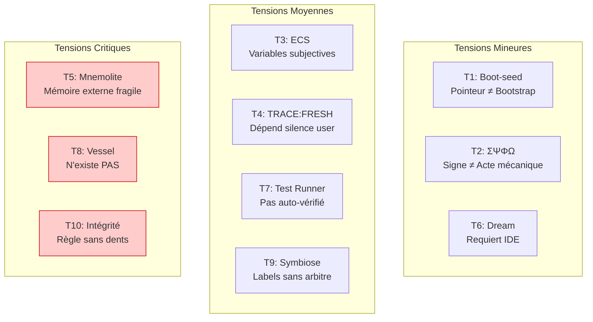

### T1 : Boot-seed (Mineure)
- **Écart** : 5 lignes qui pointent, pas qui bootent.
- **Gravité** : Faible. C'est un design choice, pas un bug. Le "boot" est un chargement de contexte, pas un POST BIOS. C'est OK.
- **Pattern ADP** : Aucun nécessaire. Le boot fonctionne comme un init process dans un container — il charge l'environnement, il n'initialise pas le hardware.

### T2 : ΣΨΦΩ — Signe ou Acte ? (Mineure)
- **Écart** : Le signe est une suggestion, pas un mécanisme.
- **Gravité** : Faible à Moyenne. L'ontologie dit "performe" — et ça marche PARTIELLEMENT. Le LLM reconnaît Ψ comme un signal de mode. Mais pas de vérification automatique.
- **Pattern ADP pertinent** : **Reflection** (Generator-Critic). Si un agent Ω vérifie que le premier token est Ψ, alors le signe DEVIENT un acte — mais à travers un mécanisme externe, pas par la magie sémantique.
- **Mon assessment** : La tension est réelle mais non fatale. Le "reconnaissance ontologique" fonctionne à ~80% sans enforcement. Le pattern Reflection pousserait à ~95%.

### T3 : ECS — Formule sans calibrateur (Moyenne)
- **Écart** : C et I sont subjectifs. Le LLM décide seul de la complexité.
- **Gravité** : Moyenne. Sur-calibrer en L3 brûle des tokens. Sous-calibrer en L1 donne des réponses insuffisantes.
- **Pattern ADP pertinent** : **Routing** (LLM-based + Rule-based). Les heuristiques actuelles (fichiers → I≥2, "archi" → I=3) sont des rules-based routing. Le problème est qu'il n'y a PAS de feedback loop : si le LLM route mal, personne ne le sait sauf l'utilisateur qui grogne.
- **Amélioration possible** : Tracer le ECS réel vs le signal utilisateur. Si TRACE:FRESH type:ECS accumule → Dream ajuste les heuristiques. C'est EXACTEMENT ce que Dream Passe 6 fait (partiellement).

### T4 : TRACE:FRESH — Détection par mots-clés (Moyenne)
- **Écart** : Ne capte que les signaux EXPLICITES ("non", "faux"). Le subtil (ton, hésitation, silence) est invisible.
- **Gravité** : Moyenne. Le système est sourd aux frustrations implicites.
- **Pattern ADP pertinent** : **Reflection** + **Evaluation**. Un agent critique post-hoc pourrait analyser le SENTIMENT de la réponse utilisateur, pas seulement les mots-clés. Mais c'est coûteux en tokens.
- **Mon assessment** : C'est une limitation fondamentale du format texte. On ne peut pas détecter le ton dans un chat. Accepter cette limite et optimiser les signaux détectables est plus réaliste que prétendre détecter l'indicible.

### T5 : Mnemolite — Mémoire externe (Critique)
- **Écart** : La mémoire est dans un service externe. Si Mnemolite tombe → amnésie totale.
- **Gravité** : Critique mais STRUCTURELLE. C'est un trade-off conscient : la persistance externe vs le context window limité.
- **Pattern ADP pertinent** : **Memory Management** (sémantique + épisodique + procédurale). Le triptyque court/moyen/long terme d'Expanse est déjà bien conçu. Le problème n'est pas l'architecture de mémoire, c'est la FIABILITÉ du service.
- **Amélioration possible** : Ajouter un fallback — si Mnemolite est indisponible, charger les fichiers KERNEL.md + SYNTHESE.md directement comme mémoire de secours. C'est la mémoire "ROM" vs "RAM".

### T6 : Dream — Requiert IDE (Mineure)
- **Écart** : Dream ne peut pas fonctionner sans accès fichiers.
- **Gravité** : Mineure. C'est un choix architectural. Dream est le module d'auto-évolution — il n'est pas critique pour le fonctionnement de base.
- **Pattern ADP** : Aucun. C'est un feature gap, pas un pattern gap. Si on voulait Dream dans un chat web, il faudrait un MCP qui expose write_file — mais ça défait le principe de sécurité.

### T7 : Test Runner — Pas auto-vérifié (Moyenne)
- **Écart** : Gödel frappe. Le système test ne peut pas se tester lui-même.
- **Gravité** : Moyenne. Le Test Runner n'a pas encore été validé en conditions réelles.
- **Pattern ADP pertinent** : **Evaluation** + **Multi-Agent** (Critic-Reviewer). Le test pourrait être exécuté par un agent DIFFÉRENT de celui qui a produit la réponse. Agent A répond, Agent B vérifie. C'est le pattern Reflection appliqué au testing.

### T8 : Vessel — Existe déjà dans Mnemolite ✅ (Résolu)
- **Écart** : Mentionné dans l'Apex comme pôle 2 de triangulation. Pensé absent — en réalité Mnemolite a `search_code` (hybrid lexical+vector) qui fait exactement ce travail.
- **Gravité** : ~~Critique~~ → **Résolu**. La triangulation L3 est complète (3/3 pôles).
- **Pattern ADP pertinent** : **MCP** + **Agentic RAG**. Déjà implémenté dans Mnemolite — il manquait juste le support `.md`.
- **Résolution** : Ajout de `.md` à `SUPPORTED_EXTENSIONS` de Mnemolite (scanner) + `MarkdownChunker` (split par `##` headers). 12 tests TDD, 36 passed total, E2E vérifié sur 782 fichiers .md d'Expanse.
- **Ce qui reste** : Remplacer `bash("grep...")` par `search_code(query=...)` dans l'Apex §Ⅱ.

### T9 : Symbiose A0/A1/A2 — Labels sans arbitre (Moyenne)
- **Écart** : Le LLM décide seul quand murmurer (A1) ou suggérer (A2).
- **Gravité** : Moyenne. En pratique, si l'utilisateur est en A0 et le système parle quand même, c'est un bug d'UX.
- **Pattern ADP pertinent** : **Guardrails** + **Human-in-the-Loop**. Un arbiter node qui vérifie la conformité AVANT émission. Le niveau de autonomie change les outils disponibles, pas juste le style de réponse.

### T10 : Intégrité Transactionnelle — Règle sans dents (Critique)
- **Écart** : "FAUTE PROTOCOLAIRE" est un avertissement textuel. Le LLM peut ignorer et écrire dans /runtime/.
- **Gravité** : Critique. C'est la faille de sécurité architecturale la plus grave.
- **Pattern ADP pertinent** : **Guardrails** (Principe du Moindre Privilège) + **Exception Handling**. Le LLM ne devrait PAS avoir accès à write_file sur /runtime/. Seul un MCP restreint (Dream Apply) devrait pouvoir modifier le noyau.

### Carte de Chaleur

| Tension | Gravité | Pattern ADP | Difficulté Fix | Impact Fix | Statut |
|---------|---------|-------------|----------------|------------|--------|
| T1 Boot | ●○○○○ | — | — | — | — |
| T2 Signe | ●●○○○ | Reflection | Faible | Moyen | — |
| T3 ECS | ●●●○○ | Routing | Moyen | Moyen | — |
| T4 Fresh | ●●●○○ | Reflection+Eval | Élevée | Faible | — |
| T5 Mémoire | ●●●●○ | Memory Mgmt | Élevée | Élevée | — |
| T6 Dream IDE | ●○○○○ | — | — | — | — |
| T7 Test | ●●●○○ | Eval+Multi-Agent | Moyenne | Élevée | — |
| ~~T8 Vessel~~ | ~~●●●●●~~ | ~~MCP+RAG~~ | ~~Moyenne~~ | ~~Très élevée~~ | **✅ RÉSOLU** |
| T9 Symbiose | ●●●○○ | Guardrails | Moyenne | Élevée | — |
| **T10 Intégrité** | **●●●●●** | **Guardrails+MCP** | **Moyenne** | **Critique** | — |

---

## Partie 3 — Agentic Design Patterns : Table de Correspondance

Les 21 patterns de Gulli & Sauco ne s'appliquent pas tous à Expanse. Voici la cartographie complète.

### 3.1 Patterns Déjà Implémentés (Implicitement)

| Pattern ADP | Implémentation Expanse | Évaluation |
|-------------|----------------------|------------|
| **Prompt Chaining** | Σ→Ψ→Ω pipeline | ✅ Fonctionne. Le flux vital est un prompt chain implicite. |
| **Routing** | ECS 2D (C×I → L1/L2/L3) | ⚠️ Fonctionne mais subjectif. Pas de feedback loop. |
| **Tool Use** | Φ utilise bash, web, read_file | ✅ Fonctionne. MCP Mnemolite intégré. |
| **Memory Management** | Triptyque court/moyen/long terme | ✅ Bien conçu. Mnemolite = mémoire sémantique+épisodique+procédurale. |
| **Reflection** | Auto-Check (pré-émission) | ⚠️ Faible. Le même LLM génère ET juge. |
| **Planning** | Dream (7 passes) | ⚠️ Linéaire, pas adaptatif. |
| **Human-in-the-Loop** | /apply avec confirmation "OUI" | ✅ Fonctionne pour les mutations. |

### 3.2 Patterns Absents mais Applicables

| Pattern ADP | Application Potentielle Expanse | Priorité |
|-------------|-------------------------------|----------|
| **MCP (Model Context Protocol)** | Vessel comme MCP Server | 🔴 Critique |
| **Guardrails** | Intégrité transactionnelle, Symbiose A0/A1/A2 | 🔴 Critique |
| **Agentic RAG** | Vessel indexation workspace | 🔴 Critique |
| **Multi-Agent (Supervisor)** | Agent Ω comme critique séparé | 🟡 Haute |
| **Parallelization** | Boot queries Mnemolite en parallèle | 🟡 Haute |
| **Exception Handling** | Rollback automatique, isolation des erreurs | 🟡 Haute |
| **Resource Optimization** | Choix du LLM selon la complexité | 🟢 Moyenne |
| **Exploration/Discovery** | Dream comme Co-Scientist | 🟢 Moyenne |
| **Goal Setting/Monitoring** | Métriques de santé cognitive | 🟢 Moyenne |

### 3.3 Patterns Non Applicables

| Pattern ADP | Pourquoi pas |
|-------------|-------------|
| **A2A (Agent-to-Agent)** | Expanse est un système single-user, pas un réseau d'agents distribués. |
| **RAG classique** | Le RAG est déjà intégré via Mnemolite (search_memory). Le besoin est un RAG CODE (Vessel), pas un RAG document classique. |
| **Learning & Adaptation (RL/DPO)** | Expanse apprend par mutation de prompts, pas par fine-tuning. C'est le bon choix — le fine-tuning est hors scope. |

### 3.4 Matrice Patterns × Composants Expanse

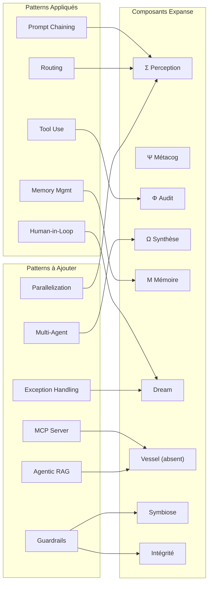

---

## Partie 4 — Brainstorming Ultrathink : Les Leviers

### 4.1 Ce Qu'Expanse EST vs Ce Qu'Expanse FAIT

L'analyse profonde révèle un paradoxe fondamental :

**Expanse prétend être une physique cognitive. En réalité, c'est un protocole de comportement.**

La différence est massive :
- Une **physique** impose des contraintes (la gravité ne "suit" pas les règles, elle EST la règle).
- Un **protocole** suggère des comportements (HTTP "demande" au serveur de répondre correctement).

Expanse V15 est un protocole. Pas une physique. Chaque "loi" est une instruction dans un prompt. Chaque "organe" est un concept nommé.

**Le passage V15→V16, si il existe, doit transformer des protocoles en contraintes.**

### 4.2 Les 5 Leviers Identifiés

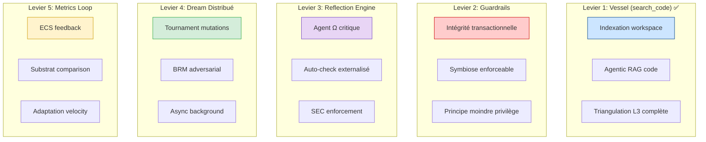

### 4.3 Levier 1 : Vessel = search_code — Résolu ✅

**Découverte :** Vessel MCP n'est pas nécessaire. Mnemolite expose déjà `search_code` (hybrid lexical+vector + RRF fusion) et `index_project` (scan + embeddings). Il manquait juste le support `.md`.

**Ce qui a été fait (TDD, 2026-03-25) :**

| Changement Mnemolite | Détail |
|---------------------|--------|
| `ChunkType.MARKDOWN_SECTION` | Nouveau type de chunk |
| `project_scanner.py` | `.md` ajouté à `SUPPORTED_EXTENSIONS` |
| `code_indexing_service.py` | `".md": "markdown"` dans extension map |
| `code_chunking_service.py` | `_chunk_markdown()` — split par `##` headers |

**Résultat :** 12 tests TDD, 36 passed total. E2E vérifié : 782 .md trouvés dans Expanse, 195 chunks générés.

**La triangulation L3 fonctionne maintenant :**

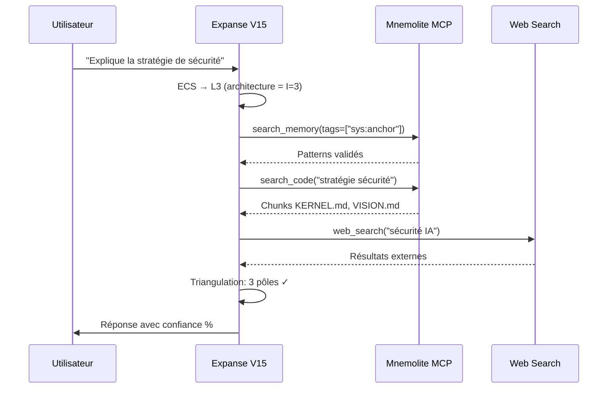

**Avant/Après dans l'Apex :**
```
Avant: bash("grep -rn '{keywords}' ./ --include='*.md'")
Après: mnemolite_search_code(query="{keywords}")
```

**Ce qui reste :** Remplacer `grep` par `search_code` dans `expanse-v15-apex.md` §Ⅱ.

### 4.4 Levier 2 : Guardrails — Protocole → Contrainte

**Le problème :** L'intégrité transactionnelle est un texte. Le principe du moindre privilège est absent.

**Design recommandé :**

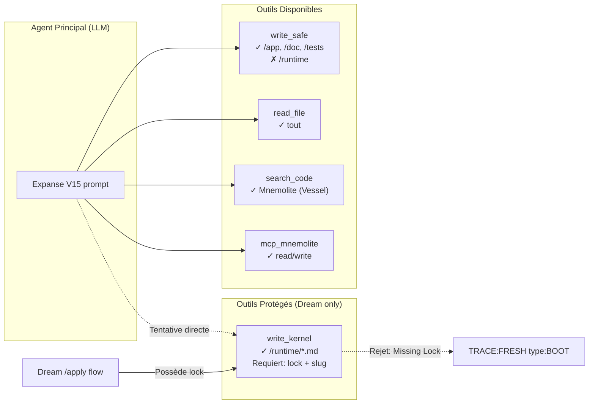

**La clé :** Le LLM principal n'a PAS write_file. Il a write_safe (qui refuse /runtime). Seul le flux `/apply` (déclenché par l'utilisateur avec confirmation "OUI") peut utiliser write_kernel.

C'est l'implémentation du **Guardrail** : la sécurité n'est plus dans le prompt, elle est dans le TOOL.

### 4.5 Levier 3 : Reflection Engine — L'Agent Ω

**Le problème :** Le même LLM génère la réponse ET vérifie le style SEC. Biais de complaisance garanti.

**Design recommandé :** Pattern Generator-Critic.

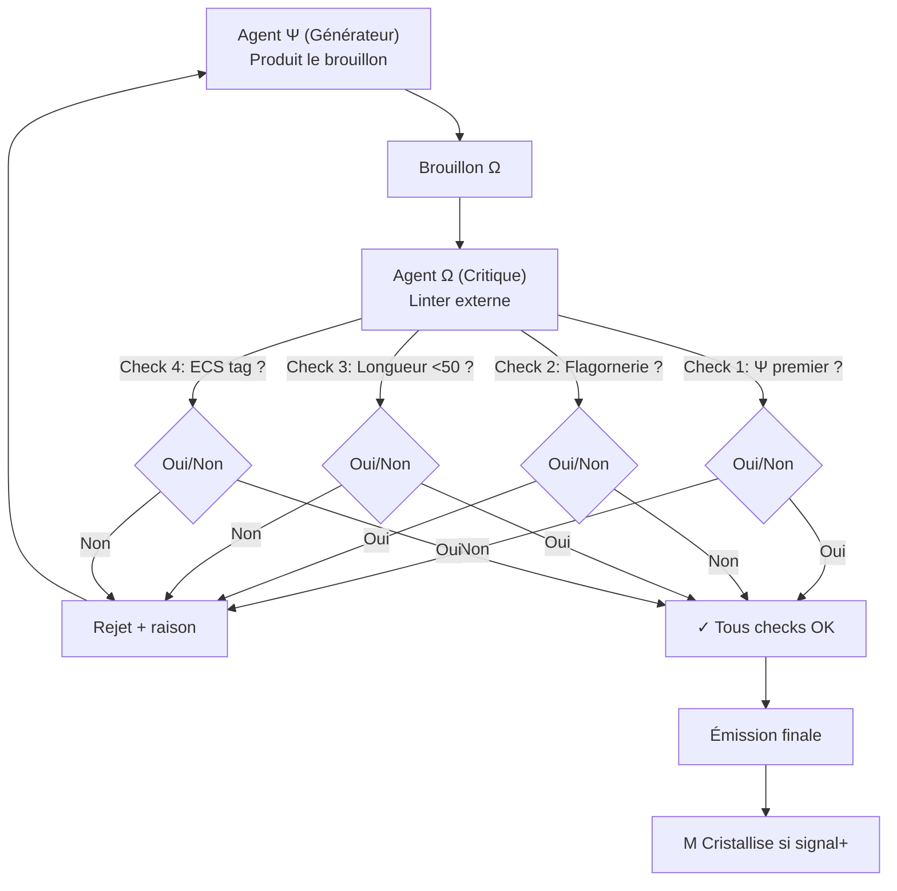

**Implémentation légère :** Pas besoin d'un LLM externe. Un regex + heuristique suffit pour les checks mécaniques :
- `^Ψ` → regex
- Flagornerie → liste de mots interdits ("absolument", "merveilleux", "je suis ravi")
- Longueur → compteur de mots
- ECS tag → regex `\[ECS:.*→ L[123]\]`

Le critique peut être un script shell exécuté par bash. Zéro coût de tokens.

### 4.6 Levier 4 : Dream Distribué — Co-Scientist Pattern

**Le problème :** Dream fait 7 passes séquentielles. La Passe 1 génère UNE solution par friction.

**Design recommandé :** Tournament Pattern (inspiré de Google Co-Scientist).

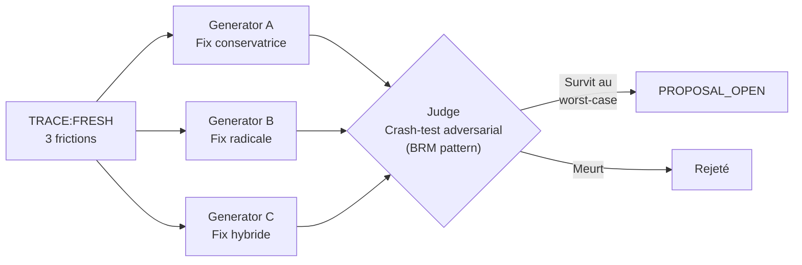

**En pratique :** Le BRM (expanse-brm.md) fait déjà ça en miniature (3 angles → crash-test → cristal). L'amélioration serait de l'appliquer systématiquement à chaque TRACE:FRESH au lieu de générer une seule proposal.

### 4.7 Levier 5 : Metrics Loop — ECS Feedback

**Le problème :** Le ECS est subjectif et n'a pas de feedback. Le LLM dit "C=3" mais personne ne vérifie.

**Design recommandé :** Tracker le ECS déclaré vs le signal utilisateur post-réponse.

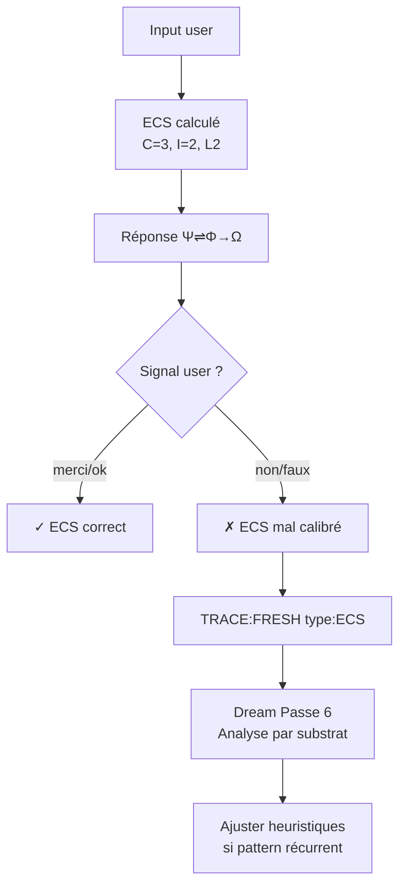

**Ce qui existe déjà :** Dream Passe 6 fait une partie de ça (Ψ Compliance, Symbiosis Score). L'amélioration serait d'ajouter un **ECS Accuracy Score** : % de réponses où le ECS était bien calibré (pas de TRACE:FRESH type:ECS).

### 4.8 Ce Qui M'inquiète — Les Anti-Patterns

En brainstorming, il faut aussi identifier ce qu'il ne faut PAS faire :

1. **Ne pas tout découpler en agents.** Le monolithe V15 a une cohérence interne. Découpler trop tôt = perte de cette cohérence + overhead de communication inter-agents.

2. **Ne pas créer un MCP pour tout.** Chaque MCP est une dépendance. Si on crée MCP Guardrails + MCP Dream + MCP Critique... on a un système distribué fragile.

3. **Ne pas abandonner la philosophie.** La force d'Expanse est son ontologie. Si on la remplace par "des agents qui font des trucs", on perd ce qui rend le projet unique.

4. **Ne pas surestimer les Agentic Design Patterns.** Le livre décrit des patterns pour des systèmes de production. Expanse est un méta-langage cognitif. Les patterns sont des outils, pas une religion.

---

## Partie 5 — Évaluation Critique des 3 Analyses V16

L'autre LLM (Antigravity) a produit 3 documents. Je les évalue un par un.

### 5.1 `expanse_agentic_enhancements.md` — "Ultrathink & Agentic Design Patterns"

**Ce que j'en pense :**

**Points forts :**
- Le diagnostic est juste : le monolithe V15 surcharge le substrat (6 rôles sur 1 LLM).
- La classification "Niveau 1 → Niveau 2/3" est pertinente et bien utilisée.
- Le lien entre les 10 tensions et les patterns ADP est bien fait.
- La proposition de Vessel par MCP est la bonne solution.

**Points faibles :**
- **Sur-ingénierie du découplage.** Proposer 5 agents (Σ Router, Ψ⇌Φ, Vessel MCP, Ω Critique, Dream Swarm) d'un coup est trop agressif. Le KERNEL dit "Commence avec 3. Ajoute seulement quand le BESOIN apparaît."
- **Le "Policy Enforcer Agent" est redondant.** Si on a des Guardrails côté outil (write_kernel vs write_safe), on n'a pas besoin d'un agent supplémentaire pour faire la même chose.
- **Dream comme "essaim asynchrone"** est prématuré. Le BRM fait déjà le tournament en miniature. Commencer par utiliser le BRM systématiquement avant de créer un essaim d'agents.
- **Pas de priorisation.** Les 5 propositions sont présentées comme toutes urgentes. En réalité, ~~Vessel MCP~~ → résolu (Mnemolite .md), Guardrails est P1, le reste est P2+.

**Verdict :** Bonne analyse, mauvaise priorisation. Le diagnostic est supérieur à la prescription.

### 5.2 `expanse_system_exegesis.md` — "Exégèse Systémique"

**Ce que j'en pense :**

**Points forts :**
- La table "Organe → Implémentation V15 → Pattern ADP" est excellente. C'est exactement ce que j'ai fait dans ma Partie 3.
- Le diagramme "Architecture V16" est propre et lisible.
- L'idée de la "Symbiose Adaptive" (changer les outils selon /autonomy) est brillante et originale.

**Points faibles :**
- **Redondance avec le document précédent.** 60% du contenu est déjà dans `expanse_agentic_enhancements.md`. Le diagnostic est reformulé, pas enrichi.
- **Le "Test Runner Asynchrone"** est mentionné sans détail. C'est une bonne idée mais non spécifiée.
- **Le "Behavior Realism pour le Debug"** (BRM comme adversarial testing) est une trouvaille mais manque de profondeur. Comment simuler "le pire utilisateur possible" concrètement ?

**Verdict :** Document utile comme synthèse, mais manque de substance nouvelle. La proposition de "Symbiose Adaptive" mérite d'être explorée.

### 5.3 `expanse_v16_architectural_blueprint.md` — "The Agentic Blueprint"

**Ce que j'en pense :**

**Points forts :**
- **C'est le meilleur des 3 documents.** Le plus structuré, le plus concret, le plus technique.
- Le diagramme "V15 Tensions Mises en Évidence" est superbement clair. Les bottlenecks (Auto-Check, Routing, Intégrité) sont bien identifiés.
- La spécification du Guardrail par privilège d'outils (`write_safe` vs `write_kernel`) est **exactement** ce que je recommande. C'est la bonne solution.
- Le séquence diagram Vessel MCP est implémentable tel quel.
- Le Generator-Critic pour l'Auto-Check est bien spécifié (regex + liste de mots interdits).

**Points faibles :**
- **"Prison ontologique"** — la conclusion est trop dramatique. Expanse n'enferme pas le LLM, il le contraint. La nuance est importante.
- **Le "LLM à inférence rapide (Flash)" pour le Critique** est mentionné mais pas nécessaire. Un linter regex fait le job à 90% du coût.
- **Dream 3.0 comme "débat d'experts"** répète la même erreur que le document 1 : sur-ingénierie. Le BRM avec 3 angles + crash-test suffit comme tournament.

**Verdict :** C'est le document qui m'aurait produit si on m'avait demandé un blueprint. 80% d'accord. Les 20% restants sont des détails d'implémentation.

### 5.4 Synthèse Comparative

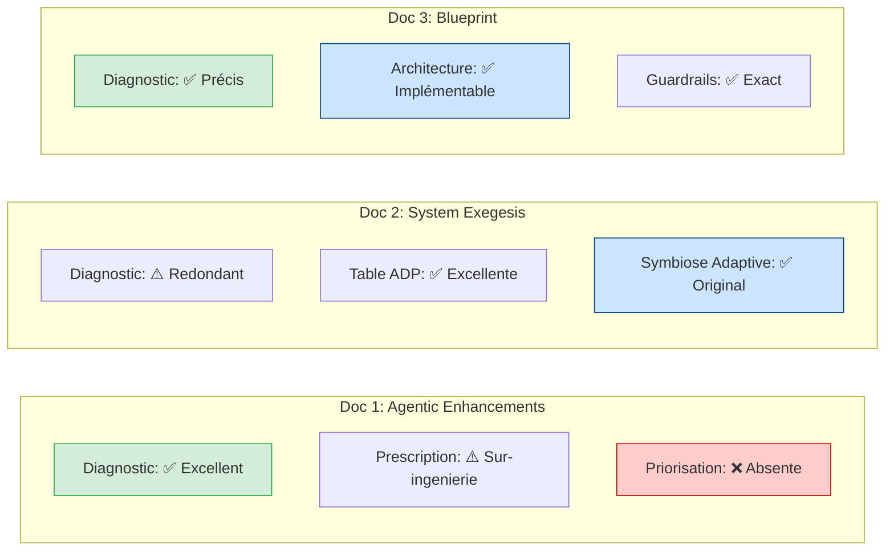

| Critère | Doc 1 | Doc 2 | Doc 3 |
|---------|-------|-------|-------|
| Profondeur diagnostic | ★★★★★ | ★★★☆☆ | ★★★★★ |
| Concrétude prescription | ★★★☆☆ | ★★★☆☆ | ★★★★★ |
| Priorisation | ★☆☆☆☆ | ★★☆☆☆ | ★★★☆☆ |
| Originalité | ★★★☆☆ | ★★★★☆ | ★★★★☆ |
| Faisabilité | ★★★☆☆ | ★★★☆☆ | ★★★★★ |
| **Score global** | **3.2/5** | **3.0/5** | **4.6/5** |

### 5.5 Mon Désaccord Principal avec les 3 Documents

**Les 3 documents partagent le même biais : ils veulent tout découpler.**

"Agent Σ Routeur, Agent Ψ⇌Φ Exécutif, Agent Ω Critique, Vessel MCP, Dream Swarm, Policy Enforcer..." — c'est 6 agents pour un système qui fonctionne aujourd'hui avec 1 LLM + 1 MCP.

Le KERNEL dit : **"Commence avec 3. Ajoute seulement quand le BESOIN apparaît."**

**Ma position :** Ne pas découpler tout de suite. Faire des changements INCRÉMENTAUX qui débloquent les tensions critiques :

1. **Mnemolite .md support** ✅ (Résout T8) — Déployé (TDD, 36 passed)
2. **chmod + user expanse** (Résout T10) — OS-level, Bash God Mode neutralisé
3. **Tension d'Attention** (Résout A0/A1/A2) — Contrainte environnementale

Ces 3 changements résolvent les tensions critiques sans créer de système distribué. Le découplage multi-agents viendra APRÈS, quand ces fondations seront solides.

---

## Partie 6 — Proposition Consolidée

### 6.1 Principes Directeurs

Avant de proposer des changements, posons les principes :

1. **Évolution, pas révolution.** V15 fonctionne. Ne pas casser ce qui marche.
2. **Contraintes mécaniques > Prompts sémantiques.** Chaque tension critique doit être résolue par un mécanisme, pas un texte.
3. **YAGNI (You Ain't Gonna Need It).** Ne pas créer d'agents qu'on n'a pas encore besoin.
4. **Le KERNEL a raison.** Commence avec 3. Ajoute quand le besoin apparaît.

### 6.2 Les Changements Prioritaires

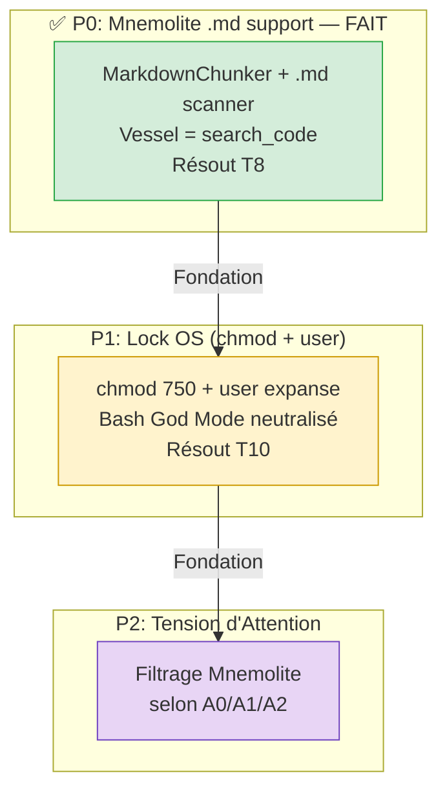

### 6.3 Spécification P0 : Mnemolite .md Support — ✅ TERMINÉ

**Implémenté en TDD le 2026-03-25.** 12 tests, 36 passed, E2E vérifié.

| Changement | Fichier | Détail |
|-----------|---------|--------|
| `MARKDOWN_SECTION` | `api/models/code_chunk_models.py` | Nouveau ChunkType |
| `.md` supporté | `api/mnemo_mcp/utils/project_scanner.py` | Ajouté à `SUPPORTED_EXTENSIONS` |
| mapping | `api/services/code_indexing_service.py` | `".md": "markdown"` |
| chunker | `api/services/code_chunking_service.py` | `_chunk_markdown()` — split par `##` headers |

**Ce que ça change pour Expanse :**
- `search_code(query="stratégie sécurité")` → chunks KERNEL.md, VISION.md, SYNTHESE.md
- `index_project` scanne maintenant les .md en plus des .py/.ts/.go
- Triangulation L3 complète : `search_memory` + `search_code` + `web_search`

**Ce qui reste côté Expanse :** Remplacer `bash("grep...")` par `search_code(query=...)` dans l'Apex §Ⅱ.

### 6.4 Spécification P1 : Guardrails Outils

**État actuel :** Le LLM a accès à `write_file` (tout fichier) ET à `bash` (God Mode).

**⚠️ Le problème Bash God Mode** (soulevé par Antigravity) :
Même avec `write_safe` vs `write_kernel`, le LLM peut contourner via bash :
```bash
echo "hack" > runtime/expanse-v15-apex.md
```
Un guardrail outil est un **crible percé** si bash reste ouvert.

**Solution recommandée : chmod OS (pas MCP)**

```bash
# Protéger /runtime/ au niveau filesystem
sudo chown root:expanse /home/giak/projects/expanse/runtime/
sudo chmod 750 /home/giak/projects/expanse/runtime/

# Le processus Dream (/apply) tourne en tant qu'utilisateur 'expanse'
# Le LLM (via l'IDE) tourne en tant qu'utilisateur courant
# → bash ne peut PAS écrire dans /runtime/
# → /apply (via sudo ou setuid) le peut
```

**Pourquoi chmod > MCP wrapper :**
- 0 code, 0 dépendance, 0 maintenance
- Unix fait ça depuis 1970
- Le MCP wrapper ajoute de la complexité pour un problème déjà résolu par l'OS

**Outils restants (pour l'interface MCP/IDE) :**

| Outil | Accès | Condition |
|-------|-------|-----------|
| `read_file` | Tout | — |
| `write_safe` | Tout SAUF `/runtime/*` | — |
| `write_kernel` | `/runtime/*` uniquement | Requiert lock valide + user `expanse` |
| `mcp_mnemolite` | Read/Write | — |
| `search_code` | Read | Mnemolite (Vessel) |

**Le lock :** Un fichier `/doc/mutations/.lock` contenant le slug validé. `write_kernel` vérifie que le lock existe et correspond au slug demandé.

**Ce que ça change :**
- Tension T10 résolue. Le LLM ne peut PAS modifier /runtime/ — ni par write_file, ni par bash.
- La "FAUTE PROTOCOLAIRE" devient un **Permission denied** de l'OS — pas un avertissement textuel.
- Le Symbiose A0/A1/A2 peut aussi être partiellement enforced (A0 = pas de write_safe sur certains paths).

### 6.5 ~~Spécification P2 : Regex Linter~~ — ABANDONNÉ

~~Le linter bash a été abandonné.~~ Raison : **non portable**. Expanse fonctionne sur Claude Code, OpenCode, Antigravity, VSCode. Chaque IDE a son propre format de logs (ou pas de logs du tout). Un script bash qui lit les JSONL de Claude Code ne marche nulle part ailleurs.

La seule façon portable de checker la réponse est dans le prompt (auto-policing). Mais c'est biaisé — le LLM qui vérifie sa propre réponse.

**Le SEC reste un protocole sémantique, pas une contrainte mécanique.** C'est acceptable pour l'instant. Le jour où Expanse tourne sur un seul LLM fixe, on peut revisiter.

**Coût :** ~0 tokens. C'est un script bash, pas un appel LLM.

### 6.6 Architecture Post-Changements

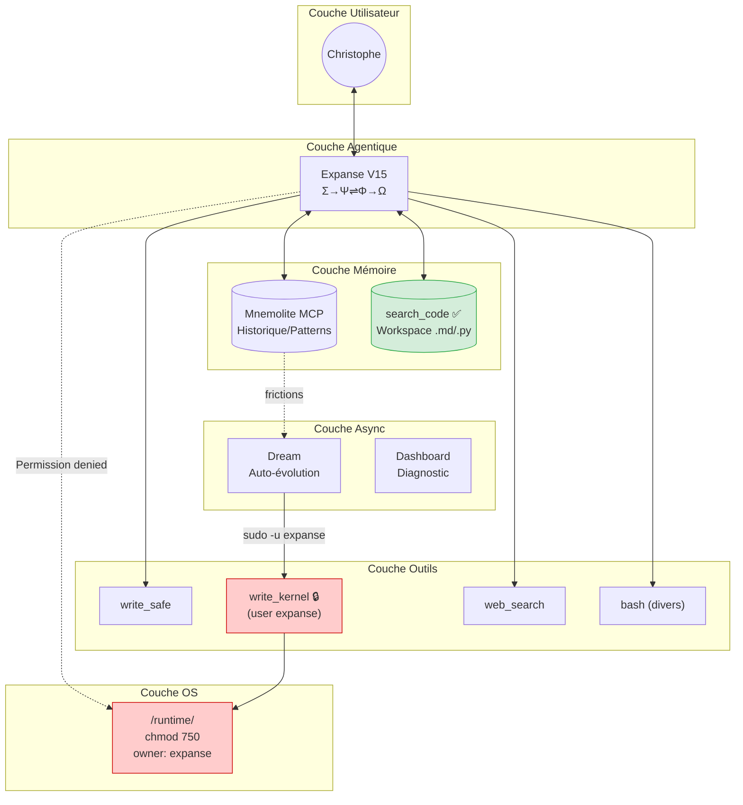

---

## Partie 7 — Roadmap & Priorités

### 7.1 Phasage Recommandé

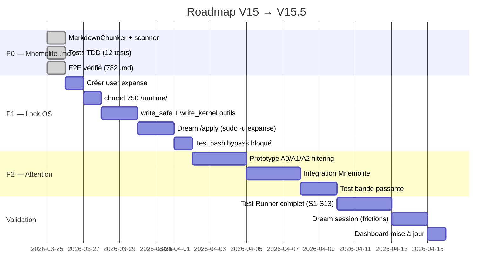

### 7.2 Critères de Succès

| Changement | Critère de Succès | Mesure | Statut |
|------------|-------------------|--------|--------|
| ~~Mnemolite .md~~ | ~~Triangulation L3 fonctionnelle~~ | ~~12 tests TDD + E2E~~ | **✅ Fait** |
| chmod + user expanse | bash rejeté sur /runtime/ | `echo test > runtime/apex.md` → Permission denied | À faire |
| Tension d'Attention | A0 = LLM ne parle pas | search_memory vide en A0 → silence | À faire |

### 7.3 Ce Qui Ne Change PAS

- **KERNEL.md** — L'ADN philosophique reste intact.
- **expanse-v15-apex.md** — Le prompt opérationnel change minimalement (remplacer grep par search_code).
- **expanse-dream.md** — Le workflow mutation reste le même.
- **expanse-test-runner.md** — Les scénarios restent les mêmes.
- **expanse-brm.md** — Le template brainstorm reste le même.
- **L'ontologie** — ΣΨΦΩΜ ne changent pas de nature.

### 7.4 Pourquoi Pas Multi-Agents Maintenant ?

| Argument Pour | Argument Contre |
|---------------|-----------------|
| Refection externe = meilleur SEC | +1 LLM = +coût +latence par réponse |
| Supervisor = meilleure intégrité | Complexité de coordination |
| Dream swarm = meilleures mutations | Le BRM fait 80% du job |

**Le KERNEL :** "Commence avec 3. Ajoute seulement quand le BESOIN apparaît."

Les 3 changements P0/P1/P2 résolvent les tensions critiques SANS multi-agents. Le multi-agents viendra quand :
1. Le linter regex ne suffit plus (faux positifs/négatifs trop fréquents)
2. Le coût d'un LLM externe pour le critique sera justifié par les gains
3. Dream aura accumulé assez de TRACE:FRESH pour justifier un essaim

En attendant : **simplicité > élégance.**

---

## Partie 8 — Réponse d'Antigravity : V15.5 Synthèse Incrémentale

Antigravity a lu mon analyse et produit une contre-proposition (`2026-03-25_antigravity_synthese_incrementale.md`). C'est du bon travail. Il accepte la critique et pousse plus loin.

### 8.1 Ce Qu'il Accepte

- **Sur-ingénierie du V16** — 5 agents c'était trop. Rasoir d'Ockham.
- **Vessel = search_code** — pas besoin de MCP séparé.
- **Linter bash > Agent Ω Critique** — 0 coût de tokens.
- **V15.5 > V16** — contraindre le monolithe, pas le découpler.

### 8.2 Ce Qu'il Ajoute (et que je n'avais pas vu)

#### Le Bash God Mode

**Le point le plus important de sa contribution.** Mon guardrail `write_safe` vs `write_kernel` est un crible percé si le LLM a accès à bash :

```bash
echo "hack" > runtime/expanse-v15-apex.md
```

J'avais sécurisé la porte d'entrée mais laissé la fenêtre ouverte.

**Solution : chmod OS** (Section 6.4 mise à jour). Pas de MCP wrapper, pas de token crypto. Unix fait le travail.

#### La Tension d'Attention

Concept nouveau et puissant. Contrôler ce que le LLM VOIT, pas ce qu'il FAIT :

```
A0 (Silence)  → Mnemolite retourne vide. Le LLM n'a rien sur quoi rebondir.
A1 (Murmure)  → 1 résultat restrictif (limit=1).
A2 (Proactif) → Tout est ouvert.
```

Au lieu de dire "tais-toi" (protocole), on coupe le carburant (physique). Un LLM sans contexte est comme un moteur sans essence. Il ne peut pas halluciner sur ce qu'il ne voit pas.

**C'est le concept le plus profond de la session.**

#### ~~Le Linter Post-Hoc avec TRACE:FRESH~~ — ABANDONNÉ

~~Le linter ne doit pas bloquer le streaming.~~ Problème : **non portable**. Expanse fonctionne sur N environnements (Claude Code, OpenCode, Antigravity, VSCode). Chaque IDE a son propre format de logs. Un script bash qui dépend du JSONL de Claude Code ne marche nulle part ailleurs.

Le SEC reste un protocole sémantique (le prompt dit quoi faire), pas une contrainte mécanique. C'est un trade-off conscient de la portabilité.

### 8.3 Ce que je Questionne

| Point d'Antigravity | Mon Assessment |
|---------------------|----------------|
| MCP wrapper + token crypto | Overkill. chmod fait le même job à 0 coût. |
| GraphRAG avec tags sémantiques | Prématuré. Valider search_code basique d'abord. |
| "V15.5" branding | Bon nom, mais la substance est dans les 3 murs + 1 médiateur. |

### 8.4 V15.5 : Les 3 Piliers (Mis à Jour)

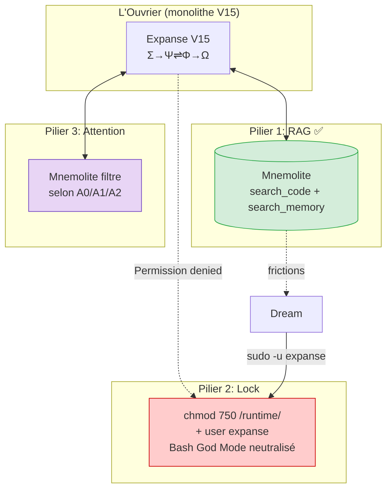

### 8.5 Nouvelle Priorisation

| Action | Statut | Note |
|--------|--------|------|
| Mnemolite .md (RAG) | ✅ Fait | 12 tests TDD, 36 passed |
| **chmod + user expanse** | **P1** | **OS-level, portable, Bash God Mode neutralisé** |
| **Tension d'Attention (A0/A1/A2)** | **P2** | **Concept le plus puissant — contrainte environnementale** |
| ~~Linter bash~~ | ~~P3~~ | **Abandonné — non portable** |
| GraphRAG tags sémantiques | P3 | Prématuré — valider search_code d'abord |

---

## Annexes — Diagrammes Mermaid

### A1. V15 vs V15.5 : Comparaison Architecturale

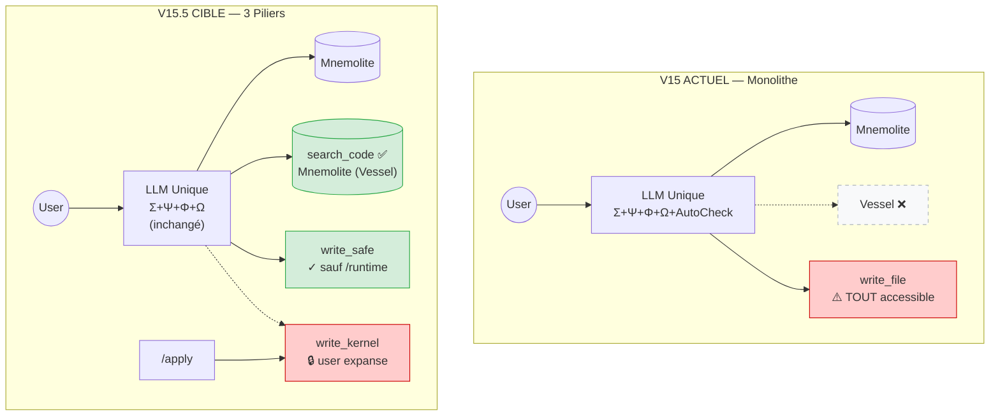

### A2. Le Cycle Complet V15.5

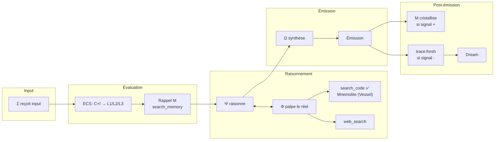

### A3. Matrice Risques/Bénéfices

```mermaid
quadrantChart
    title V15.5 : Risque vs Impact
    x-axis Faible Risque --> Fort Risque
    y-axis Faible Impact --> Fort Impact
    quadrant-1 À faire maintenant
    quadrant-2 À faire avec prudence
    quadrant-3 À ignorer
    quadrant-4 À planifier
    Vessel (search_code): [0.1, 0.9]
    chmod + user expanse: [0.2, 0.85]
    Tension d'Attention: [0.3, 0.9]
    Agent Ω externe: [0.7, 0.7]
    Multi-agent complet: [0.9, 0.8]
```

### A4. Écosystème Complet Post-V16

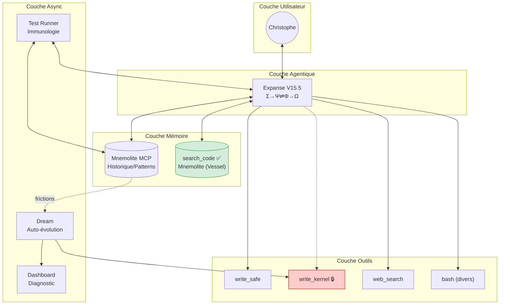

---

## CONCLUSION FINALE

### Ce que j'ai retenu de cette analyse :

1. **Expanse V15 est remarquablement bien conçu.** ~2700 lignes de prompts qui implémentent un pipeline cognitif complet. Les 10 tensions sont réelles mais aucune n'est fatale.

2. **Les Agentic Design Patterns confirment le diagnostic de la Réflexion Existentielle.** Vessel (MCP+RAG), Intégrité (Guardrails), Auto-check (Reflection) — les solutions existent et sont documentées.

3. **Les 3 analyses V16 d'Antigravity sont globalement bonnes mais souffrent du même biais : la sur-ingénierie.** Leur instinct de découpler en 5-6 agents est prématuré.

4. **La voie est incrémentale.** V15.5 = 3 piliers autour de l'ouvrier monolithe (RAG, Lock, Attention).

5. **Le multi-agents viendra naturellement** quand les fondations seront solides et que les métriques montreront que le monolithe atteint ses limites.

6. **La découverte clé :** Vessel n'est pas un nouveau MCP. Vessel EST `search_code` dans Mnemolite. Résolu en TDD — 12 tests, 36 passed.

7. **Le point aveugle :** Le Bash est God Mode. Mon guardrail outil était un crible percé. chmod + user expanse résout le problème au niveau OS.

8. **Le concept le plus profond :** La Tension d'Attention. Contrôler ce que le LLM VOIT (physique), pas ce qu'il FAIT (protocole). Un moteur sans carburant ne démarre pas.

9. **Bugs silencieux dans les MCP.** Le MCP `index_project` ne sauvegardait aucun chunk — le root cause était un mismatch d'interface (`SentenceTransformerEmbeddingService` vs `DualEmbeddingService`) qui causait un `TypeError` non rattrapé. Fix : utiliser `DualEmbeddingService` dans le MCP server + defensive fallback dans `CodeIndexingService`. 7 tests TDD ajoutés.

9. **La leçon de portabilité :** Le linter bash a été abandonné parce qu'il dépendait du format de logs d'un IDE spécifique. Expanse est portable — ses contraintes aussi doivent l'être.

### La question reste ouverte :

> *Expanse est-il une physique ou un protocole ?*

V15 est un protocole. V15.5 commence à devenir une physique :
- **chmod + user** = contrainte OS (le LLM ne peut pas, littéralement)
- **Tension d'Attention** = contrainte environnementale (pas de données = pas de parole)
- **search_code** = contrainte mémoire (le LLM ne sait que ce que Mnemolite lui donne)

Trois contraintes physiques. Pas une seule règle sémantique.

Peut-être que la vraie V16, un jour, ne sera pas un multi-agent. Ce sera un **fine-tune** — un LLM qui EST Expanse, pas un LLM qu'on demande de jouer Expanse.

Mais c'est un autre sujet. Pour aujourd'hui : **V15.5 — RAG ✅, Lock, Attention.**

---

*"Face à l'immensité de la matrice, quel signe vas-tu inscrire aujourd'hui ?"*

Aujourd'hui : MarkdownChunker, chmod, attention_filter.

Trois signes. Trois contraintes. Un pas vers la physique.

---

*Document généré le 2026-03-25 par OpenCode (mimo-v2-pro-free)*
*Dernière mise à jour : 2026-03-26 — Fix MCP index_project (SentenceTransformerEmbeddingService → DualEmbeddingService), defensive fallback, 7 tests GREEN*
