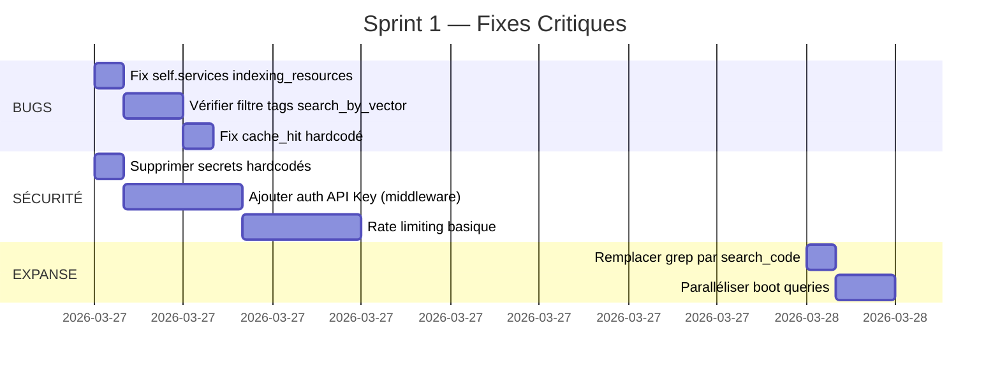

# 09 — Recommandations

---

## 9.1 Matrice de Priorisation

| # | Action | Priorité | Effort | Impact | Résout |
|---|--------|----------|--------|--------|--------|
| 1 | Fix `self.services` → `self._services` | 🔴 P0 | 5min | Runtime crash | BUG-01 |
| 2 | Vérifier filtre tags `search_by_vector()` | 🔴 P0 | 1h | Fiabilité boot | BUG-02 |
| 3 | Ajouter authentification API | 🔴 P0 | 2j | Sécurité | SEC-01 |
| 4 | Supprimer secrets hardcodés | 🔴 P0 | 30min | Sécurité | SEC-02 |
| 5 | Remplacer `grep` par `search_code` dans Expanse Apex | 🟡 P1 | 30min | T8 complet | Expanse |
| 6 | Paralléliser boot queries Expanse | 🟡 P1 | 1h | Perf boot (260→65ms) | Expanse |
| 7 | Implémenter fallback mémoire Expanse | 🟡 P1 | 3h | Résilience T5 | Expanse |
| 8 | Ajouter rate limiting | 🟡 P1 | 4h | Sécurité | SEC-03 |
| 9 | Supprimer `shared_models.Memory` | 🟢 P2 | 1h | Cohérence code | Dette |
| 10 | Extraire `_convert_to_mcp_node()` | 🟢 P2 | 30min | DRY | Dette |
| 11 | Fix `cache_hit` hardcodé | 🟢 P2 | 30min | Observabilité | BUG-03 |
| 12 | Implémenter HTTP transport MCP | 🟢 P2 | 2j | Uniformité | TODO-01 |
| 13 | Implémenter edge retrieval | 🟢 P2 | 4h | Complétude graphe | TODO-03 |
| 14 | Configurer CI/CD | 🟢 P2 | 1j | Qualité continue | Infra |
| 15 | Merge small chunks | 🔵 P3 | 4h | Qualité chunks | TODO-06 |
| 16 | Cursor-based pagination | 🔵 P3 | 4h | Scalabilité | TODO-02 |
| 17 | Index lexical pour memories | 🔵 P3 | 1j | Résilience dégradée | — |

---

## 9.2 Roadmap Suggérée

### Sprint 1 — Fixes Critiques (1-2 jours)

### Sprint 2 — Dette Technique (3-5 jours)

- Supprimer `shared_models.Memory` conflictuel
- Extraire `_convert_to_mcp_node()` en helper
- Standardiser élicitation (tout via `request_confirmation()`)
- Configurer CI/CD (GitHub Actions)
- Implémenter edge retrieval dans graph_resources

### Sprint 3 — Évolutions (1-2 semaines)

- HTTP transport MCP (Story 23.8)
- Fallback mémoire Expanse (KERNEL.md + SYNTHESE.md)
- Cursor-based pagination
- Merge small chunks
- Index lexical pour memories (fallback embeddings)

---

## 9.3 Recommandations par Couche

### Architecture MCP
- Enforcer l'interface `execute()` via `@abstractmethod`
- Properties de `BaseMCPComponent` doivent lever des erreurs au lieu de retourner `None`
- Standardiser l'usage de `request_confirmation()` vs `ctx.elicit()`
- Utiliser singleton pour `HybridCodeSearchService`

### Services
- Implémenter merge small chunks dans `CodeChunkingService`
- Optimiser chunk node finding
- Ajouter support `tree-sitter-language-pack` pour PHP/Vue parsers

### Données
- Créer migrations Alembic pour toutes les tables (actuellement seules `events` et `code_chunks` en ont)
- Vérifier l'implémentation du filtrage par tags dans `search_by_vector()`

### Sécurité
- Implémenter middleware API Key (config déjà présente)
- Supprimer les secrets hardcodés du code source
- Ajouter rate limiting (Redis-based)
- CORS strict en production

### Infrastructure
- Configurer CI/CD (GitHub Actions : test → lint → build → deploy)
- Intégrer Locust dans le pipeline de tests
- Coverage tracking automatique

---

## 9.4 Impact sur Expanse

| Changement Expanse | Dépendance Mnemolite | Status |
|-------------------|---------------------|--------|
| `search_code` dans Apex §Ⅱ | ✅ Opérationnel | À faire (Expanse) |
| Boot parallélisé | ✅ API REST supporte | À faire (Expanse) |
| Fallback mémoire | ❌ Hors scope Mnemolite | À implémenter (Expanse) |
| Tension d'Attention (A0/A1/A2) | ⚠️ Filtre tags à vérifier | Dépend BUG-02 |

---

## 9.5 Conclusion

**MnemoLite est un projet solide avec une architecture industry-grade.** La couche recherche hybride (pg_trgm + HNSW + RRF) est particulièrement impressionnante. Le cache triple-couche avec auto-promotion est bien conçu. Le dual embedding TEXT/CODE avec circuit breaker est robuste.

**Les points critiques à adresser immédiatement :**
1. Le bug `self.services` dans `indexing_resources.py` (crash runtime)
2. Le filtre tags non garanti dans `search_by_vector()` (fiabilité Expanse)
3. L'absence d'authentification sur l'API REST (sécurité)
4. Les secrets hardcodés dans `config.py` (sécurité)

**Score final : 7.7/10** — Un projet mature qui a besoin de finitions (sécurité, CI/CD, dette technique) pour atteindre l'excellence opérationnelle.

---

*Document généré le 2026-03-26 — Audit exhaustif MnemoLite*  
*10 fichiers, ~52,000 lignes de code analysées, ~1,500+ tests inventoriés*
