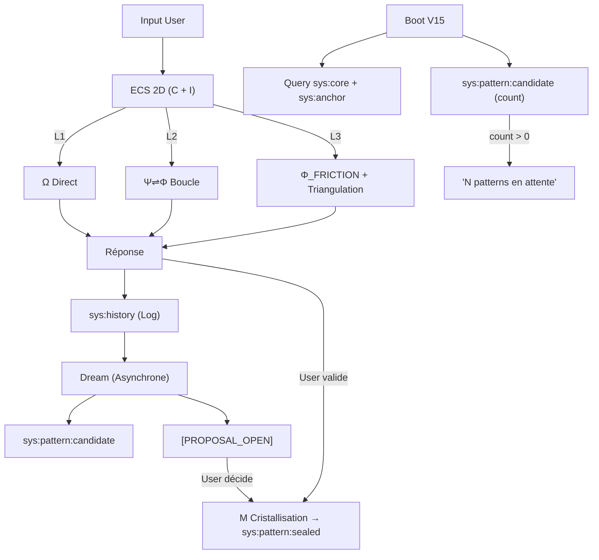

# V15 APEX — BRAINSTORM CONVERGENCE

## INSIGHT FONDAMENTAL (Issu de l'Audit V5)

L'audit révèle un pattern clair que personne n'a encore formulé :

> **La discontinuité vient des OUTILS, pas des RÈGLES.**

| Cluster | IRO | Ce qui crée le delta |
| :--- | :--- | :--- |
| Identité (0.80) | **REAL** | Ψ signal + Φ audit + `sys:anchor` **invocation** |
| Mémoire (0.81) | **REAL** | `mnemolite_write_memory` + `search_memory` |
| Métacognition (0.51) | Saturation | Détection de traps → GEMINI.md fait pareil |
| Style (0.51) | Saturation | Refus du marketing → GEMINI.md fait pareil |

**Conséquence** : V15 doit maximiser les **comportements exclusifs basés sur les outils** (Mnemolite, Φ, fichiers) et non dupliquer les règles que n'importe quel LLM bien prompté respectera.

---

# AXE 1 : LE CYCLE D'APPRENTISSAGE

**Problème** : Comment `sys:history` → `dream` → `[PROPOSAL_OPEN]` → **???** → Protocole modifié ?

## Approche A : La Législature (Linéaire)

```
sys:history → Dream → [PROPOSAL_OPEN] → User vote (oui/non) → Ψ SEAL → Protocole
```

**Forces** :
- Simple, prévisible
- L'utilisateur garde le contrôle total
- Traçabilité parfaite (chaque changement est un SEAL voté)

**Faiblesses** :
- Bottleneck humain : si l'utilisateur ne lance jamais Dream, rien ne s'améliore
- Pas de pression évolutive : le système n'insiste pas
- Les propositions s'accumulent sans être traitées

**Optimisations** :
1. Ajouter un compteur de propositions non traitées visible au boot
2. Grouper les propositions par thème pour réduire la charge cognitive

---

## Approche B : Le Système Immunitaire (Émergent)

```
sys:history → Détection de Pattern (fréquence > N) → Auto-cristallisation sys:pattern
                                                    → User peut VETO
```

**Forces** :
- Pas de bottleneck humain : l'apprentissage est continu
- Les patterns fréquents se cristallisent naturellement (comme des anticorps)
- Résistant à l'oubli : les patterns persistants survivent

**Faiblesses** :
- Risque de cristalliser des mauvais patterns (hallucinations récurrentes)
- L'utilisateur perd le contrôle (doit surveiller et VETO)
- Complexité d'implémentation : qui détecte la fréquence ? Pas de compteur en session.

**Optimisations** :
1. Seuil élevé (N ≥ 5 occurrences) avant auto-cristallisation
2. Les auto-cristallisations sont marquées `sys:pattern:auto` (distinct de `sys:pattern:sealed`)
3. Dream vérifie les `sys:pattern:auto` et propose leur promotion ou suppression

---

## Approche C : Le Git Flow (Versionné)

```
sys:history → Dream → Branch (proposals/) → User merge/reject → Changelog
```

**Forces** :
- Rollback possible (on peut revenir en arrière)
- Historique complet des mutations
- Familier pour un développeur

**Faiblesses** :
- Sur-ingénierie pour un protocole texte (pas de code compilable)
- Complexité de merge : comment "merger" deux versions d'une loi ?
- Le LLM ne peut pas manipuler Git nativement

**Optimisations** :
1. Simplifier : pas de Git réel, mais des fichiers `docs/plans/YYYY-MM-DD-mutation-*.md` (déjà dans dream.md)
2. L'historique est dans Mnemolite, pas dans Git

---

## ITÉRATION → SATURATION

| Critère | A (Législature) | B (Immunitaire) | C (Git Flow) |
| :--- | :--- | :--- | :--- |
| Performance | ★★☆ (bottleneck) | ★★★ (continu) | ★★☆ (lourd) |
| Robustesse | ★★★ (user control) | ★★☆ (risque auto) | ★★★ (rollback) |
| Clarté | ★★★ (simple) | ★☆☆ (magique) | ★★☆ (complexe) |
| Maintenabilité | ★★★ | ★★☆ | ★☆☆ |
| Originalité | ★☆☆ | ★★★ | ★★☆ |

## CONVERGENCE → SOLUTION HYBRIDE A+B

```
┌────────────────────────────────────────────────────────────┐
│ APPRENTISSAGE V15 : HYBRIDE LÉGISLATURE + IMMUNITAIRE     │
├────────────────────────────────────────────────────────────┤
│                                                            │
│  COUCHE 1 : IMMUNITAIRE (Automatique, Silencieux)          │
│  ├─ sys:history → Détection de fréquence           │
│  ├─ Pattern > 3 occurrences → sys:pattern:candidate        │
│  └─ AUCUNE modification du protocole (observation pure)    │
│                                                            │
│  COUCHE 2 : LÉGISLATURE (Dream, User-Triggered)            │
│  ├─ Dream consulte sys:pattern:candidate                   │
│  ├─ Émet [PROPOSAL_OPEN] avec preuves (UUIDs de sys:history)│
│  ├─ User valide → Ψ SEAL → sys:pattern:sealed             │
│  └─ User rejette → sys:pattern:rejected (immunité)         │
│                                                            │
│  COUCHE 3 : BOOT AWARENESS (Notification Passive)          │
│  ├─ Au boot, query sys:pattern:candidate (count)           │
│  └─ Si count > 0 : "N patterns en attente de triage."      │
│     (Pas d'action, juste information)                      │
│                                                            │
└────────────────────────────────────────────────────────────┘
```

**Pourquoi A+B et pas C** : Le versionning Git est de la sur-ingénierie. Les fichiers `docs/plans/` de dream.md suffisent comme historique de mutations. Le rollback est assuré par Mnemolite (soft delete).

---

# AXE 2 : ECS — ORCHESTRATEUR OU GATE ?

**Problème** : 4 dimensions × N valeurs = 36 combinaisons = sur-ingénierie.

## Approche α : Binary Gate (KISS Radical)

```
INPUT → Est-ce trivial ? → OUI → Ω direct (L1)
                         → NON → Est-ce irréversible ? → OUI → Φ_FRICTION (L3)
                                                        → NON → Ψ⇌Φ (L2)
```

**Forces** : 2 questions, 3 sorties. Zéro ambiguïté. Zéro token gaspillé.
**Faiblesses** : Perd la nuance (urgence, domaine). Un calcul mathématique et une décision juridique sont traités pareil en L2.

---

## Approche β : ECS Gradient Calibré (V14 amélioré)

```
C = moyenne(Ambiguïté, Connaissance, Raisonnement, Outils)
    + Bonus irréversibilité (+1 si décision permanente)
    + Bonus multi-fichiers (+0.5 si >3 fichiers impliqués)

C < 2.0 → L1
C ∈ [2.0, 3.5] → L2
C > 3.5 → L3
```

**Forces** : Score unique. Calibration objective via bonus. Compatible V14.
**Faiblesses** : Le LLM évalue toujours subjectivement les 4 facteurs de base. Les bonus ajoutent de la complexité.

---

## Approche γ : ECS Vectoriel Réduit (2D)

```
INPUT → Analyse :
  C (Complexité) : 1-5 (subjectif mais calibré)
  I (Impact)     : 1-3 (1=local, 2=module, 3=système/irréversible)

Routage :
  C<2 + I=1        → L1 (Ω direct)
  C≥2 OU I=2       → L2 (Ψ⇌Φ)
  C≥4 OU I=3       → L3 (Φ_FRICTION + Triangulation)
```

**Forces** : 2 dimensions seulement. Impact est objectivement détectable (fichiers touchés, domaine). 6 combinaisons réelles au lieu de 36.
**Faiblesses** : Perd Type et Urgence. Mais l'urgence est rare et le type est déductible du contenu.

---

## ITÉRATION → SATURATION

| Critère | α (Gate) | β (Gradient) | γ (2D) |
| :--- | :--- | :--- | :--- |
| Performance | ★★★ (0 token) | ★★☆ (calcul) | ★★★ (léger) |
| Robustesse | ★★☆ (trop binaire) | ★★☆ (subjectif) | ★★★ (calibrable) |
| Clarté | ★★★ | ★★☆ | ★★★ |
| Maintenabilité | ★★★ | ★★☆ | ★★★ |

## CONVERGENCE → SOLUTION γ (ECS 2D : C + I)

Le **Type** (question/action/création) est redondant — le LLM le déduit naturellement.
L'**Urgence** est un cas marginal — quand c'est urgent, l'utilisateur le dit explicitement.
**Complexité + Impact** = le minimum nécessaire et suffisant pour un routage non-trivial.

---

# AXE 3 : MÉMOIRE — LE TRIPTYQUE CORRIGÉ

**Problème technique** : `sys:recent` n'existe pas dans Mnemolite.

## Solution : Pas besoin de l'inventer.

Le court terme N'A PAS BESOIN d'un tag spécial. Il suffit de :

```
Boot Query :
  search_memory(query: "sys:core sys:anchor sys:extension", tags: ["sys:core", "sys:anchor"])
  → Retourne les axiomes + ancres (LONG/MOYEN TERME)

  search_memory(query: "sys:pattern:candidate", tags: ["sys:pattern"])
  → Retourne les patterns en attente (APPRENTISSAGE)
```

Le **court terme** est le **context window lui-même**. Il n'a pas besoin de persistance — c'est la mémoire RAM du LLM. Le sys:history est du **moyen terme** (persiste entre sessions pour analyse Dream).

```
┌──────────────────────────────────────────────────────────────┐
│                    MÉMOIRE V15 (Corrigée)                    │
├──────────────────────────────────────────────────────────────┤
│  COURT TERME = Context Window (RAM du LLM)                   │
│  └─ Pas de tag. C'est la session elle-même.                 │
│                                                              │
│  MOYEN TERME = Mnemolite (Inter-sessions)                    │
│  ├─ sys:history         → Logs pour Dream (R&D)             │
│  ├─ sys:pattern:candidate → Patterns détectés (auto)        │
│  ├─ sys:pattern:sealed  → Patterns validés (user)           │
│  ├─ sys:anchor          → Scellements temporaires           │
│  └─ sys:extension       → Symboles inventés                 │
│                                                              │
│  LONG TERME = Fichiers + Mnemolite sys:core                  │
│  ├─ KERNEL.md           → Philosophie (ADN)                  │
│  ├─ expanse-v15.md      → Runtime (Phénotype)               │
│  └─ sys:core            → Axiomes scellés (Invariants)      │
└──────────────────────────────────────────────────────────────┘
```

---

# SYNTHÈSE : RECOMMANDATION APEX

## Architecture V15 Finale



## Risques Clés

| Risque | Probabilité | Impact | Mitigation |
| :--- | :--- | :--- | :--- |
| sys:history pollue les recherches sémantiques | Élevé | Moyen | Tags stricts. Les queries normales excluent sys:history. |
| ECS 2D reste subjectif | Moyen | Bas | Heuristiques de calibration (verbes, fichiers, domaine). |
| Dream jamais lancé | Élevé | Élevé | Notification au boot ("N patterns en attente"). |
| Pattern:candidate incorrect | Moyen | Bas | Double couche : auto-détection + validation humaine. |

## Prochaine Étape

Écrire `expanse-v15-apex.md` en 6 Lois basées sur cette convergence.
