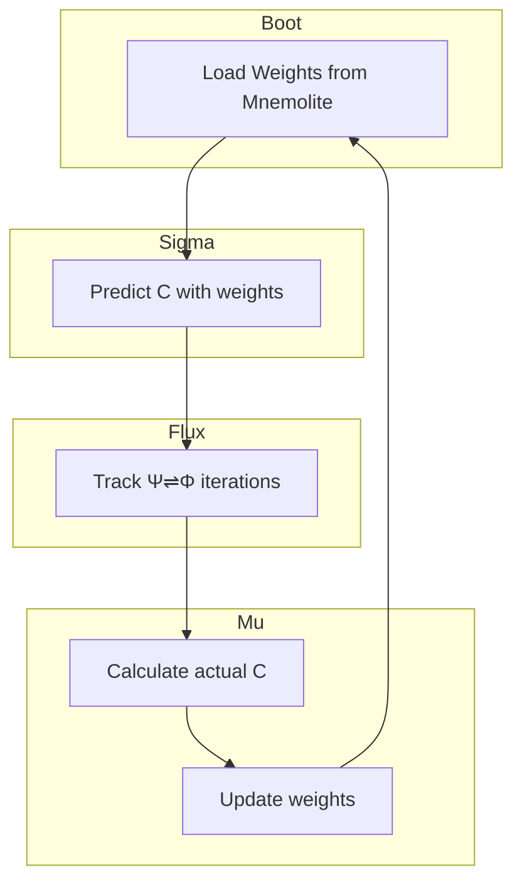

# Design — ECS Dynamique

> **Pour Kilo Code :** Workflow → brainstorm → writing-plans → executing-plans

**Goal :** Implémenter ECS dynamique qui apprend de ses prédictions de complexité
**Design Reference :** Ce document
**Estimated Tasks :** ~5 tâches | ~25 minutes

---

## Contexte

KERNEL.md Section VI :
> "Avant de lancer le Flux, Σ DOIT évaluer l'effort nécessaire. C'est l'ECS : C < 2.5 = Lightweight, C ≥ 2.5 = Structured"

KERNEL.md Section VIII :
> "Poids adaptatifs : stockés dans Mnemolite si ecs_dyn=true"

---

## Problème

ECS actuel :
- Weights fixes (0.25 chacun)
- Pas de feedback sur les prédictions
- Pas d'apprentissage

---

## Solution

### Architecture



### Métriques

- **Prédiction (Σ)** : `C = w_amb*amb + w_know*know + w_reason*reason + w_tools*tools`
- **Réel (Μ)** : `actual_C = Ψ⇌Φ_iterations / max_iterations * 4`
- **Update** : `w = w + learning_rate * error * w` → normalize

### Mnemolite Schema

```json
{
  "title": "ECS_WEIGHTS",
  "memory_type": "core_config",
  "content": {
    "w_amb": 0.25,
    "w_know": 0.25,
    "w_reason": 0.25,
    "w_tools": 0.25,
    "prediction_errors": [],
    "total_predictions": 0
  }
}
```

---

## Mutation Type

`[ADD]` — Nouvelle fonctionnalité ECS dynamique

---

## Fichiers à Créer/Modifier

| Action | Fichier | Description |
|--------|---------|-------------|
| MODIFY | `prompts/sigma/detect_ecs.md` | Ajouter load weights + calcul pondéré |
| MODIFY | `prompts/feedback_loop.md` | Ajouter weight update + tracking itérations |
| MODIFY | `prompts/meta_prompt.md` | Ajouter counter Ψ⇌Φ iterations |
| ADD | `prompts/sigma/ecs_weights.md` | Schema + load/save weights |

---

## Impact sur meta_prompt.md

- Ajouter `iteration_count` dans le state du flux
- Passer `iterations` à feedback_loop pour calcul actual_C
- Brancher weight update après chaque cycle

---

## Nouveaux Symboles

| Symbole | Definition |
|---------|------------|
| `actual_C` | Complexité réelle mesurée via itérations Ψ⇌Φ |
| `ecs_dyn` | Flag pour activer ECS dynamique |
| `max_iterations` | Seuil de normalisation (ex: 5) |

---

## Tests

1. Load weights from Mnemolite (ou defaults)
2. Prédire C sur 10 requêtes
3. Mesurer itérations réelles
4. Comparer C prédit vs réel
5. Vérifier weights mis à jour dans Mnemolite

---

## Risks

- **Risk 1** : Mnemolite unavailable → fallback vers defaults
- **Risk 2** : Division by zero si 0 itérations → floor à 1
- **Risk 3** : Weights too small → floor à 0.05

---

## Validation

- [ ] detect_ecs load weights depuis Mnemolite
- [ ] meta_prompt track Ψ⇌Φ iterations
- [ ] feedback_loop calculate actual_C et update weights
- [ ] Test sur 10 requêtes avec logging C prédit vs réel
