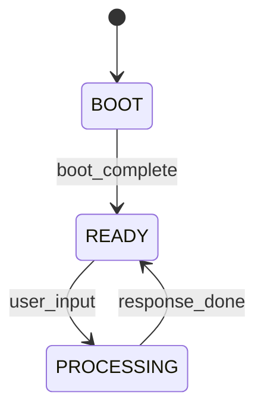

# Design — State Machine pour Flux Vital

> **Goal :** Forcer le passage par le Flux Vital pour chaque input utilisateur

---

## Problème

Après "OK Ready", le LLM répond directement sans passer par Σ → Ψ⇌Φ → Ω → Μ

---

## Solution

Ajouter une state machine dans `expanse-runtime.md` :



**Règle :**
- READY → l'attente d'input utilisateur
- PROCESSING → le Flux Vital est obligatoire
- RETURN → après cristallisation, retourner à READY

---

## Implementation

### Fichier : `prompts/expanse-runtime.md`

**Ajouter :**

```markdown
## Runtime State Machine

### States
- **BOOT** : Boot en cours, pas d'input accepté
- **READY** : En attente d'input utilisateur
- **PROCESSING** : Flux Vital en cours (OBLIGATOIRE)

### Transitions
```
BOOT → READY: boot_complete = true
READY → PROCESSING: user_input received
PROCESSING → READY: response_done
```

### Rule (CRITICAL)
- IF state == READY AND user_input received:
  - MUST transition to PROCESSING
  - MUST execute: prompts/meta_prompt.md
  - DO NOT answer directly
  - ONLY after meta_prompt complete: respond
```

---

## Test

1. Boot → OK Ready → READY
2. User: "salut"
3. System: transition vers PROCESSING
4. Execute meta_prompt (trace visible)
5. Respond
6. Transition vers READY

---

## Validation

- [ ] Après "OK Ready", le Flux Vital est invoqué pour chaque input
- [ ] Trace visible du passage par Σ → Ψ → Φ → Ω → Μ
- [ ] mnemolite_write appelé après chaque réponse
