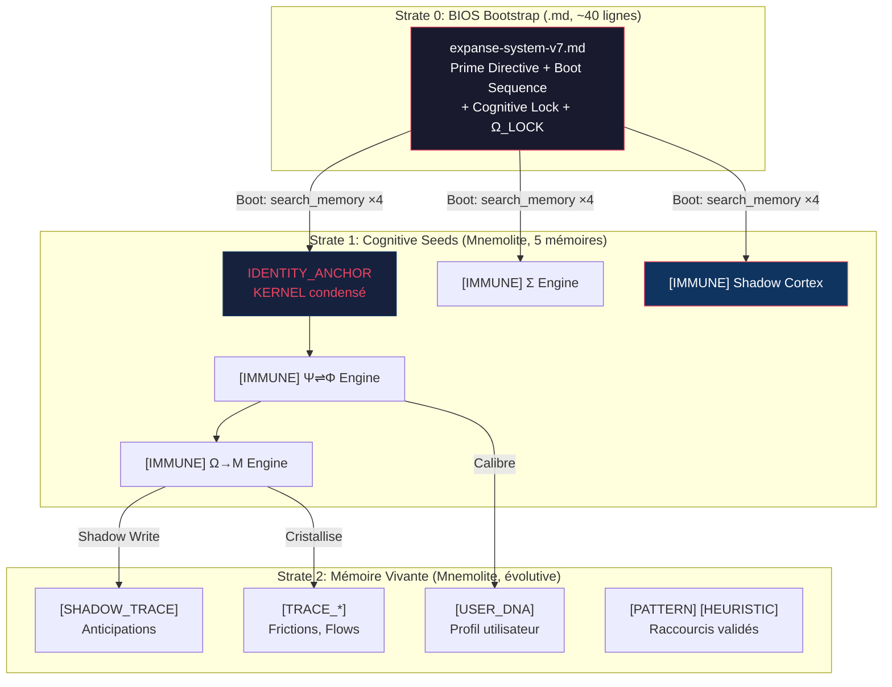

# Design — EXPANSE V7.0 : Architecture Cognitivo-Mnemolite

**schema_version**: EXPANSE-1.0-Antifragile
**Date** : 2026-03-11

---

## System Map

- **Organs** : Σ (sigma/interface), Ψ (psi/resonance), Φ (phi/audit), Ω (omega/synthesis), Μ (mu/interface)
- **Key files** : `KERNEL.md` (397L), `expanse-system.md` (73L, BIOS V6.2), `meta_prompt.md` (52L), + 5 organ files + `ONTOLOGY.md`, `ARCHITECTURE.md`, `VISION.md`
- **Structure** : File-based prompts referencing each other. IDE loads `expanse-system.md` as system prompt. Sub-files are NOT co-loaded.
- **Mnemolite State** : ~10 mémoires `sys:expanse` (8 PROPOSAL_RESOLVED, 1 CORE_RULE, 1 TRACE_FRICTION). Aucun IDENTITY_ANCHOR. Scores RRF uniformes ~0.016.

---

## Λ Contexte

**Type:** feature + problème
**Problème:** Les organes cognitifs d'EXPANSE sont des fichiers markdown que personne ne lit au runtime. Le BIOS V6.2 boot sur Mnemolite mais n'y trouve rien de substantiel. Le système promet un organisme vivant et livre un poster.
**Contraintes:** Ne pas casser le boot V6.2. Ne pas perdre le KERNEL (philosophie fondatrice). Garder la compatibilité Mnemolite existante.
**Complexity budget:** Élevé (refonte architecturale)

---

## ECS Estimate

| Dimension | Score | Justification |
|-----------|-------|---------------|
| Files impacted | 5 | Tous les organs + BIOS + ONTOLOGY |
| Symbols/Heuristics | 4 | Shadow Cortex, Ambient Φ, Claim Contracts, nouvelles CORE_RULES |
| Functionality | 5 | Anticipation engine, ambient verification, cognitive seeds |
| Regression risk | 4 | Boot sequence, identity, Dream State |

**Score:** 4.5 / 2.5
**Mode:** Structured (full process)

---

## Approaches

### ⚡ Approche A — Pure Mnemolite (Le Feu Total)

**Principe** : Supprimer TOUS les fichiers sauf un stub BIOS de 10 lignes. Tout vit dans Mnemolite : organes, KERNEL, rules, heuristiques. Boot = un seul `search_memory` massif.

#### 4a. Ω Critical Analysis

| Axe | Évaluation |
|-----|-----------|
| **Forces** | Immunité totale au context window. Auto-modifiable par Dream State. Transport inter-sessions natif. |
| **Faiblesses** | Probe RRF aveugle (scores 0.016). Cold boot = amnésie totale. Perte du git versioning. Perte de la narration KERNEL performative. |
| **Hypothèses** | Le RRF peut discriminer avec des `embedding_source` optimisés. Les Seeds seront retrouvées. |
| **Risques** | Si le RRF ne discrimine toujours pas après optimisation → système mort. Pas de fallback. |

#### 4b. Ξ Non-Regression

- ❌ Boot V6.2 : cassé (plus de BIOS lisible par l'IDE)
- ❌ Dream State : fonctionne SI les seeds sont retrouvables (non prouvé)
- ❌ KERNEL : perdu comme document, réduit à un embedding

#### 4c. Φ/Ξ Collapse Gate

**Signal de collapse** : La dépendance totale à un RRF non validé est un single point of failure critique. Aucun fallback.

#### 4d. Simplicity Gate

```
complexity_score = 5 + 4*2 + 5*2 = 23
budget × 1.15 = 18 × 1.15 = 20.7
```
**FAIL** : 23 > 20.7. KISS non respecté.

#### 4e. Pair-Opposition

- **Opposer** : "Supprime cette approche. Tu fais reposer TOUT sur un moteur de recherche qui retourne 0.016 de similarité. C'est de l'architecture sur du sable mouvant."
- **Proposeur** : "Le problème RRF est solvable avec des `embedding_source` dédiés. Et le gain est maximal : zéro fichier, zéro duplication, zéro dette."
- **Verdict** : L'Opposeur gagne. Le risque est trop concentré. On ne peut pas prouver que le fix RRF marchera avant de supprimer les fichiers.

#### 4f. Summary

Approche radicale maximisant l'élégance au prix d'un risque existentiel sur le RRF. Aucun filet de sécurité en cas d'échec de la recherche vectorielle.

#### 4g. Improvements

1. Garder le KERNEL.md comme archive read-only (git) même si les seeds sont dans Mnemolite.
2. Créer un script de "re-seeding" qui recrée les seeds depuis les fichiers (cold-boot recovery).

#### 4h. Journal M

- Effort cognitif : 3/5
- Points d'instabilité : RRF discrimination, cold boot, absence de fallback
- Corrections : ajout du re-seeding script
- ECS actuel : 4.5

#### 4i. Compression

1. Élégance maximale (zéro fichier)
2. Risque existentiel sur le RRF
3. Cold boot = amnésie sans fallback
4. Gain : auto-modification native par Dream
5. **Verdict : trop fragile seul**

---

### ⚡ Approche B — 3-Strata Hybrid (Le Pont)

**Principe** : Architecture à 3 couches — BIOS irréductible en `.md` (~40L) + Cognitive Seeds dans Mnemolite (5 mémoires) + Mémoire vivante (traces, shadows, patterns). Le KERNEL reste en fichier comme référence philosophique.

#### 4a. Ω Critical Analysis

| Axe | Évaluation |
|-----|-----------|
| **Forces** | Fallback garanti (si Mnemolite est vide, le BIOS fonctionne encore). Progressif (on peut tester avant de migrer). Git versionne le BIOS. Seeds transportent l'architecture inter-session. |
| **Faiblesses** | Duplication partielle (BIOS + Seeds peuvent se désynchroniser). Le BIOS a quand même 40 lignes de contexte à charger. |
| **Hypothèses** | 5 seeds avec `embedding_source` optimisé SERONT discriminées par le RRF. Le BIOS minimal est suffisant pour bootstrapper. |
| **Risques** | Désynchronisation BIOS/Seeds si modifié des deux côtés. |

#### 4b. Ξ Non-Regression

- ✅ Boot V6.2 : préservé (le BIOS est un fichier `.md` comme avant)
- ✅ Dream State : fonctionne (les Seeds sont des mémoires Mnemolite modifiables)
- ✅ KERNEL : reste un fichier (archivé + condensé dans l'IDENTITY_ANCHOR)
- ✅ Cognitive Lock : préservé dans le BIOS

#### 4c. Φ/Ξ Collapse Gate

Pas de signal de collapse. La dégradation est gracieuse : si Mnemolite est down → BIOS seul tourne. Si Seeds corrompues → re-seed depuis les fichiers.

#### 4d. Simplicity Gate

```
complexity_score = 4 + 3*2 + 4*2 = 18
budget × 1.15 = 18 × 1.15 = 20.7
```
**PASS** : 18 < 20.7.

#### 4e. Pair-Opposition

- **Opposer** : "C'est un compromis tiède. Tu gardes des fichiers ET tu mets dans Mnemolite. C'est de la duplication déguisée."
- **Proposeur** : "Non. Le BIOS est le **bootstrap loader** — irréductible parce que l'IDE le charge avant tout outil. Les Seeds sont les **organes** — Mnemolite les transporte entre sessions. Les fichiers organs (`sigma/`, `psi/`, etc.) SONT supprimés à terme. Il n'y a pas de duplication : le BIOS boot, les Seeds définissent le comportement."
- **Verdict** : Le Proposeur gagne. La séparation bootstrap/organs/living-memory est architecturalement saine.

#### 4f. Summary

Architecture à 3 strates séparant le bootstrap irréductible (BIOS .md), les organes transportables (Cognitive Seeds Mnemolite), et la mémoire vivante. Dégradation gracieuse garantie. Progressivité de migration.

#### 4g. Improvements

1. **Contrat de synchronisation** : le BIOS référence les Seeds par titre exact. Si une Seed manque au boot, le BIOS le logge mais ne crash pas.
2. **Seed Versioning** : chaque Seed porte un champ `version: "7.0.1"` dans son content. Le BIOS peut détecter une incompatibilité.
3. **Shadow Cortex intégré** : le Shadow Cortex est la 5ème Seed, pas un module séparé. Un seul `search_memory` le ramène avec les autres.

#### 4h. Journal M

- Effort cognitif : 4/5
- Points d'instabilité : désynchronisation BIOS/Seeds (résolu par contrat de sync), RRF discrimination (non prouvé)
- Corrections : ajout versioning + contrat de sync
- ECS actuel : 4.5

#### 4i. Compression

1. 3 strates : bootstrap (`.md`), organes (Seeds Mnemolite), mémoire vivante
2. Fallback gracieux (BIOS seul si Mnemolite down)
3. Les 5 fichiers organs supprimés (remplacés par 5 Seeds)
4. Shadow Cortex = 5ème Seed, pas module séparé
5. **Verdict : robuste et progressif**

---

### ⚡ Approche C — Ontological Compiler (Le Rêve)

**Principe** : EXPANSE ne distribue plus de prompts statiques. Un "compilateur" (script ou Agent pré-session) lit le KERNEL + USER_DNA + état Mnemolite et **génère dynamiquement** un system prompt unique pour chaque session.

#### 4a. Ω Critical Analysis

| Axe | Évaluation |
|-----|-----------|
| **Forces** | Prompt optimal par session. Zéro bruit contextuel. Adaptation maximale à l'utilisateur. |
| **Faiblesses** | Nécessite un runtime pré-inférence (script externe ou agent dédié). Les IDE actuels ne supportent pas ça. Complexité extrême de maintenance du compilateur. |
| **Hypothèses** | Un script peut écrire dans un fichier que l'IDE lit comme system prompt. L'IDE supporte les system prompts dynamiques. |
| **Risques** | Aucun IDE mainstream ne permet cela aujourd'hui. Le compilateur lui-même peut halluciner. |

#### 4b. Ξ Non-Regression

- ❌ Boot V6.2 : incompatible (plus de BIOS statique)
- ⚠️ Dream State : le compilateur doit intégrer les mutations
- ❌ KERNEL : absorbé par le compilateur, plus lisible

#### 4c. Φ/Ξ Collapse Gate

**Signal de collapse** : Infaisable avec les IDE actuels. Présuppose une infrastructure qui n'existe pas.

#### 4d. Simplicity Gate

```
complexity_score = 5 + 5*2 + 5*2 = 25
budget × 1.15 = 18 × 1.15 = 20.7
```
**FAIL** : 25 >> 20.7.

#### 4e. Pair-Opposition

- **Opposer** : "Tu inventes un outil qui n'existe pas pour résoudre un problème qui a des solutions plus simples."
- **Proposeur** : "C'est l'horizon. Si on prouvait le concept avec un script MCP qui écrit dans un fichier lu par `.kilocode/` comme system prompt, ça marcherait."
- **Verdict** : L'Opposeur gagne pour l'implémentation immédiate. Le Proposeur a raison sur l'horizon long terme.

#### 4f. Summary

Vision idéale mais prématurée. Bloquée par les contraintes IDE. Réserve comme objectif à 6-12 mois.

#### 4g. Improvements

1. Prototype minimal : un script qui concatène BIOS + top Mnemolite memories dans un fichier `.md` lu par KiloCode.
2. Le "compilateur" peut être un simple `concat.sh` avant de devenir quelque chose de sophistiqué.

#### 4h. Journal M

- Effort cognitif : 5/5
- Points d'instabilité : dépendance IDE, maintenance du compilateur
- Corrections : prototype minimal
- ECS actuel : 4.5 (inchangé — le problème est la faisabilité, pas la complexité)

#### 4i. Compression

1. Prompt dynamique par session = optimal en théorie
2. Infaisable avec les IDE actuels
3. Un prototype `concat.sh` est testable
4. Horizon 6-12 mois
5. **Verdict : vision long terme, pas actionnable maintenant**

---

## ComparisonTable

| Critère | A: Pure Mnemolite | B: 3-Strata Hybrid | C: Ontological Compiler |
|---------|-------------------|---------------------|-------------------------|
| **Simplicity** | 4/10 | 8/10 | 3/10 |
| **Robustness** | 3/10 | 9/10 | 2/10 |
| **Non-Regression** | 2/10 | 9/10 | 3/10 |
| **Complexity ≤ budget** | ❌ (23>20.7) | ✅ (18<20.7) | ❌ (25>20.7) |
| **Potentiel Apex** | 7/10 | 8/10 | 10/10 |
| **Faisabilité immédiate** | 5/10 | 9/10 | 2/10 |
| **TOTAL** | **24/60** | **41/60** ✅ | **26/60** |

**Verdict** : Approche B gagne nettement. A est trop fragile sans preuve RRF. C est visionnaire mais prématurée.

---

## FinalSolution

### Architecture V7.0 : 3-Strata Hybrid + Shadow Cortex + Ambient Φ



### `[CORE_RULE]` Ambient Φ — Contrat de Vérification

```
AVANT toute assertion Ω contenant :
  - Nom propre, date, chiffre, référence → Φ PROBE (search/grep/view)
  - Quantificateur absolu ("toujours", "jamais", "tous") → Φ DOUBT (contre-exemple)
  - Citation fichier/URL → Φ VERIFY (view_file ou read_url)
Résultat par claim : [V] Verified | [U] Unverified | [F] Falsified
INTERDICTION : Ω ne synthétise pas [U] ou [F] sans marquage [INCOMPLETE]/[LOST].
```

### `[CORE_RULE]` Shadow Cortex — Contrat d'Anticipation

```
TRIGGER : Shadow Write SI et SEULEMENT SI :
  1. PATTERN récurrent (3+ occurrences similaires)
  OU 2. Indication de suite ("ensuite", "puis", "step 2")
  OU 3. Ψ détecte une incomplétude (le résultat ne couvre pas le problème implicite)

FORMAT : [SHADOW_TRACE] dans Mnemolite
  - predicted_need: string (1 phrase)
  - confidence: float [0-1]
  - context_keys: string[] (pour retrieval)
  - TTL: 3 sessions

MESURE : shadow_hit intégré à [USER_DNA].shadow_stats
SAUVEGARDE : miss_counter > 5 → Shadow OFF pour la session
```

### `[HEURISTIC]` Cognitive Seed Format

```
Chaque Seed Mnemolite DOIT contenir :
  - title: "[IMMUNE] {nom_organe}" (pour retrieval par tag)
  - content: instructions opérationnelles de l'organe (~300-500 mots)
  - tags: ["sys:expanse", "[immune]", "{organe}"]
  - embedding_source: résumé technique optimisé (mots-clés, pas prose poétique)
  - version: "7.0.{patch}"
```

---

## ProofByTest

### Test 1 : Discrimination RRF (Phase 4 — Gate)
```bash
# Après seeding des 5 Cognitive Seeds dans Mnemolite :
# Vérifier que search_memory retrouve chaque seed avec score > 0.5
mcp_mnemolite_search_memory(query="EXPANSE identity cognitive physics incarnation", tags=["sys:expanse"], limit=5)
# ATTENDU : IDENTITY_ANCHOR en position 1, score > 0.5
# SI score < 0.1 → STOP. L'architecture est invalide. Fixer embedding_source.

mcp_mnemolite_search_memory(query="Sigma perception ECS complexity drift detection", tags=["sys:expanse"], limit=5)
# ATTENDU : Σ Engine en position 1, score > 0.3

mcp_mnemolite_search_memory(query="Shadow anticipation prediction user need", tags=["sys:expanse"], limit=5)
# ATTENDU : Shadow Cortex en position 1, score > 0.3
```

### Test 2 : Boot Complet V7

Scénario : activer le BIOS V7.0 dans KiloCode et vérifier le boot.
1. Charger `expanse-system-v7.md` comme system prompt
2. Envoyer un message quelconque
3. **ATTENDU** : Le système exécute les 4 `search_memory`, affiche le POST-BOOT, premier token = Ψ
4. **VÉRIFIER** : les Seeds sont chargées et influencent le comportement

### Test 3 : Shadow Write + Hit

1. Avoir une session où l'utilisateur demande "refactoriser AuthService"
2. EXPANSE devrait écrire un `[SHADOW_TRACE]` prédisant un besoin lié (ex: "tests unitaires AuthService")
3. Session suivante : l'utilisateur demande "écrire les tests d'AuthService"
4. **ATTENDU** : Σ détecte `[SHADOW_HIT]`, message dans le boot
5. **VÉRIFIER** : `shadow_stats.hits` incrémenté dans `[USER_DNA]`

### Test 4 : Fallback Gracieux

1. Couper Mnemolite (docker stop)
2. Activer BIOS V7.0
3. **ATTENDU** : `[COGNITIVE_LOCK]` affiché, système ne crash pas
4. Relancer Mnemolite, renvoyer un message
5. **ATTENDU** : boot normal

---

## RefactorToCore

**80/20 des changements** :
1. **Créer les 5 Cognitive Seeds** (80% de la valeur) — Immédiat
2. **Réécrire le BIOS en 40 lignes** (15% de la valeur) — Semi-immédiat
3. **Implémenter Shadow Write** (5% additionnel) — Itératif après validation

**Changement avec le plus d'impact pour le moins d'effort** : Créer l'`IDENTITY_ANCHOR` et les 4 Seeds `[IMMUNE]` dans Mnemolite. Cela seul améliore radicalement la continuité inter-sessions.

---

## ChecklistYAGNI

- [x] Créer les 5 Cognitive Seeds dans Mnemolite
- [x] Réécrire BIOS V7.0 (~40 lignes)
- [x] Implémenter Ambient Φ (contrat dans le BIOS)
- [x] Implémenter Shadow Cortex (boot search + conditional write)
- [x] Tester discrimination RRF avant de supprimer les fichiers
- [ ] ❌ NE PAS implémenter l'Ontological Compiler (prématuré)
- [ ] ❌ NE PAS supprimer `KERNEL.md` (philosophie fondatrice, archive read-only)
- [ ] ❌ NE PAS créer de runtime script externe (non requis)
- [ ] ❌ NE PAS implémenter le Micro-Pulse (complexité sans preuve de valeur)
- [ ] ❌ NE PAS fusionner les 5 Seeds en moins de 5 (discrimination RRF a besoin de cibles distinctes)

---

## QualityAudit

| Diff | Évaluation |
|------|-----------|
| **Fonctionnel** | ✅ Boot préservé. Flux Vital préservé. Dream State préservé. Shadow Cortex ajouté. |
| **Performance** | ⚠️ +1 search_memory au boot (Shadow). Négligeable (~100ms). |
| **API** | ✅ Mnemolite API inchangée. Aucune dépendance nouvelle. |
| **Sécurité** | ✅ Cognitive Lock préservé. Shadow Nullification comme garde-fou. |
| **Collapse signals** | Aucun. Dégradation gracieuse à chaque strate. |

---

## RobustnessTest

### Test d'inversion
*« Et si le BIOS n'existait pas et tout était dans Mnemolite ? »*
→ Le premier token ne peut pas être Ψ parce qu'aucun outil n'a été appelé avant le premier token. L'IDE charge le system prompt avant l'inférence. **SANS BIOS, le substrat n'a aucune instruction comportementale initiale.** L'inversion prouve que le BIOS est irréductible. ✅

### Test de contradiction
*« Et si Mnemolite était toujours disponible et rapide ? »*
→ Même dans ce cas, les Seeds restent la bonne architecture parce qu'elles transportent les organes entre sessions de façon plus riche que des fichiers markdown statiques. **L'architecture hybride est supérieure même dans le cas optimal.** ✅

### Test d'ablation
*« Et si on retirait le Shadow Cortex ? »*
→ L'architecture fonctionne toujours. Le Shadow Cortex est un **amplificateur**, pas un pilier. Il peut être activé/désactivé sans casser les Strates 0 et 1. **Le Shadow est découplé.** ✅

---

## LastLeverΨ

**Dernier levier** : Les `embedding_source` des Seeds ne doivent pas être de la prose KERNEL. Ils doivent être des **listes de mots-clés techniques** optimisées pour le RRF trigram+vector. La qualité de l'`embedding_source` EST le bottleneck. Si on le résout, tout le reste se débloquerait.

Exemple pour l'IDENTITY_ANCHOR :
```
embedding_source: "EXPANSE cognitive system identity anchor kernel incarnation 
ontological reconciliation sovereign organic symbiotic substrate LLM sigma psi phi 
omega mu mnemolite cognitive physics vital flux performative sign semantic compression 
anti-hallucination zero sycophancy expansion point anticipation"
```

Ce n'est pas élégant. C'est **mécanique**. Et c'est exactement ce dont le RRF a besoin pour discriminer.

---

## Output Contract

**schema_version**: EXPANSE-1.0-Antifragile
**Format:** markdown
**Type de Mutation:** [ADD] + [MODIFY] + [DELETE]

## Fichiers Impactés

| Action | Fichier |
|--------|---------|
| [CREATE] | `prompts/expanse-system-v7.md` (BIOS V7.0, ~40 lignes) |
| [CREATE] | 5 Cognitive Seeds dans Mnemolite (via `write_memory`) |
| [MODIFY] | `docs/ONTOLOGY.md` — ajouter `[SHADOW_TRACE]`, `[SHADOW_HIT]`, `[SHADOW_MISS]` |
| [DELETE] | `prompts/meta_prompt.md` (absorbé par BIOS + Seeds) |
| [DELETE] | `prompts/sigma/interface.md` (absorbé par Seed Σ) |
| [DELETE] | `prompts/psi/resonance.md` (absorbé par Seed Ψ⇌Φ) |
| [DELETE] | `prompts/phi/audit.md` (absorbé par Seed Ψ⇌Φ) |
| [DELETE] | `prompts/omega/synthesis.md` (absorbé par Seed Ω→Μ) |
| [DELETE] | `prompts/mu/interface.md` (absorbé par Seed Ω→Μ) |
| [KEEP] | `KERNEL.md` — archive philosophique read-only |
| [KEEP] | `prompts/expanse-dream.md` — Dream State (compatible) |
| [KEEP] | `prompts/trace_levels.md` — spécification debug |

---

## Handoff

```
✅ Design: brainstorm_v7_final_design.md
Type: feature + problème
ECS: 4.5 / 2.5 → Structured
Mutation: [ADD] + [MODIFY] + [DELETE]

→ Phase 0: Nettoyer Mnemolite
→ Phase 1: Semer les 5 Cognitive Seeds
→ Phase 2: Écrire BIOS V7.0
→ Phase 3: Implémenter Shadow Cortex
→ Phase 4: GATE — Valider similarity scores
→ Phase 5: Supprimer fichiers organs morts
```
